# Test2 Service Framework Architecture

This document provides Mermaid class diagrams documenting the Test2 service framework architecture at various levels of abstraction.

## Table of Contents

- [High-Level Overview](#high-level-overview)
- [Lifecycle Layer](#lifecycle-layer)
- [Host Layer](#host-layer)
- [Registry Layer](#registry-layer)
- [Provider Layer](#provider-layer)
- [Service Layer](#service-layer)
- [Util Layer](#util-layer)
- [Service Implementations](#service-implementations)
- [Exception Hierarchy](#exception-hierarchy)
- [Sequence Diagrams](#sequence-diagrams)
  - [Startup Sequence](#startup-sequence)
  - [Shutdown Sequence](#shutdown-sequence)
  - [Cross-Thread Async Invocation](#cross-thread-async-invocation)

---

## High-Level Overview

A conceptual view of the five main framework layers and their dependencies.

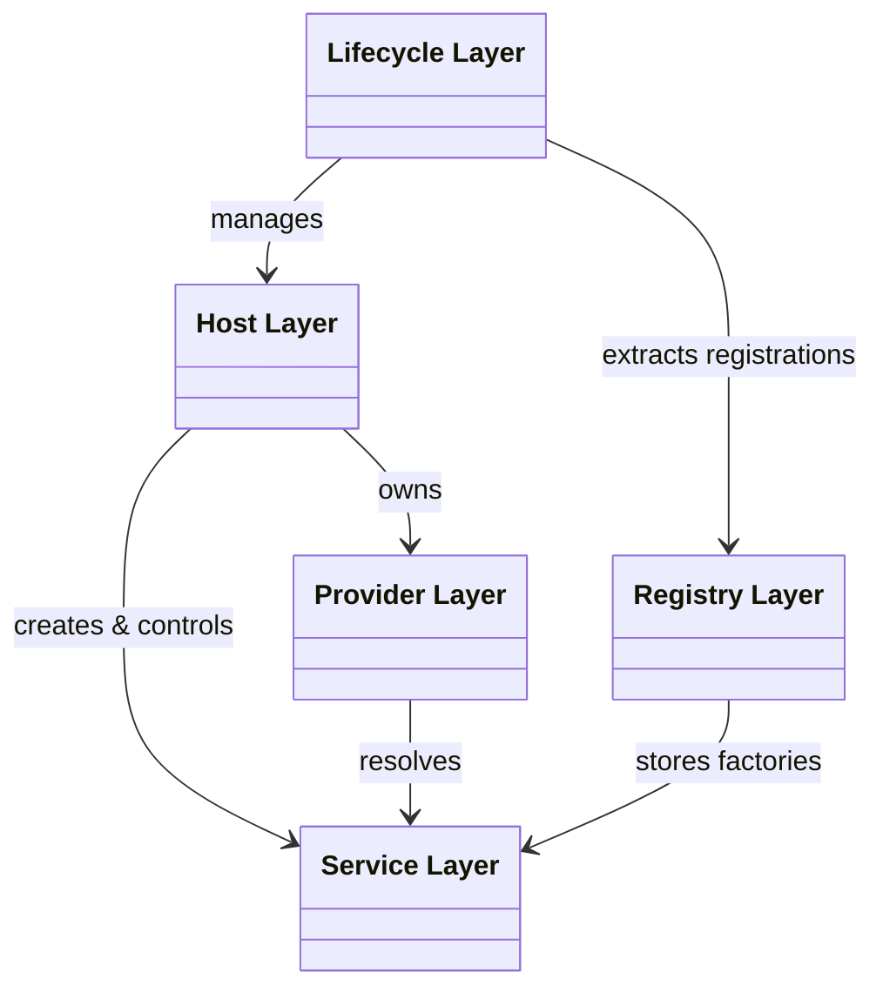

---

## Lifecycle Layer

The `LifecycleManager` orchestrates the entire service lifecycle, coordinating startup and shutdown across thread groups with priority ordering. `ExecutorContext` and `DispatchContext` provide thread-safe lifetime tracking and cross-thread operation support.

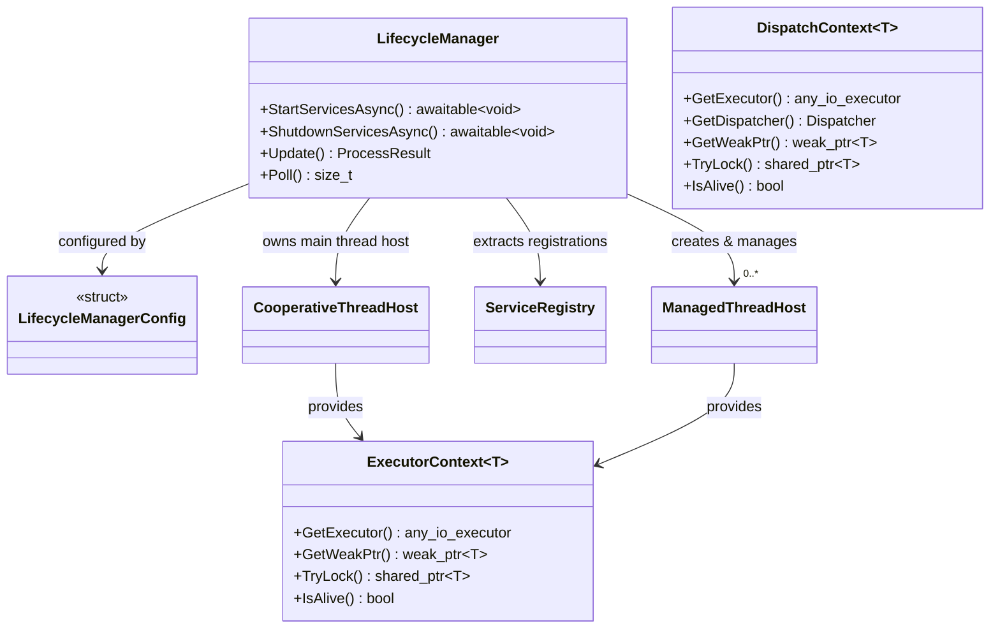

---

## Host Layer

Service hosts manage thread execution and service lifecycle within their thread context.

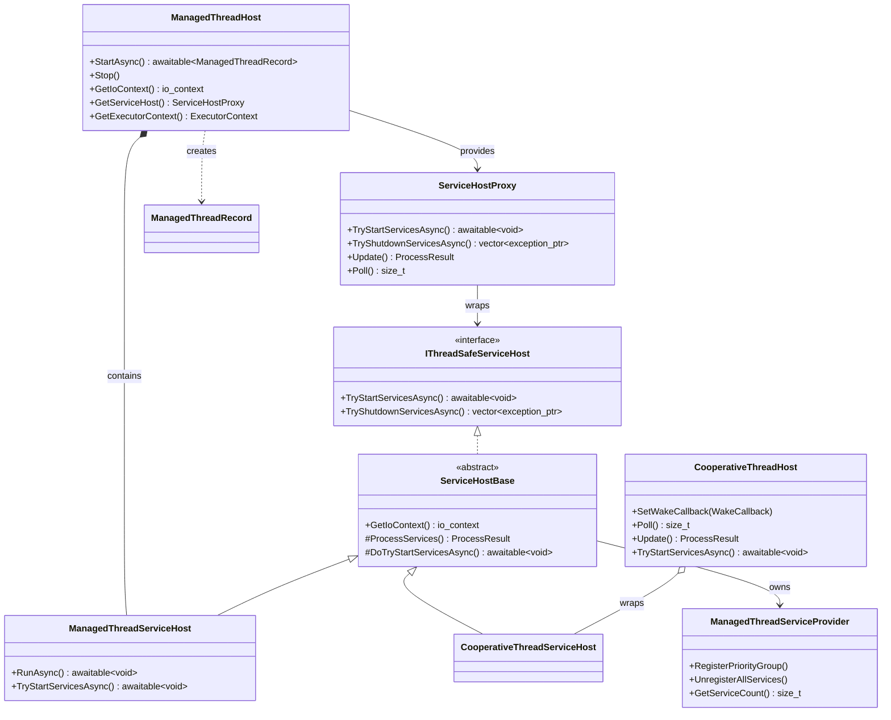

---

## Registry Layer

The registry system handles service registration with priority and thread group assignment.

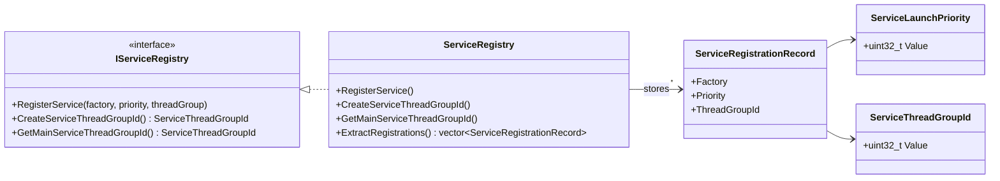

---

## Provider Layer

The provider system enables dependency injection and service resolution.

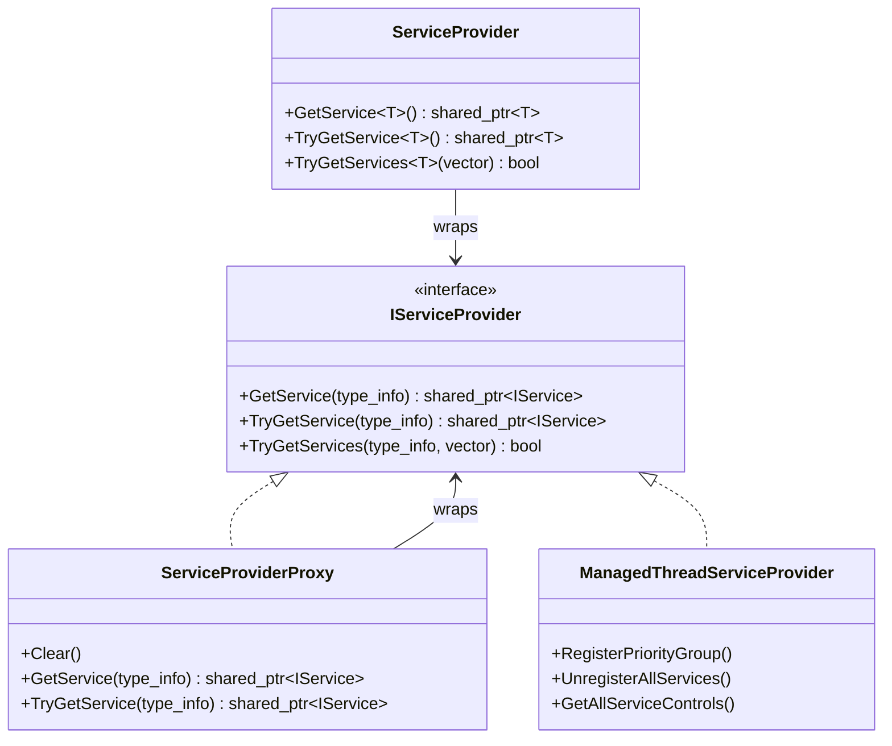

---

## Service Layer

Core service abstractions defining the service contract and lifecycle.

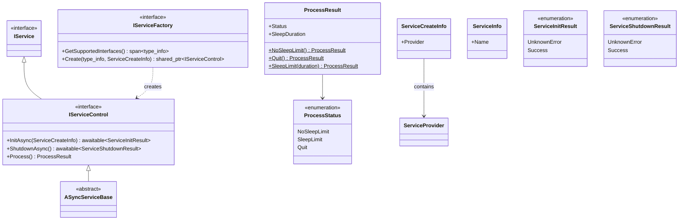

---

## Util Layer

Utilities for cross-thread communication and safe async method invocation.

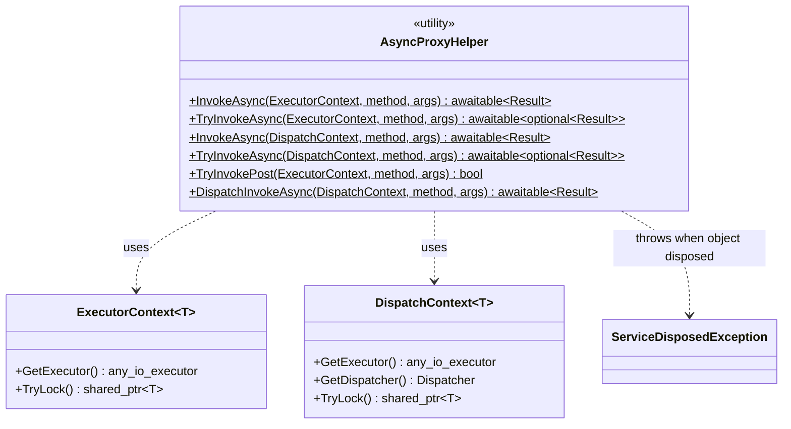

---

## Service Implementations

Concrete service implementations demonstrating the dual inheritance pattern (extends `ASyncServiceBase` and implements service-specific interface).

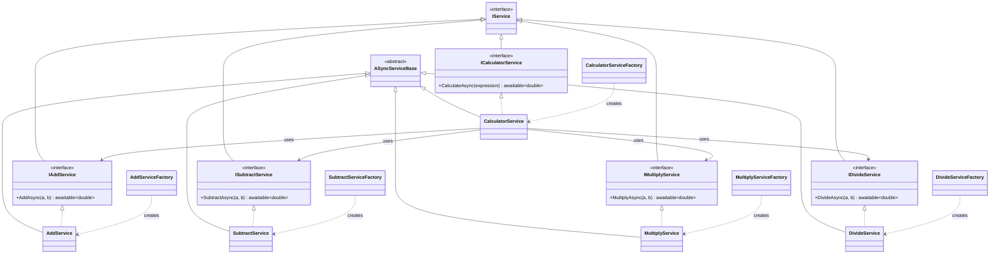

---

## Exception Hierarchy

Custom exceptions organized by their standard library base class.

```mermaid
classDiagram
    direction TB

    class std_exception["std::exception"]

    class std_runtime_error["std::runtime_error"]
    class std_logic_error["std::logic_error"]
    class std_bad_cast["std::bad_cast"]

    class AggregateException
    class MultipleServicesFoundException
    class ServiceDisposedException
    class ServiceProviderException
    class UnknownServiceException
    class WrongThreadException

    class DuplicateServiceRegistrationException
    class EmptyPriorityGroupException
    class InvalidPriorityOrderException
    class InvalidServiceFactoryException
    class RegistryExtractedException

    class ServiceCastException

    std_exception <|-- std_runtime_error
    std_exception <|-- std_logic_error
    std_exception <|-- std_bad_cast

    std_runtime_error <|-- AggregateException
    std_runtime_error <|-- MultipleServicesFoundException
    std_runtime_error <|-- ServiceDisposedException
    std_runtime_error <|-- ServiceProviderException
    std_runtime_error <|-- UnknownServiceException
    std_runtime_error <|-- WrongThreadException

    std_logic_error <|-- DuplicateServiceRegistrationException
    std_logic_error <|-- EmptyPriorityGroupException
    std_logic_error <|-- InvalidPriorityOrderException
    std_logic_error <|-- InvalidServiceFactoryException
    std_logic_error <|-- RegistryExtractedException

    std_bad_cast <|-- ServiceCastException
```

---

## Sequence Diagrams

### Startup Sequence

High-level view of the `LifecycleManager` orchestrating service startup across multiple thread groups with priority ordering.

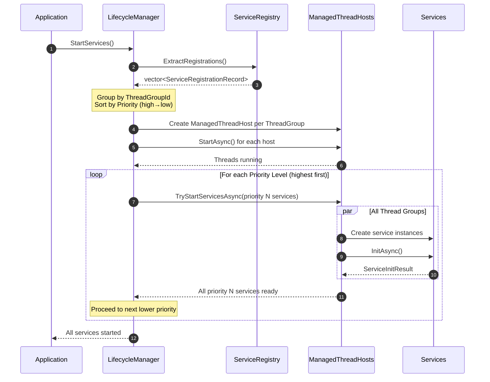

### Shutdown Sequence

High-level view of the `LifecycleManager` orchestrating graceful shutdown in reverse priority order.

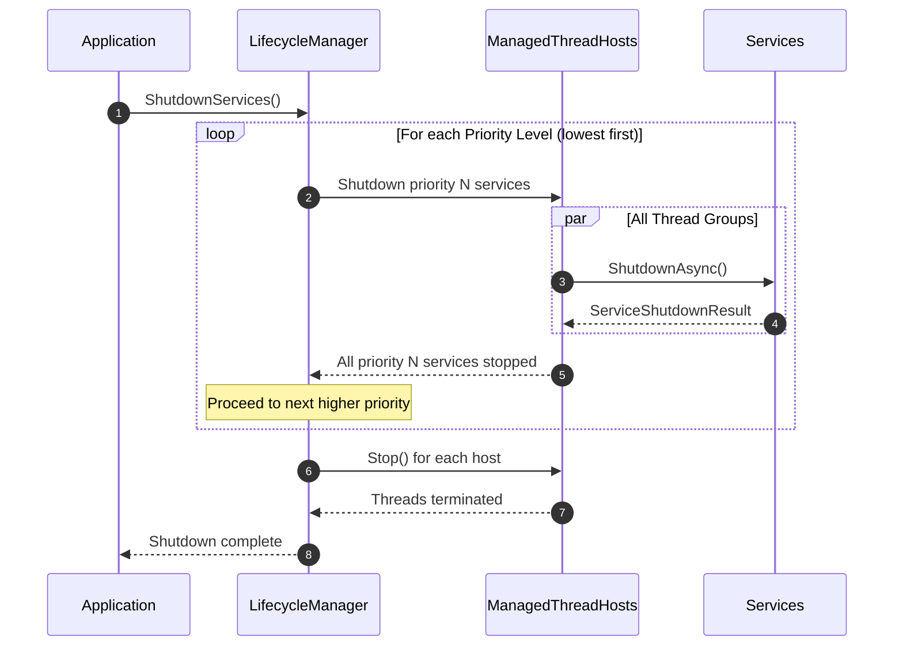

### Cross-Thread Async Invocation

Demonstrates how `AsyncProxyHelper` uses `DispatchContext` to safely invoke async methods on objects living in different threads.

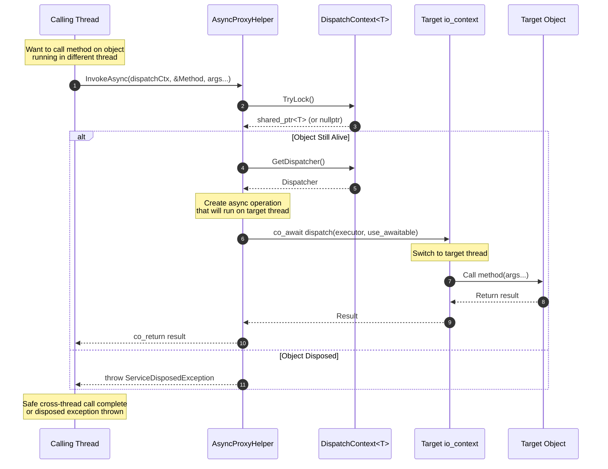

**Key Points:**

1. **Lifetime Safety**: `TryLock()` ensures object still exists before invocation
2. **Thread Switching**: `co_await dispatch()` moves execution to target thread's `io_context`
3. **Exception Handling**: Throws `ServiceDisposedException` if object was destroyed
4. **Type Safety**: Template methods maintain compile-time type checking
5. **Async-Friendly**: Fully compatible with C++20 coroutines (`co_await`)

**Alternative Patterns:**

- **TryInvokeAsync**: Returns `std::optional<Result>` instead of throwing on disposed objects
- **TryInvokePost**: Fire-and-forget posting without waiting for result
- **ExecutorContext**: Similar pattern but without dispatcher (simpler, dispatch-only)
- **DispatchInvokeAsync**: Uses `co_await dispatch()` explicitly for guaranteed thread context

---

## Design Patterns

The framework implements several well-known design patterns:

| Pattern | Implementation |
|---------|----------------|
| **Factory** | `IServiceFactory` creates service instances |
| **Service Locator** | `IServiceProvider` / `ServiceProvider` resolve dependencies |
| **Registry** | `ServiceRegistry` holds registrations before instantiation |
| **Proxy** | `ServiceProviderProxy` wraps provider with disconnect capability |
| **Template Method** | `ServiceHostBase` defines algorithm, subclasses provide specifics |
| **Value Object** | `ServiceLaunchPriority`, `ServiceThreadGroupId` wrap primitives |
| **Aggregate Exception** | `AggregateException` collects multiple failures |
