# Modern Async Patterns & C++ Service Framework Architecture

**A presentation for senior C++ developers and architects**

---

# Agenda

1. **Language Adoption & Reception** — The async/await journey across languages
2. **Async Patterns Classification** — Request/Response, Messaging, Threading Models
3. **Threading Pitfalls** — Re-entrancy, cross-thread callbacks, coroutine traps
4. **Service Framework Architecture** — 5-layer design, DI, build considerations
5. **Integration & Summary** — Qt integration, pattern mapping, key takeaways

---

<!-- ============================================================ -->
<!-- PHASE 1: FOUNDATIONS                                          -->
<!-- ============================================================ -->

# The Async/Await Journey

## Timeline of Language Adoption

| Year | Language | Feature | Source |
|------|----------|---------|--------|
| 1958 | — | Melvin Conway coins "coroutine" | [Conway, ACM 1963](http://melconway.com/Home/pdf/compiler.pdf) |
| 1963 | Assembly | First published coroutine implementation | [Conway, CACM](https://doi.org/10.1145/366663.366704) |
| 1967 | Simula 67 | Native coroutine support | [Dahl & Hoare, 1972](https://en.wikipedia.org/wiki/Simula) |
| 2010 | F# 2.0 | Asynchronous workflows (demoed 2007) | [Syme et al., PADL 2011](https://link.springer.com/chapter/10.1007/978-3-642-18378-2_15) |
| 2012 | C# 5.0 | `async`/`await` keywords | [.NET Blog](https://devblogs.microsoft.com/dotnet/async-in-4-5-worth-the-await/) |
| 2015 | Python 3.5 | `async def`/`await` | [PEP 492](https://peps.python.org/pep-0492/) |
| 2017 | JavaScript | ES2017 native `async`/`await` | [ECMAScript 2017](https://262.ecma-international.org/8.0/) |
| 2019 | Rust 1.39 | `async`/`.await` | [Rust Blog](https://blog.rust-lang.org/2019/11/07/Async-await-stable.html) |
| 2020 | C++20 | Coroutines (`co_await`, `co_return`, `co_yield`) | [cppreference](https://en.cppreference.com/w/cpp/language/coroutines) |
| 2021 | Swift 5.5 | `async`/`await` | [SE-0296](https://github.com/apple/swift-evolution/blob/main/proposals/0296-async-await.md) |

> *"Many languages have adopted, or are planning to adopt"* async/await-style coroutines
> — [Python PEP 492](https://peps.python.org/pep-0492/)

---

# C++20 Coroutine Keywords

## Three new keywords

```cpp
// co_await — suspend and wait for a result
auto result = co_await async_operation();

// co_return — return a value from a coroutine
co_return computed_value;

// co_yield — produce a value and suspend (generators)
co_yield next_item;
```

## Example: Boost.Asio awaitable

```cpp
boost::asio::awaitable<void> do_work() {
    auto result = co_await boost::asio::async_read(socket, buffer, boost::asio::use_awaitable);
    co_return;
}
```

---

# Developer Reception: The Good

## Why developers like async/await

- **Reads like synchronous code** — flattens callback chains
- **Reduces indentation** — no more "callback hell" or nested `.then()` chains
- **Simpler error handling** — use familiar `try`/`catch` patterns
- **Debugger support** — debuggers can show full async callstacks (C#, JS, Python)
- **Widely adopted** — skills transfer across languages

> *"This enables you to write code that uses asynchronous functions but looks like synchronous code."*
> — [MDN: async and await](https://developer.mozilla.org/en-US/docs/Learn/JavaScript/Asynchronous/Promises#async_and_await)

---

# Developer Reception: The Criticism

## Known pain points

| Issue | Description |
|-------|-------------|
| **Async cascade** | Once one function is `async`, callers must also be `async` ("function coloring") |
| **Error handling complexity** | Every `await` may need `try`/`catch`; unhandled async errors are hard to debug |
| **Accidental sequential execution** | Easy to write `await a; await b;` instead of parallel execution |
| **Hidden complexity** | State machines generated by compiler can be hard to debug |

<small>¹ "Function coloring" refers to the phenomenon where async functions "infect" their callers — see [What Color is Your Function?](https://journal.stuffwithstuff.com/2015/02/01/what-color-is-your-function/)</small>

---

# C++ Specific Challenges

## Why C++20 coroutines are harder

| Challenge | Impact |
|-----------|--------|
| **No standard library support** | Must use Boost.Asio, cppcoro, or custom implementations |
| **Heap allocations** | Coroutine frames typically heap-allocated |
| **HALO optimization limits** | Heap Allocation eLision Optimization only works in specific cases (inlining required) |
| **No async callstacks** | Debuggers support async callstacks for other languages, but not yet for C++ coroutines (tooling improving) |
| **Debugging difficulty** | Suspended coroutines have fragmented stack traces (tooling improving) |
| **Customization complexity** | `promise_type`, `awaiter` concepts have steep learning curve |

---

# Async Approaches Comparison

| Approach | Pros | Cons | Use Case |
|----------|------|------|----------|
| **Callbacks** | Simple, no runtime overhead | Callback hell, hard to compose | Legacy code, simple events |
| **Futures/Promises** | Composable, error propagation | Verbose, continuation chains | One-shot async results |
| **Coroutines** | Readable, sequential style | Function coloring, complexity | I/O-bound operations |
| **Virtual Threads** | No syntax change, simple model | Requires runtime support | Java/JVM only |
| **Actors/Message Passing** | Isolated state, scalable | Different mental model | Distributed systems |

---

# C++23/26: The Future

## `std::execution` (P2300) vs Boost.Asio

| Aspect | Boost.Asio | std::execution (P2300) |
|--------|------------|------------------------|
| **Availability** | Now (mature, production-ready) | C++26 target (stdexec library today) |
| **Model** | Proactor pattern, completion handlers | Senders & Receivers |
| **Coroutine support** | `awaitable<T>`, `use_awaitable` | Native sender/receiver composition |
| **Function coloring** | Yes (async functions differ) | No (same function can be sync or async) |
| **Cancellation** | `cancellation_signal`, manual | Built-in via `stop_token`, structured |
| **Scope** | I/O focused (networking, timers) | General async execution |

### Why This Framework Uses Boost.Asio

- **Available today** — P2300 is still being standardized
- **C++20 coroutine support** — `awaitable<T>` works well with `co_await`
- **I/O primitives** — networking, timers already included
- **Future path** — Boost.Asio expected to integrate with P2300

**Recommendation**: Use Boost.Asio coroutines now; migrate schedulers first when P2300 stabilizes. See [Appendix A10](#appendix-a10-migration-boostasio-→-stdexecution).

---

# std::execution Code Example

## Sender/Receiver Model (P2300)

```cpp
// Future C++ (conceptual)
auto work = just(42)
          | then([](int x) { return x * 2; })
          | on(thread_pool_scheduler);

sync_wait(work);  // or start(work, receiver)
```

**Status**: Targeting C++26, available in stdexec library today.

---

<!-- ============================================================ -->
<!-- PHASE 2: ASYNC PATTERNS CLASSIFICATION                        -->
<!-- ============================================================ -->

# Async Patterns: Request/Response

| Pattern | Description | C++ Example | C# Example |
|---------|-------------|-------------|------------|
| **Simple Request/Response** | One request → one response | `std::future<T>` / `std::async` | `Task<T>` / `async`-`await` |
| **Continuation / Callback** | Response → chained handling | `future.then(...)` (library) | `Task.ContinueWith(...)` |
| **Fire-and-Forget** | Request with discarded response | `std::thread(...).detach()` | `Task.Run(() => DoWork())` |

### Key Characteristics
- Single completion point
- Error propagation through result type
- Fire-and-forget: unobserved errors, side-effect only

---

# Async Patterns: Asynchronous Messaging

| Pattern | Description | C++ Example | C# Example |
|---------|-------------|-------------|------------|
| **Event / Pub-Sub** | Broadcast → many responses | Callback lists, Qt signals/slots | `event EventHandler<T>`, `IObservable<T>` |
| **Producer-Consumer** | Streamed/batched messages | `std::queue + mutex + condition_variable` | `Channel<T>`, `BlockingCollection<T>` |
| **Message Queue** | Persistent/distributed | ZeroMQ, Boost.Asio queue | RabbitMQ, Azure Service Bus |

### Key Characteristics
- One-to-many (Pub-Sub) or many-to-many (Queue)
- Decoupled producers and consumers
- Message queues: cross-process, durable, reliable delivery

---

# Pattern Decision Flowchart


---

# Error Handling by Pattern

## Why Request/Response is Easy

| Aspect | Request/Response |
|--------|------------------|
| **Completion points** | Single — one place to catch errors |
| **Error ownership** | Clear — caller owns the error |
| **Propagation** | Automatic — exception bubbles up or `future` holds it |
| **Syntax** | `try`/`catch` around `co_await` just works |

```cpp
// Request/Response: Clean error handling
try {
    auto result = co_await service.DoWorkAsync();
    process(result);
} catch (const std::exception& ex) {
    log_error(ex.what());  // ✅ Single, clear error path
}
```

---

# Error Handling: Events & Pub-Sub

## Why Events Are Harder

| Problem | Description |
|---------|-------------|
| **N subscribers can fail** | One event → N handlers → N possible exceptions |
| **No return path** | Publisher has no way to receive exceptions from subscribers |
| **Who owns the error?** | Publisher? Subscriber? Framework? Ambiguous. |
| **Unhandled = crash** | Qt: exception in slot → `std::terminate` |

```cpp
// Pub-Sub: Who handles the error?
signal.emit(data);  // Calls N subscribers
// Subscriber 3 throws... now what?
// - Other subscribers may not run
// - Publisher doesn't know
// - Program may crash
```

---

# Events: The Golden Rule

## Never Let Exceptions Escape to the Publisher

> *Each subscriber is responsible for its own errors.*

### Why?
- Publisher doesn't know (or care) who subscribed
- One subscriber's failure shouldn't affect others
- Publisher has no context to handle subscriber-specific errors

```cpp
// ❌ BAD: Exception escapes to publisher
void on_data_received(const Data& data) {
    process(data);  // Throws → crashes publisher or skips other subscribers
}

// ✅ GOOD: Subscriber owns its errors
void on_data_received(const Data& data) {
    try {
        process(data);
    } catch (const std::exception& ex) {
        spdlog::error("Failed to process data: {}", ex.what());
        // Decide locally: retry? ignore? alert?
    }
}
```

---

# Events: Subscriber Error Strategies

## Each Subscriber Should Choose a Strategy

| Strategy | When to Use | Example |
|----------|-------------|--------|
| **Log and continue** | Non-critical updates | UI refresh failed |
| **Retry with backoff** | Transient failures | Network hiccup |
| **Queue for later** | Ordering matters | Persist to retry queue |
| **Fail-fast locally** | Corrupted state | Disconnect this subscriber |
| **Escalate via separate channel** | Critical errors | Send error event / metric |

See [Appendix A11](#appendix-a11-safe-event-handler-wrapper) for a framework helper pattern.

---

# Fire-and-Forget: Why It's Dangerous

## The Hidden Trap

| Issue | Consequence |
|-------|-------------|
| **No observer** | No one to receive or handle errors |
| **Unobserved exceptions** | Silently lost or crash the process |
| **No completion signal** | Caller can't know if it succeeded |
| **Resource leaks** | No cleanup on failure |

```cpp
// ❌ DANGEROUS: Fire-and-forget with detach
std::thread([&]() {
    risky_operation();  // Throws? → std::terminate!
}).detach();

// ❌ DANGEROUS: Ignoring the future
std::async(std::launch::async, []() {
    might_fail();  // Exception stored in future... that no one checks
});
```

---

# Fire-and-Forget: Safe Alternatives

## If You Must Fire-and-Forget

```cpp
// ✅ SAFER: Explicit error boundary
boost::asio::post(io_context, [&]() {
    try {
        risky_operation();
    } catch (const std::exception& ex) {
        spdlog::error("Background task failed: {}", ex.what());
        // Decide: retry? alert? metric?
    }
});

// ✅ SAFER: Use co_spawn with error handler
boost::asio::co_spawn(io_context, do_work(),
    [](std::exception_ptr ep) {
        if (ep) try { std::rethrow_exception(ep); }
        catch (const std::exception& ex) {
            spdlog::error("Coroutine failed: {}", ex.what());
        }
    });
```

### Rule of Thumb
> *"If you don't observe the result, you must observe the error."*

---

# Error Handling: Pattern Comparison

| Pattern | Error Ownership | Propagation | Unhandled Error Fate |
|---------|-----------------|-------------|----------------------|
| **Request/Response** | Caller | Automatic via future/await | Caller receives exception |
| **Continuation** | Next handler | Chained through `.then()` | Final handler or unobserved |
| **Fire-and-Forget** | ⚠️ Nobody | None | Silent loss or `terminate` |
| **Events/Pub-Sub** | ⚠️ Ambiguous | None (no return path) | Crash or silent loss |
| **Message Queue** | Consumer | Dead-letter queue | Retry or DLQ |

### Key Insight

**Request/Response** has a natural error path back to the caller.
**Events** and **Fire-and-Forget** require *explicit* error handling design.

---

# Service Threading Models

| Service Type | Can call from any thread? | Executes on | Terms |
|--------------|---------------------------|-------------|-------|
| **Free-threaded** | ✅ Yes | Any thread (thread-safe) | Thread-safe, Concurrent |
| **Single-threaded** | ❌ No | Specific thread only | Thread-affine, STA, UI-thread-only |
| **Marshaled** | ✅ Yes (calls redirected) | Host thread | Dispatcher-based, Actor-style |

### Design Implications

- **Free-threaded**: Requires internal synchronization (locks, atomics)
- **Single-threaded**: Caller must be on correct thread (UI frameworks)
- **Marshaled**: Framework handles thread switching (`io_context::post()`)

---

<!-- ============================================================ -->
<!-- PHASE 3: THREADING PITFALLS                                   -->
<!-- ============================================================ -->

# The Single-Threaded Re-Entrancy Problem

## What is re-entrancy?

A function is called again **before the previous call finishes** — even on a **single thread**.

### Common cause
**Callbacks executed immediately during an operation**

### Consequences
- Broken invariants
- State corruption
- Iterator invalidation
- Undefined behavior

---

# Re-Entrancy: Code Example

```cpp
std::vector<int> v = {1, 2, 3, 4, 5};

void callback(std::vector<int>& v) {
    v.erase(std::find(v.begin(), v.end(), 3));  // Invalidates iterators!
}

for (auto it = v.begin(); it != v.end(); ++it) {
    callback(v);        // Re-entrant modification
    std::cout << *it;   // UB: iterator now invalid
}
```

→ **Undefined behavior** caused by single-threaded re-entrancy

---

# Solution: Queue Callbacks

## Without Queuing

```text
function A()
  modify data
  fire callback → re-enters A → corrupts state
  resume A()  // broken invariants
```

## With Queuing

```text
function A()
  modify data
  schedule callback  // deferred
  finish A()         // invariants intact
process queued callbacks safely
```

**This is exactly what event loops do**: JavaScript, Qt, game engines, `io_context`

---

# The Cross-Thread Callback Problem

## When you call a service on another thread...

The callback/continuation often executes **on that thread**, not yours.

### Problems

| Issue | Example |
|-------|---------|
| **UI updates from wrong thread** | WPF/Qt crash or undefined behavior |
| **Race conditions** | Shared state accessed without synchronization |
| **Unexpected execution context** | Locks held, different thread-local storage |

---

# Cross-Thread Callback: Sequence Diagram


---

# Coroutines Have the Same Trap

## After `co_await`, which thread resumes?

**By default**: The thread that **completed** the async operation.

```cpp
// Running on UI thread
auto result = co_await background_service.DoWorkAsync();
// ⚠️ Now running on BACKGROUND thread!
update_ui(result);  // CRASH!
```

### The trap
Coroutines **look** sequential but thread context can change at every `co_await`.

---

# Coroutine Thread Affinity: Solutions

## C# Solution: `SynchronizationContext`

```csharp
// C# automatically captures UI context
var result = await backgroundService.DoWorkAsync();
UpdateUI(result);  // ✅ Automatically back on UI thread
```

## C++ Solution: Executors / `io_context`

```cpp
// Option 1: Spawn coroutine bound to UI executor (stays on UI thread)
boost::asio::co_spawn(ui_io_context, do_work(), detached);

// Option 2: Explicit post back after cross-executor await
auto result = co_await background_service.DoWorkAsync();
co_await boost::asio::post(ui_io_context, boost::asio::use_awaitable);
update_ui(result);  // ✅ Now on UI thread
```

**Key insight**: Coroutines spawned via `co_spawn` stay on their executor for all *internal* `co_await`s. Manual marshaling is only needed after awaiting a *different* executor.

See [Appendix A12](#appendix-a12-c-thread-affinity-patterns) for UI framework comparison and `resume_on` helper.

---

# Threading Pitfalls: Summary

| Problem | Cause | Solution |
|---------|-------|----------|
| **Single-thread re-entrancy** | Immediate callback execution | Queue callbacks (`post()`) |
| **Cross-thread callbacks** | Callback runs on completing thread | Marshal to correct thread |
| **Coroutine thread switch** | `co_await` resumes on completing thread | Bind to executor / use `SynchronizationContext` |

### Key Insight

**Queuing solves re-entrancy; Executors solve thread affinity.**

Both are provided by `boost::asio::io_context`.

---

<!-- ============================================================ -->
<!-- PHASE 4: SERVICE FRAMEWORK ARCHITECTURE                       -->
<!-- ============================================================ -->

# Service Framework: 5-Layer Architecture


---

# Host Layer: Two Hosting Models

| Host Type | Thread Ownership | Use Case |
|-----------|------------------|----------|
| `CooperativeThreadServiceHost` | External (UI/main thread) | Qt, game loops, UI apps |
| `ManagedThreadServiceHost` | Internal (owns thread) | Background services |

### `CooperativeThreadServiceHost` Key Features

```cpp
// Non-blocking poll — integrates with external event loop
std::size_t Poll();

// Convenience: poll + process all services
ProcessResult Update();

// Wake callback for cross-thread notification
void SetWakeCallback(WakeCallback callback);
```

---

# How the Framework Solves Threading Pitfalls

| Pitfall | Framework Solution |
|---------|-------------------|
| **Re-entrancy** | All async work queued via `io_context::post()` |
| **Cross-thread callbacks** | Each host owns its `io_context`; callbacks execute on host's thread |
| **Coroutine thread affinity** | Coroutines spawned with `co_spawn(host.GetIoContext(), ...)` |
| **Service thread safety** | Marshaled services redirect calls to host thread |

### Key Design Decision

**One `io_context` per thread group** — provides natural thread affinity boundaries.

---

# Dependency Injection via ServiceProvider

## The Problem: Constructor Dependency Chaining

When `C` gains a new dependency, you must update `B`, then `A`:

```cpp
// Before: A → B → C
A::A(B b) : m_b(b) {}
B::B(C c) : m_c(c) {}

// After: C needs Logger
C::C(Logger log) : m_log(log) {}
B::B(C c, Logger log) : m_c(c, log) {}  // Must change B!
A::A(B b, Logger log) : m_b(b, log) {}  // Must change A!
```

## The Solution: Composition Root

```cpp
// Single place wires everything — ServiceProvider resolves dependencies
auto c = provider.GetService<ILogger>();
auto b = provider.GetService<IServiceB>();  // Internally uses ILogger
auto a = provider.GetService<IServiceA>();  // Internally uses IServiceB
```

---

# Why Interfaces Limit Dependencies

## Without Interfaces — Direct Dependencies

```cpp
// CalculatorService.hpp
#include "AddService.hpp"       // Pulls in ALL of AddService's headers
#include "SubtractService.hpp"  // And all of its dependencies...

class CalculatorService {
    AddService m_add;           // Concrete dependency
};
```

**Problem**: Change `AddService.hpp` → rebuild `CalculatorService` → rebuild all consumers

## With Interfaces — Compile-Time Firewall

```cpp
// CalculatorService.hpp
#include "IAddService.hpp"      // Interface only — minimal header

class CalculatorService {
    std::shared_ptr<IAddService> m_add;  // Interface pointer
};
```

**Benefit**: Change `AddService` implementation → only rebuild `AddService.cpp`

---

# C++ Build Considerations

## The Trade-off

| Fast Builds | Convenient Code |
|-------------|-----------------|
| Forward declarations | `#include` everything |
| Pimpl idiom | Inline implementations |
| Interface pointers | Concrete member objects |
| Separate `.cpp` files | Header-only templates |

## Pimpl Idiom (Pointer to Implementation)

```cpp
// MyService.hpp — minimal includes
class MyService {
public:
    MyService();
    ~MyService();
    void DoWork();
private:
    class Impl;
    std::unique_ptr<Impl> m_pImpl;  // Hides everything
};
```

**Trade-offs**: Extra indirection, heap allocation, more boilerplate

---

# Startup Sequence

```mermaid
sequenceDiagram
    autonumber
    participant App as Application
    participant LM as LifecycleManager
    participant Reg as ServiceRegistry
    participant TH as ManagedThreadHosts
    participant Svc as Services

    App->>LM: StartServices()
    LM->>Reg: ExtractRegistrations()
    Reg-->>LM: vector<ServiceRegistrationRecord>

    Note over LM: Group by ThreadGroupId<br/>Sort by Priority (high→low)

    LM->>TH: Create ManagedThreadHost per ThreadGroup
    LM->>TH: StartAsync() for each host

    loop For each Priority Level (highest first)
        TH->>Svc: Create service instances
        TH->>Svc: InitAsync()
        Svc-->>TH: ServiceInitResult
        Note over LM: Wait for all at this priority
    end

    LM-->>App: All services started
```



---

# Code Walkthrough: IServiceControl

```cpp
class IServiceControl : public IService {
public:
    virtual ~IServiceControl() = default;

    // Async lifecycle methods using Boost.Asio awaitables
    virtual boost::asio::awaitable<ServiceInitResult>
        InitAsync(const ServiceCreateInfo& info) = 0;

    virtual boost::asio::awaitable<ServiceShutdownResult>
        ShutdownAsync() = 0;

    // Called each frame/tick by the host
    virtual ProcessResult Process() = 0;
};
```

**Key Point**: `awaitable<T>` enables `co_await` for async initialization/shutdown.

---

# Code Walkthrough: ServiceHostBase

```cpp
boost::asio::awaitable<void> DoTryStartServicesAsync(
    std::vector<StartServiceRecord> services,
    ServiceLaunchPriority currentPriority)
{
    // Create proxy for rollback capability
    auto providerProxy = std::make_shared<ServiceProviderProxy>(m_provider);
    ServiceCreateInfo createInfo(ServiceProvider(providerProxy));
    std::vector<ServiceInitRecord> initRecords;

    // Phase 1: Create all service instances
    CreateServiceInstances(services, createInfo, initRecords);

    // Phase 2: Initialize all services (async)
    co_await InitializeServices(initRecords, createInfo);

    // Phase 3: Register or rollback
    co_await ProcessInitializationResults(initRecords, currentPriority, providerProxy);
}
```

**Key Point**: `co_await` makes async initialization read like synchronous code.

---

# Design Patterns in the Framework

| Pattern | Implementation | Purpose |
|---------|----------------|---------|
| **Factory** | `IServiceFactory` | Creates service instances |
| **Service Locator** | `ServiceProvider` | Runtime dependency resolution |
| **Registry** | `ServiceRegistry` | Stores registrations before instantiation |
| **Proxy** | `ServiceProviderProxy` | Wraps provider with disconnect for rollback |
| **Template Method** | `ServiceHostBase` | Defines algorithm, subclasses provide specifics |
| **Value Object** | `ServiceLaunchPriority`, `ServiceThreadGroupId` | Type-safe primitive wrappers |
| **Aggregate Exception** | `AggregateException` | Collects multiple initialization failures |

---

<!-- ============================================================ -->
<!-- PHASE 5: INTEGRATION & SUMMARY                                -->
<!-- ============================================================ -->

# Legacy Qt Integration

## The Challenge

Qt has its own event loop (`QCoreApplication::exec()`) and threading model.

## The Solution: `CooperativeThreadServiceHost`

```cpp
// In Qt main window
CooperativeThreadServiceHost m_serviceHost;

// Set wake callback to notify Qt event loop
m_serviceHost.SetWakeCallback([this]() {
    QMetaObject::invokeMethod(this, "onServiceHostWake",
        Qt::QueuedConnection);
});

// In Qt timer or idle handler
void MainWindow::onServiceHostWake() {
    auto result = m_serviceHost.Update();
    // Handle ProcessResult (sleep hints, quit request)
}
```

---

# Qt Integration: Sequence Diagram

```mermaid
sequenceDiagram
    participant QtLoop as Qt Event Loop
    participant Host as CooperativeThreadServiceHost
    participant IO as io_context
    participant Svc as Background Service

    Note over QtLoop: Main/UI thread

    Svc->>IO: post(completion_handler)
    IO->>Host: TriggerWake()
    Host->>QtLoop: WakeCallback → QMetaObject::invokeMethod

    QtLoop->>Host: Update()
    Host->>IO: Poll()
    IO->>Svc: Execute queued handlers

    Note over QtLoop: ✅ All service code runs on UI thread
```



---

# Pattern → Framework Mapping

| Async Pattern | Framework Implementation | Thread Safety |
|---------------|--------------------------|---------------|
| **Request/Response** | `boost::asio::awaitable<T>` with `co_await` | Executor-bound |
| **Queued Callbacks** | `io_context::post()` | Prevents re-entrancy |
| **Thread Affinity** | One `io_context` per host | Automatic marshaling |
| **Priority Ordering** | `ServiceLaunchPriority` | Controlled startup/shutdown |
| **Event Dispatch** | `WakeCallback` + `PostWithWake()` | Cross-thread safe |

---

# Key Takeaways

1. **Async/await is industry standard** — C++20 coroutines bring this to C++

2. **Thread safety requires design** — Re-entrancy and cross-thread callbacks are real dangers

3. **Queuing is the solution** — `io_context::post()` solves re-entrancy; executors solve affinity

4. **Interfaces enable fast builds** — Dependency injection via `ServiceProvider` limits compile-time coupling

5. **Framework provides guardrails** — 5-layer architecture enforces separation of concerns

6. **Legacy integration is possible** — `CooperativeThreadServiceHost` bridges to Qt, game engines, etc.

---

# Questions?

## Resources

- **Boost.Asio**: https://www.boost.org/doc/libs/release/doc/html/boost_asio.html
- **cppreference Coroutines**: https://en.cppreference.com/w/cpp/language/coroutines
- **P2300 std::execution**: https://wg21.link/p2300
- **Qt Threading**: https://doc.qt.io/qt-6/threads.html

**Thank you!** — *Slides: `docs/presentation_async_patterns.md`*

---

<!-- ============================================================ -->
<!-- APPENDIX                                                      -->
<!-- ============================================================ -->

# Appendix A1: Full DoTryStartServicesAsync

```cpp
boost::asio::awaitable<void> DoTryStartServicesAsync(
    std::vector<StartServiceRecord> services,
    ServiceLaunchPriority currentPriority)
{
    if (services.empty()) {
        spdlog::warn("TryStartServicesAsync called with empty service list");
        co_return;
    }

    ValidateServiceFactories(services);

    auto providerProxy = std::make_shared<ServiceProviderProxy>(m_provider);
    std::weak_ptr<IServiceProvider> providerWeak = providerProxy;
    ServiceProvider serviceProvider(providerWeak);
    ServiceCreateInfo createInfo(serviceProvider);

    std::vector<ServiceInitRecord> initRecords;

    try {
        CreateServiceInstances(services, createInfo, initRecords);
        co_await InitializeServices(initRecords, createInfo);
        co_await ProcessInitializationResults(initRecords, currentPriority, providerProxy);
    } catch (...) {
        providerProxy->Clear();  // Rollback on failure
        throw;
    }
}
```

---

# Appendix A2: Exception Hierarchy


---

# Appendix A3: Custom ui_thread_awaiter (💡 Idea)

```cpp
// Concept: Awaiter that resumes on Qt UI thread
struct qt_ui_thread_awaiter {
    QObject* target;

    bool await_ready() const noexcept { return false; }

    void await_suspend(std::coroutine_handle<> h) {
        QMetaObject::invokeMethod(target, [h]() {
            h.resume();  // Resume on UI thread
        }, Qt::QueuedConnection);
    }

    void await_resume() const noexcept {}
};

// Usage in coroutine
co_await qt_ui_thread_awaiter{qApp};
update_ui();  // Now safely on UI thread
```

---

# Appendix A4: CooperativeThreadServiceHost + Qt Bridge

```cpp
class QtServiceBridge : public QObject {
    Q_OBJECT
    CooperativeThreadServiceHost m_host;
    QTimer m_pollTimer;

public:
    QtServiceBridge(QObject* parent = nullptr) : QObject(parent) {
        // Wake callback triggers Qt slot
        m_host.SetWakeCallback([this]() {
            QMetaObject::invokeMethod(this, &QtServiceBridge::onWake,
                Qt::QueuedConnection);
        });

        // Periodic polling as fallback
        connect(&m_pollTimer, &QTimer::timeout, this, &QtServiceBridge::onPoll);
        m_pollTimer.start(16);  // ~60 FPS
    }

private slots:
    void onWake() { m_host.Poll(); }
    void onPoll() {
        auto result = m_host.Update();
        if (result.GetStatus() == ProcessStatus::Quit) {
            QCoreApplication::quit();
        }
    }
};
```

---

# Appendix A5: Async Approaches Extended Comparison

| Aspect | Callbacks | Futures | Coroutines | Virtual Threads | Actors |
|--------|-----------|---------|------------|-----------------|--------|
| **Readability** | Poor | Medium | Good | Excellent | Medium |
| **Composability** | Poor | Good | Good | N/A | Good |
| **Error handling** | Manual | Via result | try/catch | try/catch | Message-based |
| **Cancellation** | Manual | Via token | Structured | Interrupt | Message-based |
| **Debugging** | Hard | Medium | Hard | Easy | Medium |
| **Memory overhead** | Low | Medium | Medium | Low per-thread | High |
| **C++ support** | Native | std::future | C++20 | N/A | Libraries |

---

# Appendix A6: Build Dependency Diagram


**Key**: Calculator depends only on *interfaces*, not AddService implementation.

---

# Appendix A7: DI Patterns Deep-Dive

## Composition Root

Single location where all dependencies are wired:

```cpp
void ConfigureServices(ServiceRegistry& registry) {
    registry.RegisterService<AddServiceFactory>(Priority(100), MainThread);
    registry.RegisterService<CalculatorServiceFactory>(Priority(50), MainThread);
}
```

## Service Locator Trade-offs

| Pros | Cons |
|------|------|
| Runtime flexibility | Hidden dependencies |
| No constructor changes | Harder to test |
| Decouples callers | Less explicit contracts |

**Recommendation**: Use Service Locator at boundaries; prefer constructor injection within components.

---

# Appendix A8: References & Sources

## Books
- Lakos, J. (1996). *Large-Scale C++ Software Design*. Addison-Wesley.
- Meyers, S. (2014). *Effective Modern C++*. O'Reilly.
- Martin, R. C. (2017). *Clean Architecture*. Prentice Hall.

## Official Documentation
- https://en.cppreference.com/w/cpp/language/coroutines
- https://www.boost.org/doc/libs/release/doc/html/boost_asio.html
- https://doc.qt.io/qt-6/threads.html
- https://peps.python.org/pep-0492/

## Standards Proposals
- P2300 std::execution: https://wg21.link/p2300
- P0057 Coroutines TS: https://wg21.link/p0057

---

# Appendix A8: References (continued)

## Verified CppCon Presentations

| Topic | Talk | Speaker | Year |
|-------|------|---------|------|
| Coroutines | [From Functions to Coroutines](https://github.com/CppCon/CppCon2020/blob/main/Presentations/from_functions_to_coroutines/) | Rainer Grimm | 2020 |
| Coroutines | [Coroutine Patterns](https://github.com/CppCon/CppCon2023/blob/main/Presentations/coroutine_patterns.pdf) | Francesco Zoffoli | 2023 |
| Executors | [Working with Asynchrony Generically](https://github.com/CppCon/CppCon2021/blob/main/Presentations/Working_with_Asynchrony_Generically_Parts_1_2_Eric_Niebler_1.pptx) | Eric Niebler | 2021 |
| Networking | [Deploying the Networking TS](https://github.com/CppCon/CppCon2021/blob/main/Presentations/deploying_the_networking_TS.pdf) | Robert Leahy | 2021 |
| Design | [Breaking Dependencies: SOLID Principles](https://github.com/CppCon/CppCon2020/blob/main/Presentations/breaking_dependencies_the_solid_principles/) | Klaus Iglberger | 2020 |
| Concurrency | [Concurrency Patterns](https://github.com/CppCon/CppCon2021/blob/main/Presentations/ConcurrencyPatterns_1.pdf) | Rainer Grimm | 2021 |

---

# Appendix A9: C++ Coroutine Debugging (LLDB)

## LLDB Has the Best C++ Coroutine Support

While no debugger yet matches C#/JS async callstack experience for C++, **LLDB is closest**:

| LLDB Version | Feature |
|--------------|---------|
| 16.0+ | Pretty-printer for `std::coroutine_handle` |
| 18.0+ | Shows `__promise` and `__coro_frame` variables automatically |
| 21.0+ | Suspension point labels map `__coro_index` to source locations |

## Custom Async Backtrace Command

Clang provides Python scripts for LLDB ([Debugging Coroutines](https://clang.llvm.org/docs/DebuggingCoroutines.html)):

```python
# Load in LLDB: command script import lldb_coro_debugging.py
(lldb) coro bt        # Print async backtrace following continuations
(lldb) coro in-flight # List all in-flight coroutines
```

## Requirements

- **Library cooperation**: Your `promise_type` must expose continuation pointers
- **Manual setup**: Not integrated into IDE debugger UI
- **Clang-compiled**: Best results with Clang, not MSVC

## MSVC/Visual Studio Status

- No async callstack support for C++ coroutines
- Basic coroutine frame inspection only
- Parallel Stacks window is for .NET async, not C++20 coroutines

---

# Appendix A10: Migration Boost.Asio → std::execution

## Migration Difficulty by Pattern

| Scenario | Difficulty | Reason |
|----------|------------|--------|
| **Isolated coroutines** | Medium | Replace `awaitable<T>` with senders, `co_await` with `sync_wait` |
| **Deep coroutine chains** | Hard | `co_await` syntax doesn't directly map to sender pipes |
| **io_context-heavy code** | Medium | Replace with schedulers; Boost.Asio will likely provide adapters |
| **Mixed I/O + computation** | Easier | P2300 excels at composing different execution contexts |

## Code Comparison

**Boost.Asio Coroutine:**
```cpp
boost::asio::awaitable<int> fetch_and_process() {
    auto data = co_await async_read(socket, buffer, use_awaitable);
    auto result = co_await async_compute(data);
    co_return result;
}
```

**std::execution (P2300):**
```cpp
auto fetch_and_process() {
    return async_read(socket, buffer)
         | then([](auto data) { return async_compute(data); })
         | let_value([](auto result) { return just(result); });
}
```

## Migration Strategy

1. **Wait for Boost.Asio adapters** — Chris Kohlhoff (Asio author) is involved with P2300
2. **Migrate schedulers first** — Replace `io_context` usage with P2300 schedulers
3. **Keep coroutines for I/O** — `awaitable<T>` remains readable for I/O-heavy code
4. **Use P2300 for composition** — Sender algorithms for complex async pipelines

## The Good News

- **Gradual migration** — Both approaches can coexist during transition
- **Same concepts** — Executors, completion tokens, async composition remain similar
- **Library support** — Boost.Asio expected to provide sender/receiver integration

---

# Appendix A11: Safe Event Handler Wrapper

## Framework Pattern for Error Boundaries

Wrap event handlers to ensure exceptions never escape to the publisher:

```cpp
// Error policy interface
struct ErrorPolicy {
    virtual void handle(const std::exception& ex) = 0;
    virtual ~ErrorPolicy() = default;
};

struct LogErrorPolicy : ErrorPolicy {
    void handle(const std::exception& ex) override {
        spdlog::error("Handler failed: {}", ex.what());
    }
};

// Safe handler wrapper
template<typename Handler>
auto make_safe_handler(Handler h, std::shared_ptr<ErrorPolicy> policy) {
    return [h = std::move(h), policy](auto&&... args) {
        try {
            h(std::forward<decltype(args)>(args)...);
        } catch (const std::exception& ex) {
            policy->handle(ex);
        }
    };
}
```

## Usage Example

```cpp
auto policy = std::make_shared<LogErrorPolicy>();

// Wrap handler before subscribing
signal.connect(make_safe_handler(
    [](const Data& data) {
        process(data);  // May throw — but safely caught
    },
    policy
));
```

**Key Point**: The wrapper ensures one subscriber's exception never affects the publisher or other subscribers.

---

# Appendix A12: C++ Thread Affinity Patterns

## UI Framework Comparison

| Framework | Thread Marshaling | Coroutine Support |
|-----------|-------------------|-------------------|
| **Qt** | `QMetaObject::invokeMethod(obj, Qt::QueuedConnection)` | No built-in; use custom awaiter |
| **wxWidgets** | `CallAfter(fn)` or `wxEvtHandler::QueueEvent()` | No built-in |
| **JUCE** | `MessageManager::callAsync(fn)` | No built-in |
| **Win32** | `PostMessage()` / `SendMessage()` | No built-in |
| **GTK** | `g_idle_add()` | No built-in |

**Key insight**: No widely-adopted C++ UI framework has automatic coroutine context capture like C#'s `SynchronizationContext`.

## The Cleanest Pattern: `resume_on` Awaitable

```cpp
// Wrapper that awaits an operation then resumes on a specific executor
template<typename Awaitable>
auto resume_on(boost::asio::any_io_executor exec, Awaitable awaitable)
    -> boost::asio::awaitable<typename Awaitable::value_type>
{
    auto result = co_await std::move(awaitable);
    co_await boost::asio::post(exec, boost::asio::use_awaitable);
    co_return result;
}
```

## Usage Example

```cpp
// Store UI executor at coroutine start
auto ui_exec = co_await boost::asio::this_coro::executor;

// Await background work and automatically resume on UI thread
auto data = co_await resume_on(ui_exec, background_service.FetchDataAsync());
update_ui(data);  // ✅ Guaranteed to be on UI thread
```

## Why This Works

1. **Captures executor once** at coroutine start
2. **Wraps any awaitable** — no changes needed to background services
3. **Explicit but concise** — makes thread transitions visible without boilerplate
4. **Composable** — works with any `awaitable<T>`

**Trade-off**: Requires explicit wrapping (unlike C# automatic capture), but makes thread transitions visible and intentional.
