# Modern Async Patterns & C++ Service Framework Architecture

**A presentation for senior C++ developers and architects**

---

# Agenda

1. **Language Adoption & Reception** — The async/await journey across languages
2. **Async Patterns Classification** — Request/Response, Messaging, Threading Models
3. **Threading Pitfalls** — Re-entrancy, cross-thread callbacks, coroutine traps
4. **Service Framework Architecture** — 5-layer design, DI, build considerations
5. **Integration & Summary** — Qt integration, pattern mapping, key takeaways

---

<!-- ============================================================ -->
<!-- PHASE 1: FOUNDATIONS                                          -->
<!-- ============================================================ -->

# The Async/Await Journey

## Timeline of Language Adoption

| Year | Language | Feature |
|------|----------|---------|
| 2007 | F# | Asynchronous workflows (research origin) |
| 2012 | C# 5.0 | `async`/`await` keywords |
| 2015 | Python 3.5 | `async def`/`await` (PEP 492) |
| 2017 | JavaScript | ES2017 native `async`/`await` |
| 2020 | C++20 | Coroutines (`co_await`, `co_return`, `co_yield`) |
| 2021+ | Swift, Rust, Kotlin | Native async support |

> *"Many languages have adopted, or are planning to adopt"* async/await-style coroutines
> — [Python PEP 492](https://peps.python.org/pep-0492/)

---

# C++20 Coroutine Keywords

## Three new keywords

```cpp
// co_await — suspend and wait for a result
auto result = co_await async_operation();

// co_return — return a value from a coroutine
co_return computed_value;

// co_yield — produce a value and suspend (generators)
co_yield next_item;
```

## Example: Boost.Asio awaitable

```cpp
boost::asio::awaitable<void> do_work() {
    auto result = co_await async_read(socket, buffer);
    co_return;
}
```

---

# Developer Reception: The Good

## Why developers like async/await

- **Reads like synchronous code** — flattens callback chains
- **Reduces indentation** — no more "callback hell" or nested `.then()` chains
- **Simpler error handling** — use familiar `try`/`catch` patterns
- **Widely adopted** — skills transfer across languages

> *"This enables you to write code that uses asynchronous functions but looks like synchronous code."*
> — [MDN: async and await](https://developer.mozilla.org/en-US/docs/Learn/JavaScript/Asynchronous/Promises#async_and_await)

---

# Developer Reception: The Criticism

## Known pain points

| Issue | Description |
|-------|-------------|
| **Async cascade** | Once one function is `async`, callers must also be `async` ("function coloring") |
| **Error handling complexity** | Every `await` may need `try`/`catch`; unhandled async errors are hard to debug |
| **Accidental sequential execution** | Easy to write `await a; await b;` instead of parallel execution |
| **Hidden complexity** | State machines generated by compiler can be hard to debug |

---

# C++ Specific Challenges

## Why C++20 coroutines are harder

| Challenge | Impact |
|-----------|--------|
| **No standard library support** | Must use Boost.Asio, cppcoro, or custom implementations |
| **Heap allocations** | Coroutine frames typically heap-allocated |
| **HALO optimization limits** | Heap Allocation eLision Optimization only works in specific cases (inlining required) |
| **Debugging difficulty** | Suspended coroutines have fragmented stack traces |
| **Customization complexity** | `promise_type`, `awaiter` concepts have steep learning curve |

---

# Alternative Approach: Java Project Loom

## Virtual Threads (Java 21+)

Instead of async/await syntax, Java chose **lightweight threads**:

```java
// No async/await needed — just write synchronous code
try (var executor = Executors.newVirtualThreadPerTaskExecutor()) {
    executor.submit(() -> {
        var result = blockingOperation();  // Cheap to block!
        return result;
    });
}
```

**Philosophy**: If threads are cheap enough, you don't need special syntax.

**Trade-off**: Requires runtime support; C++ cannot easily adopt this approach.

---

# Async Approaches Comparison

| Approach | Pros | Cons | Use Case |
|----------|------|------|----------|
| **Callbacks** | Simple, no runtime overhead | Callback hell, hard to compose | Legacy code, simple events |
| **Futures/Promises** | Composable, error propagation | Verbose, continuation chains | One-shot async results |
| **Coroutines** | Readable, sequential style | Function coloring, complexity | I/O-bound operations |
| **Virtual Threads** | No syntax change, simple model | Requires runtime support | Java/JVM only |
| **Actors/Message Passing** | Isolated state, scalable | Different mental model | Distributed systems |

---

# C++23/26: The Future

## `std::execution` (P2300)

A new model for asynchronous programming:

- **Senders & Receivers** — composable async operations
- **Schedulers** — abstract thread/execution context
- **Structured concurrency** — parent operations own child operations
- **No function coloring** — same function can be sync or async

```cpp
// Future C++ (conceptual)
auto work = just(42)
          | then([](int x) { return x * 2; })
          | on(thread_pool_scheduler);

sync_wait(work);  // or start(work, receiver)
```

**Status**: Targeting C++26, available in stdexec library today.

---

<!-- ============================================================ -->
<!-- PHASE 2: ASYNC PATTERNS CLASSIFICATION                        -->
<!-- ============================================================ -->

# Async Patterns: Request/Response

| Pattern | Description | C++ Example | C# Example |
|---------|-------------|-------------|------------|
| **Simple Request/Response** | One request → one response | `std::future<T>` / `std::async` | `Task<T>` / `async`-`await` |
| **Continuation / Callback** | Response → chained handling | `future.then(...)` (library) | `Task.ContinueWith(...)` |
| **Fire-and-Forget** | Request with discarded response | `std::thread(...).detach()` | `Task.Run(() => DoWork())` |

### Key Characteristics
- Single completion point
- Error propagation through result type
- Fire-and-forget: unobserved errors, side-effect only

---

# Async Patterns: Asynchronous Messaging

| Pattern | Description | C++ Example | C# Example |
|---------|-------------|-------------|------------|
| **Event / Pub-Sub** | Broadcast → many responses | Callback lists, Qt signals/slots | `event EventHandler<T>`, `IObservable<T>` |
| **Producer-Consumer** | Streamed/batched messages | `std::queue + mutex + condition_variable` | `Channel<T>`, `BlockingCollection<T>` |
| **Message Queue** | Persistent/distributed | ZeroMQ, Boost.Asio queue | RabbitMQ, Azure Service Bus |

### Key Characteristics
- One-to-many (Pub-Sub) or many-to-many (Queue)
- Decoupled producers and consumers
- Message queues: cross-process, durable, reliable delivery

---

# Pattern Decision Flowchart


---

# Service Threading Models

| Service Type | Can call from any thread? | Executes on | Terms |
|--------------|---------------------------|-------------|-------|
| **Free-threaded** | ✅ Yes | Any thread (thread-safe) | Thread-safe, Concurrent |
| **Single-threaded** | ❌ No | Specific thread only | Thread-affine, STA, UI-thread-only |
| **Marshaled** | ✅ Yes (calls redirected) | Host thread | Dispatcher-based, Actor-style |

### Design Implications

- **Free-threaded**: Requires internal synchronization (locks, atomics)
- **Single-threaded**: Caller must be on correct thread (UI frameworks)
- **Marshaled**: Framework handles thread switching (`io_context::post()`)

---

<!-- ============================================================ -->
<!-- PHASE 3: THREADING PITFALLS                                   -->
<!-- ============================================================ -->

# The Single-Threaded Re-Entrancy Problem

## What is re-entrancy?

A function is called again **before the previous call finishes** — even on a **single thread**.

### Common cause
**Callbacks executed immediately during an operation**

### Consequences
- Broken invariants
- State corruption
- Iterator invalidation
- Undefined behavior

---

# Re-Entrancy: Code Example

```cpp
std::vector<int> v = {1, 2, 3, 4, 5};

void callback(std::vector<int>& v) {
    v.erase(std::find(v.begin(), v.end(), 3));  // Invalidates iterators!
}

for (auto it = v.begin(); it != v.end(); ++it) {
    callback(v);        // Re-entrant modification
    std::cout << *it;   // UB: iterator now invalid
}
```

→ **Undefined behavior** caused by single-threaded re-entrancy

---

# Solution: Queue Callbacks

## Without Queuing

```
function A()
  modify data
  fire callback → re-enters A → corrupts state
  resume A()  // broken invariants
```

## With Queuing

```
function A()
  modify data
  schedule callback  // deferred
  finish A()         // invariants intact
process queued callbacks safely
```

**This is exactly what event loops do**: JavaScript, Qt, game engines, `io_context`

---

# The Cross-Thread Callback Problem

## When you call a service on another thread...

The callback/continuation often executes **on that thread**, not yours.

### Problems

| Issue | Example |
|-------|---------|
| **UI updates from wrong thread** | WPF/Qt crash or undefined behavior |
| **Race conditions** | Shared state accessed without synchronization |
| **Unexpected execution context** | Locks held, different thread-local storage |

---

# Cross-Thread Callback: Sequence Diagram


---

# Coroutines Have the Same Trap

## After `co_await`, which thread resumes?

**By default**: The thread that **completed** the async operation.

```cpp
// Running on UI thread
auto result = co_await background_service.DoWorkAsync();
// ⚠️ Now running on BACKGROUND thread!
update_ui(result);  // CRASH!
```

### The trap
Coroutines **look** sequential but thread context can change at every `co_await`.

---

# Coroutine Thread Affinity: Solutions

## C# Solution: `SynchronizationContext`

```csharp
// C# automatically captures UI context
var result = await backgroundService.DoWorkAsync();
UpdateUI(result);  // ✅ Automatically back on UI thread
```

## C++ Solution: Executors / `io_context`

```cpp
// Explicitly bind coroutine to UI context
co_await boost::asio::post(ui_io_context, boost::asio::use_awaitable);
update_ui(result);  // ✅ Now on UI thread

// Or: spawn coroutine on specific executor
boost::asio::co_spawn(ui_io_context, do_work(), detached);
```

---

# Threading Pitfalls: Summary

| Problem | Cause | Solution |
|---------|-------|----------|
| **Single-thread re-entrancy** | Immediate callback execution | Queue callbacks (`post()`) |
| **Cross-thread callbacks** | Callback runs on completing thread | Marshal to correct thread |
| **Coroutine thread switch** | `co_await` resumes on completing thread | Bind to executor / use `SynchronizationContext` |

### Key Insight

**Queuing solves re-entrancy; Executors solve thread affinity.**

Both are provided by `boost::asio::io_context`.

---

<!-- ============================================================ -->
<!-- PHASE 4: SERVICE FRAMEWORK ARCHITECTURE                       -->
<!-- ============================================================ -->

# Service Framework: 5-Layer Architecture


---

# Host Layer: Two Hosting Models

| Host Type | Thread Ownership | Use Case |
|-----------|------------------|----------|
| `CooperativeThreadServiceHost` | External (UI/main thread) | Qt, game loops, UI apps |
| `ManagedThreadServiceHost` | Internal (owns thread) | Background services |

### `CooperativeThreadServiceHost` Key Features

```cpp
// Non-blocking poll — integrates with external event loop
std::size_t Poll();

// Convenience: poll + process all services
ProcessResult Update();

// Wake callback for cross-thread notification
void SetWakeCallback(WakeCallback callback);
```

---

# How the Framework Solves Threading Pitfalls

| Pitfall | Framework Solution |
|---------|-------------------|
| **Re-entrancy** | All async work queued via `io_context::post()` |
| **Cross-thread callbacks** | Each host owns its `io_context`; callbacks execute on host's thread |
| **Coroutine thread affinity** | Coroutines spawned with `co_spawn(host.GetIoContext(), ...)` |
| **Service thread safety** | Marshaled services redirect calls to host thread |

### Key Design Decision

**One `io_context` per thread group** — provides natural thread affinity boundaries.

---

# Dependency Injection via ServiceProvider

## The Problem: Constructor Dependency Chaining

When `C` gains a new dependency, you must update `B`, then `A`:

```cpp
// Before: A → B → C
A::A(B b) : m_b(b) {}
B::B(C c) : m_c(c) {}

// After: C needs Logger
C::C(Logger log) : m_log(log) {}
B::B(C c, Logger log) : m_c(c, log) {}  // Must change B!
A::A(B b, Logger log) : m_b(b, log) {}  // Must change A!
```

## The Solution: Composition Root

```cpp
// Single place wires everything — ServiceProvider resolves dependencies
auto c = provider.GetService<ILogger>();
auto b = provider.GetService<IServiceB>();  // Internally uses ILogger
auto a = provider.GetService<IServiceA>();  // Internally uses IServiceB
```

---

# Why Interfaces Limit Dependencies

## Without Interfaces — Direct Dependencies

```cpp
// CalculatorService.hpp
#include "AddService.hpp"       // Pulls in ALL of AddService's headers
#include "SubtractService.hpp"  // And all of its dependencies...

class CalculatorService {
    AddService m_add;           // Concrete dependency
};
```

**Problem**: Change `AddService.hpp` → rebuild `CalculatorService` → rebuild all consumers

## With Interfaces — Compile-Time Firewall

```cpp
// CalculatorService.hpp
#include "IAddService.hpp"      // Interface only — minimal header

class CalculatorService {
    std::shared_ptr<IAddService> m_add;  // Interface pointer
};
```

**Benefit**: Change `AddService` implementation → only rebuild `AddService.cpp`

---

# C++ Build Considerations

## The Trade-off

| Fast Builds | Convenient Code |
|-------------|-----------------|
| Forward declarations | `#include` everything |
| Pimpl idiom | Inline implementations |
| Interface pointers | Concrete member objects |
| Separate `.cpp` files | Header-only templates |

## Pimpl Idiom (Pointer to Implementation)

```cpp
// MyService.hpp — minimal includes
class MyService {
public:
    MyService();
    ~MyService();
    void DoWork();
private:
    class Impl;
    std::unique_ptr<Impl> m_pImpl;  // Hides everything
};
```

**Trade-offs**: Extra indirection, heap allocation, more boilerplate

---

# Startup Sequence

```mermaid
sequenceDiagram
    autonumber
    participant App as Application
    participant LM as LifecycleManager
    participant Reg as ServiceRegistry
    participant TH as ManagedThreadHosts
    participant Svc as Services

    App->>LM: StartServices()
    LM->>Reg: ExtractRegistrations()
    Reg-->>LM: vector<ServiceRegistrationRecord>

    Note over LM: Group by ThreadGroupId<br/>Sort by Priority (high→low)

    LM->>TH: Create ManagedThreadHost per ThreadGroup
    LM->>TH: StartAsync() for each host

    loop For each Priority Level (highest first)
        TH->>Svc: Create service instances
        TH->>Svc: InitAsync()
        Svc-->>TH: ServiceInitResult
        Note over LM: Wait for all at this priority
    end

    LM-->>App: All services started
```



---

# Code Walkthrough: IServiceControl

```cpp
class IServiceControl : public IService {
public:
    virtual ~IServiceControl() = default;

    // Async lifecycle methods using Boost.Asio awaitables
    virtual boost::asio::awaitable<ServiceInitResult>
        InitAsync(const ServiceCreateInfo& info) = 0;

    virtual boost::asio::awaitable<ServiceShutdownResult>
        ShutdownAsync() = 0;

    // Called each frame/tick by the host
    virtual ProcessResult Process() = 0;
};
```

**Key Point**: `awaitable<T>` enables `co_await` for async initialization/shutdown.

---

# Code Walkthrough: ServiceHostBase

```cpp
boost::asio::awaitable<void> DoTryStartServicesAsync(
    std::vector<StartServiceRecord> services,
    ServiceLaunchPriority currentPriority)
{
    // Create proxy for rollback capability
    auto providerProxy = std::make_shared<ServiceProviderProxy>(m_provider);
    ServiceCreateInfo createInfo(ServiceProvider(providerProxy));

    // Phase 1: Create all service instances
    CreateServiceInstances(services, createInfo, initRecords);

    // Phase 2: Initialize all services (async)
    co_await InitializeServices(initRecords, createInfo);

    // Phase 3: Register or rollback
    co_await ProcessInitializationResults(initRecords, currentPriority, providerProxy);
}
```

**Key Point**: `co_await` makes async initialization read like synchronous code.

---

# Design Patterns in the Framework

| Pattern | Implementation | Purpose |
|---------|----------------|---------|
| **Factory** | `IServiceFactory` | Creates service instances |
| **Service Locator** | `ServiceProvider` | Runtime dependency resolution |
| **Registry** | `ServiceRegistry` | Stores registrations before instantiation |
| **Proxy** | `ServiceProviderProxy` | Wraps provider with disconnect for rollback |
| **Template Method** | `ServiceHostBase` | Defines algorithm, subclasses provide specifics |
| **Value Object** | `ServiceLaunchPriority`, `ServiceThreadGroupId` | Type-safe primitive wrappers |
| **Aggregate Exception** | `AggregateException` | Collects multiple initialization failures |

---

<!-- ============================================================ -->
<!-- PHASE 5: INTEGRATION & SUMMARY                                -->
<!-- ============================================================ -->

# Legacy Qt Integration

## The Challenge

Qt has its own event loop (`QCoreApplication::exec()`) and threading model.

## The Solution: `CooperativeThreadServiceHost`

```cpp
// In Qt main window
CooperativeThreadServiceHost m_serviceHost;

// Set wake callback to notify Qt event loop
m_serviceHost.SetWakeCallback([this]() {
    QMetaObject::invokeMethod(this, "onServiceHostWake",
        Qt::QueuedConnection);
});

// In Qt timer or idle handler
void MainWindow::onServiceHostWake() {
    auto result = m_serviceHost.Update();
    // Handle ProcessResult (sleep hints, quit request)
}
```

---

# Qt Integration: Sequence Diagram

```mermaid
sequenceDiagram
    participant QtLoop as Qt Event Loop
    participant Host as CooperativeThreadServiceHost
    participant IO as io_context
    participant Svc as Background Service

    Note over QtLoop: Main/UI thread

    Svc->>IO: post(completion_handler)
    IO->>Host: TriggerWake()
    Host->>QtLoop: WakeCallback → QMetaObject::invokeMethod

    QtLoop->>Host: Update()
    Host->>IO: Poll()
    IO->>Svc: Execute queued handlers

    Note over QtLoop: ✅ All service code runs on UI thread
```



---

# Pattern → Framework Mapping

| Async Pattern | Framework Implementation | Thread Safety |
|---------------|--------------------------|---------------|
| **Request/Response** | `boost::asio::awaitable<T>` with `co_await` | Executor-bound |
| **Queued Callbacks** | `io_context::post()` | Prevents re-entrancy |
| **Thread Affinity** | One `io_context` per host | Automatic marshaling |
| **Priority Ordering** | `ServiceLaunchPriority` | Controlled startup/shutdown |
| **Event Dispatch** | `WakeCallback` + `PostWithWake()` | Cross-thread safe |

---

# Key Takeaways

1. **Async/await is industry standard** — C++20 coroutines bring this to C++

2. **Thread safety requires design** — Re-entrancy and cross-thread callbacks are real dangers

3. **Queuing is the solution** — `io_context::post()` solves re-entrancy; executors solve affinity

4. **Interfaces enable fast builds** — Dependency injection via `ServiceProvider` limits compile-time coupling

5. **Framework provides guardrails** — 5-layer architecture enforces separation of concerns

6. **Legacy integration is possible** — `CooperativeThreadServiceHost` bridges to Qt, game engines, etc.

---

# Questions?

## Resources

- **Boost.Asio**: https://www.boost.org/doc/libs/release/doc/html/boost_asio.html
- **cppreference Coroutines**: https://en.cppreference.com/w/cpp/language/coroutines
- **P2300 std::execution**: https://wg21.link/p2300
- **Qt Threading**: https://doc.qt.io/qt-6/threads.html

---

<!-- ============================================================ -->
<!-- APPENDIX                                                      -->
<!-- ============================================================ -->

# Appendix A1: Full DoTryStartServicesAsync

```cpp
boost::asio::awaitable<void> DoTryStartServicesAsync(
    std::vector<StartServiceRecord> services,
    ServiceLaunchPriority currentPriority)
{
    if (services.empty()) {
        spdlog::warn("TryStartServicesAsync called with empty service list");
        co_return;
    }

    ValidateServiceFactories(services);

    auto providerProxy = std::make_shared<ServiceProviderProxy>(m_provider);
    std::weak_ptr<IServiceProvider> providerWeak = providerProxy;
    ServiceProvider serviceProvider(providerWeak);
    ServiceCreateInfo createInfo(serviceProvider);

    std::vector<ServiceInitRecord> initRecords;

    try {
        CreateServiceInstances(services, createInfo, initRecords);
        co_await InitializeServices(initRecords, createInfo);
        co_await ProcessInitializationResults(initRecords, currentPriority, providerProxy);
    } catch (...) {
        providerProxy->Clear();  // Rollback on failure
        throw;
    }
}
```

---

# Appendix A2: Exception Hierarchy

```mermaid
classDiagram
    direction TB

    class std_runtime_error["std::runtime_error"]
    class std_logic_error["std::logic_error"]
    class std_bad_cast["std::bad_cast"]

    class AggregateException
    class MultipleServicesFoundException
    class ServiceProviderException
    class UnknownServiceException

    class DuplicateServiceRegistrationException
    class EmptyPriorityGroupException
    class InvalidPriorityOrderException
    class InvalidServiceFactoryException

    class ServiceCastException

    std_runtime_error <|-- AggregateException
    std_runtime_error <|-- MultipleServicesFoundException
    std_runtime_error <|-- ServiceProviderException
    std_runtime_error <|-- UnknownServiceException

    std_logic_error <|-- DuplicateServiceRegistrationException
    std_logic_error <|-- EmptyPriorityGroupException
    std_logic_error <|-- InvalidPriorityOrderException
    std_logic_error <|-- InvalidServiceFactoryException

    std_bad_cast <|-- ServiceCastException
```



---

# Appendix A3: Custom ui_thread_awaiter (💡 Idea)

```cpp
// Concept: Awaiter that resumes on Qt UI thread
struct qt_ui_thread_awaiter {
    QObject* target;

    bool await_ready() const noexcept { return false; }

    void await_suspend(std::coroutine_handle<> h) {
        QMetaObject::invokeMethod(target, [h]() {
            h.resume();  // Resume on UI thread
        }, Qt::QueuedConnection);
    }

    void await_resume() const noexcept {}
};

// Usage in coroutine
co_await qt_ui_thread_awaiter{qApp};
update_ui();  // Now safely on UI thread
```

---

# Appendix A4: CooperativeThreadServiceHost + Qt Bridge

```cpp
class QtServiceBridge : public QObject {
    Q_OBJECT
    CooperativeThreadServiceHost m_host;
    QTimer m_pollTimer;

public:
    QtServiceBridge(QObject* parent = nullptr) : QObject(parent) {
        // Wake callback triggers Qt slot
        m_host.SetWakeCallback([this]() {
            QMetaObject::invokeMethod(this, &QtServiceBridge::onWake,
                Qt::QueuedConnection);
        });

        // Periodic polling as fallback
        connect(&m_pollTimer, &QTimer::timeout, this, &QtServiceBridge::onPoll);
        m_pollTimer.start(16);  // ~60 FPS
    }

private slots:
    void onWake() { m_host.Poll(); }
    void onPoll() {
        auto result = m_host.Update();
        if (result.GetStatus() == ProcessStatus::Quit) {
            QCoreApplication::quit();
        }
    }
};
```

---

# Appendix A5: Async Approaches Extended Comparison

| Aspect | Callbacks | Futures | Coroutines | Virtual Threads | Actors |
|--------|-----------|---------|------------|-----------------|--------|
| **Readability** | Poor | Medium | Good | Excellent | Medium |
| **Composability** | Poor | Good | Good | N/A | Good |
| **Error handling** | Manual | Via result | try/catch | try/catch | Message-based |
| **Cancellation** | Manual | Via token | Structured | Interrupt | Message-based |
| **Debugging** | Hard | Medium | Hard | Easy | Medium |
| **Memory overhead** | Low | Medium | Medium | Low per-thread | High |
| **C++ support** | Native | std::future | C++20 | N/A | Libraries |

---

# Appendix A6: Build Dependency Diagram


**Key**: Calculator depends only on *interfaces*, not AddService implementation.

---

# Appendix A7: DI Patterns Deep-Dive

## Composition Root

Single location where all dependencies are wired:

```cpp
void ConfigureServices(ServiceRegistry& registry) {
    registry.RegisterService<AddServiceFactory>(Priority(100), MainThread);
    registry.RegisterService<CalculatorServiceFactory>(Priority(50), MainThread);
}
```

## Service Locator Trade-offs

| Pros | Cons |
|------|------|
| Runtime flexibility | Hidden dependencies |
| No constructor changes | Harder to test |
| Decouples callers | Less explicit contracts |

**Recommendation**: Use Service Locator at boundaries; prefer constructor injection within components.

---

# Appendix A8: References & Sources

## Books
- Lakos, J. (1996). *Large-Scale C++ Software Design*. Addison-Wesley.
- Meyers, S. (2014). *Effective Modern C++*. O'Reilly.
- Martin, R. C. (2017). *Clean Architecture*. Prentice Hall.

## Official Documentation
- https://en.cppreference.com/w/cpp/language/coroutines
- https://www.boost.org/doc/libs/release/doc/html/boost_asio.html
- https://doc.qt.io/qt-6/threads.html
- https://peps.python.org/pep-0492/

## Standards Proposals
- P2300 std::execution: https://wg21.link/p2300
- P0057 Coroutines TS: https://wg21.link/p0057

---

# Appendix A8: References (continued)

## Verified CppCon Presentations

| Topic | Talk | Speaker | Year |
|-------|------|---------|------|
| Coroutines | [From Functions to Coroutines](https://github.com/CppCon/CppCon2020/blob/main/Presentations/from_functions_to_coroutines/) | Rainer Grimm | 2020 |
| Coroutines | [Coroutine Patterns](https://github.com/CppCon/CppCon2023/blob/main/Presentations/coroutine_patterns.pdf) | Francesco Zoffoli | 2023 |
| Executors | [Working with Asynchrony Generically](https://github.com/CppCon/CppCon2021/blob/main/Presentations/Working_with_Asynchrony_Generically_Parts_1_2_Eric_Niebler_1.pptx) | Eric Niebler | 2021 |
| Networking | [Deploying the Networking TS](https://github.com/CppCon/CppCon2021/blob/main/Presentations/deploying_the_networking_TS.pdf) | Robert Leahy | 2021 |
| Design | [Breaking Dependencies: SOLID Principles](https://github.com/CppCon/CppCon2020/blob/main/Presentations/breaking_dependencies_the_solid_principles/) | Klaus Iglberger | 2020 |
| Concurrency | [Concurrency Patterns](https://github.com/CppCon/CppCon2021/blob/main/Presentations/ConcurrencyPatterns_1.pdf) | Rainer Grimm | 2021 |

---

# End of Presentation

**Thank you!**

*Slides available in repository: `docs/presentation_async_patterns.md`*
