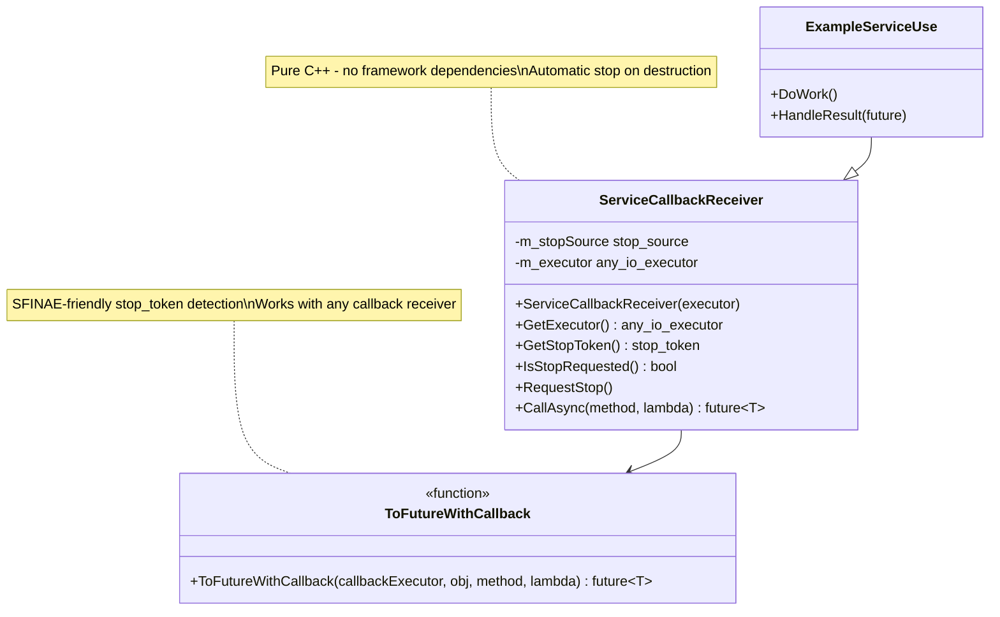
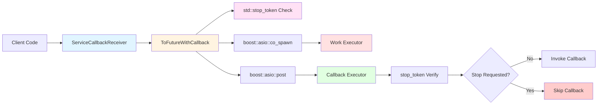
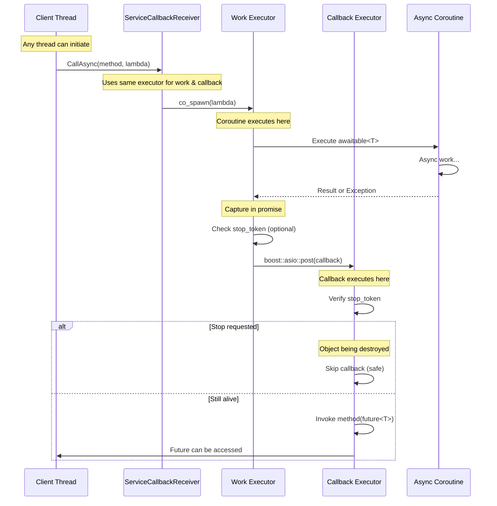
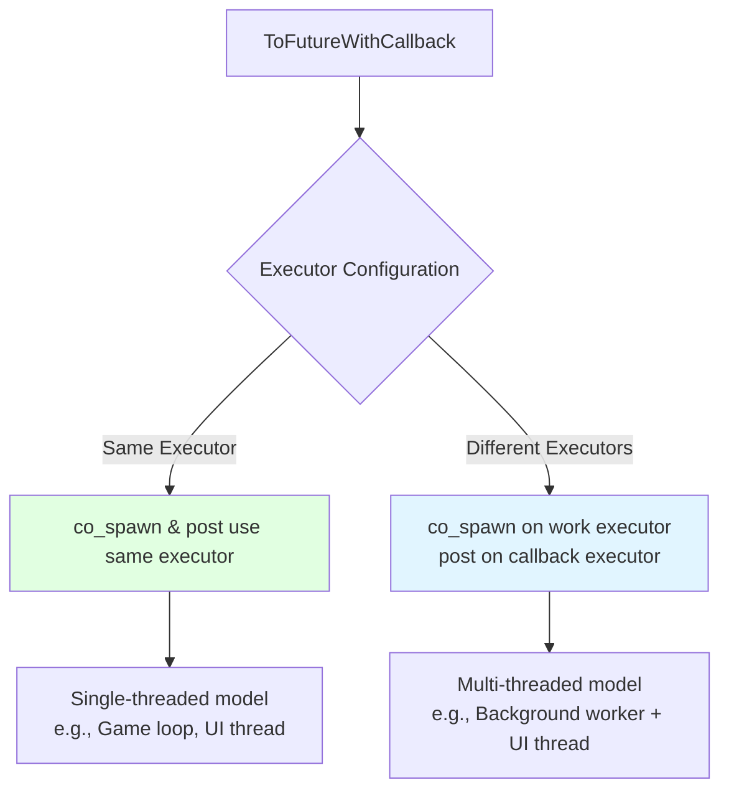
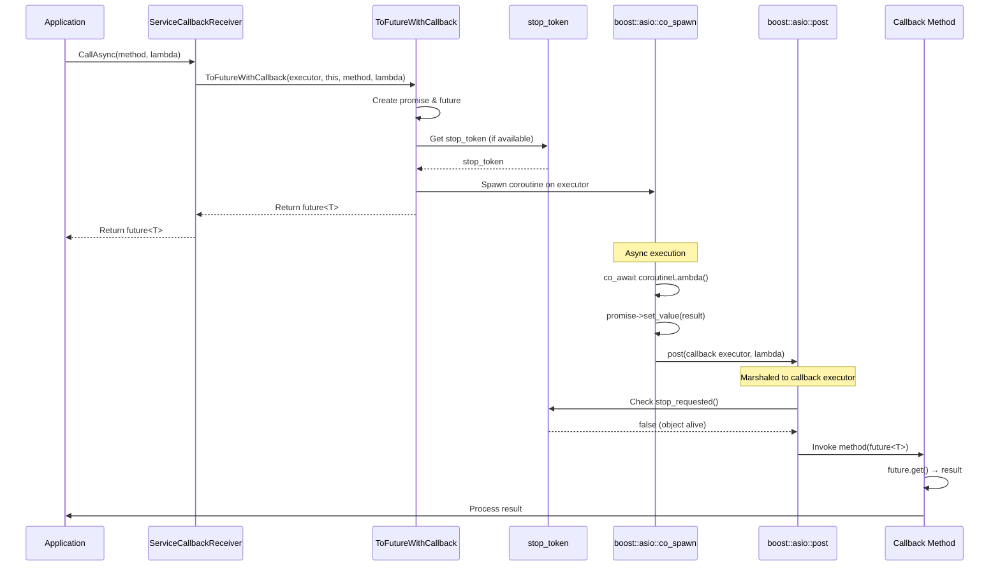
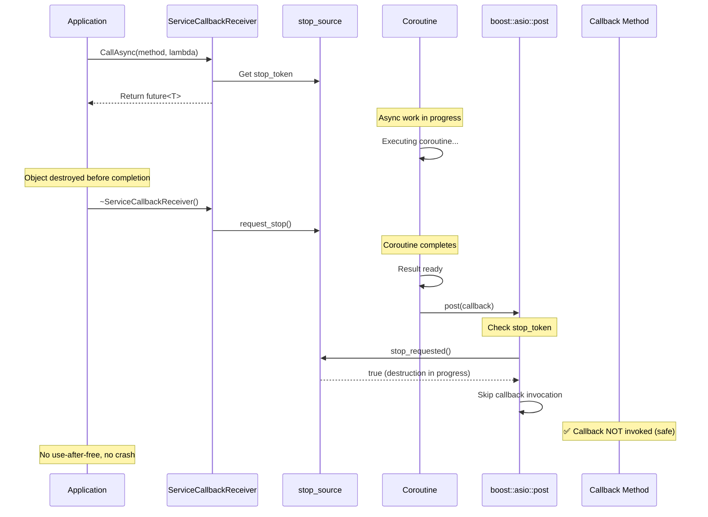
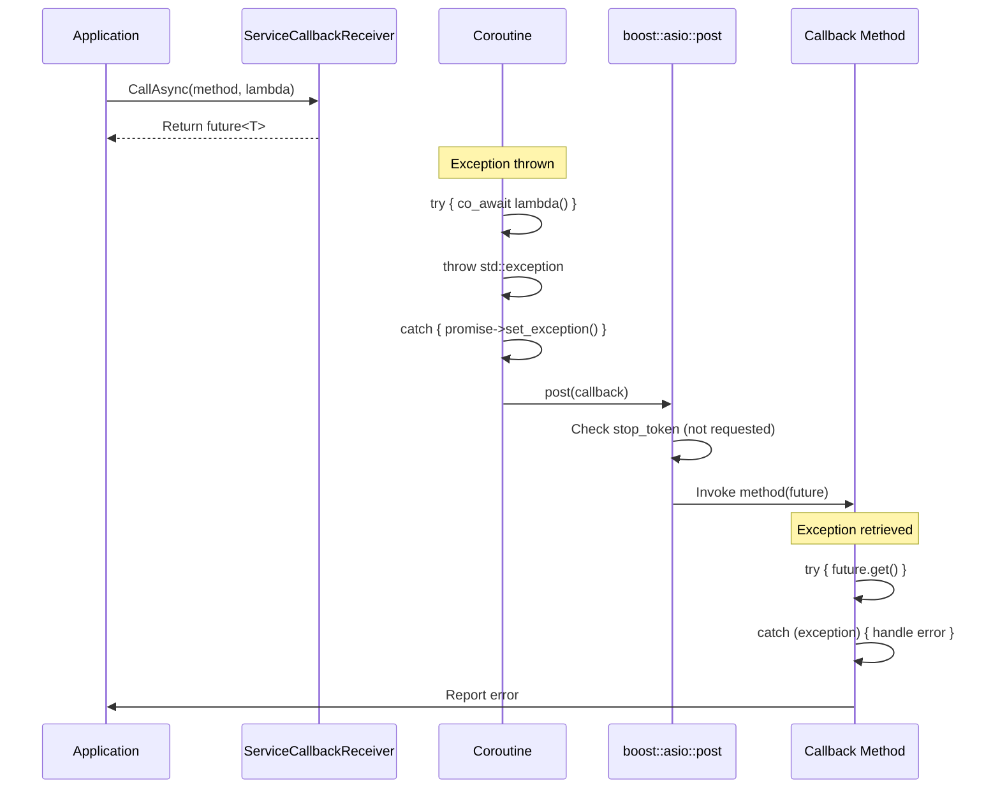
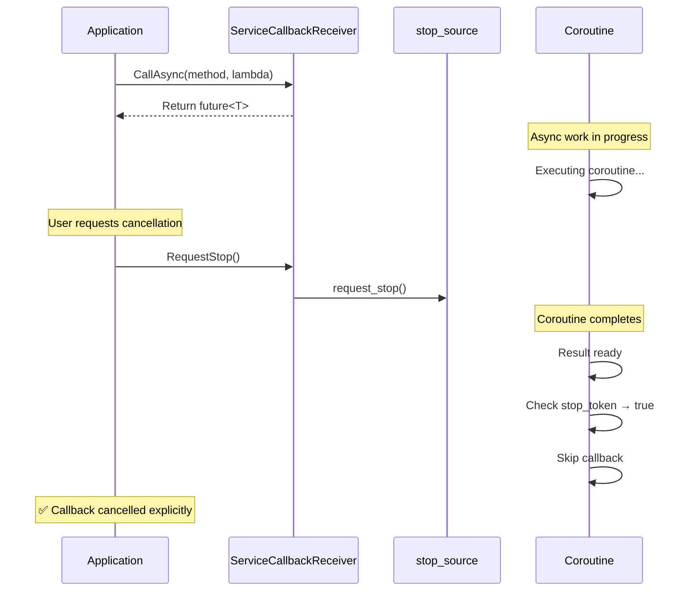
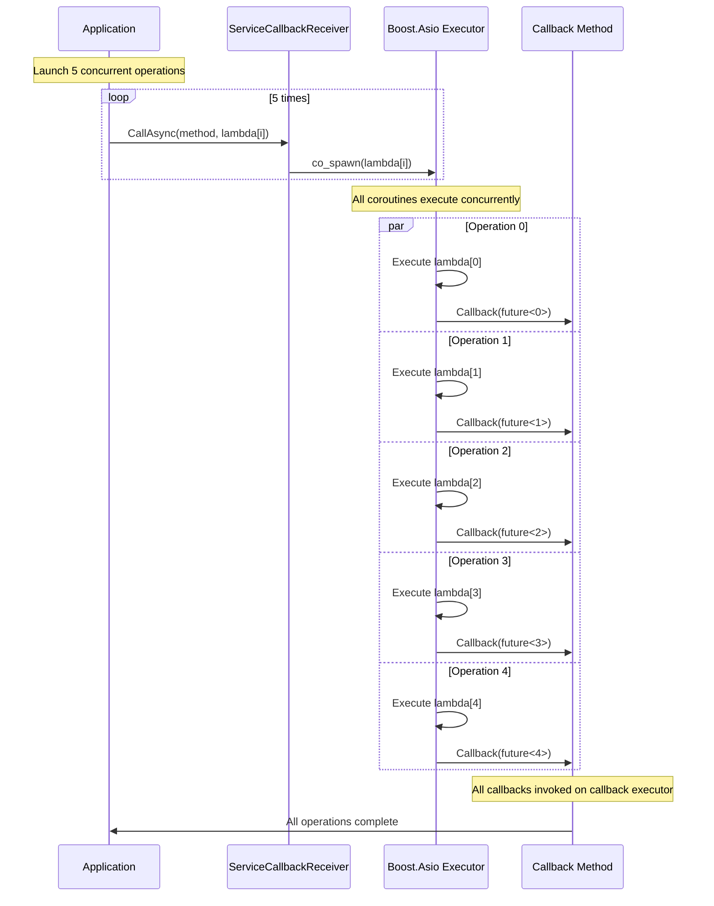
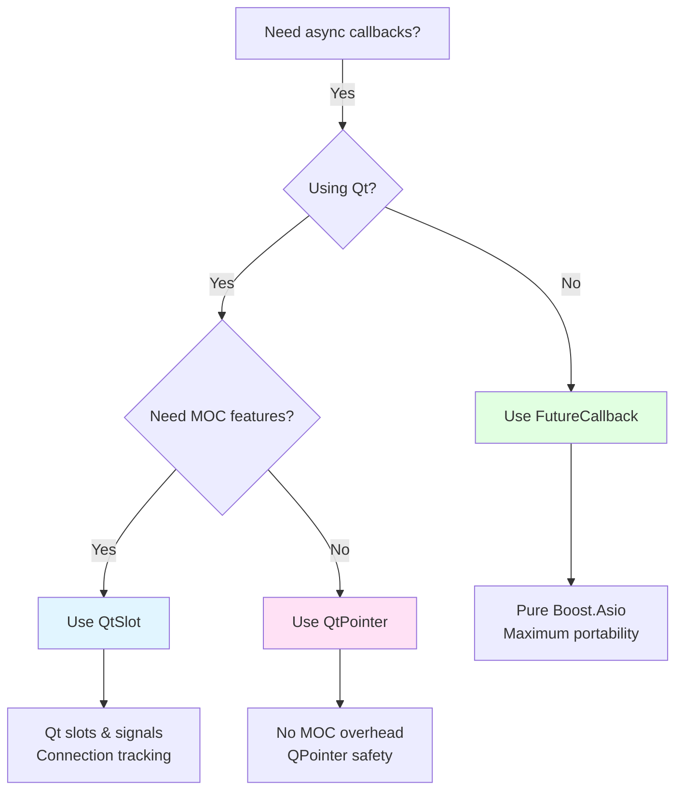

# Future Callback - Boost.Asio Coroutine Integration with stop_token

Pure Boost.Asio-based async helper for executing `boost::asio::awaitable<T>` coroutines with callback functions using `std::stop_token` for automatic lifetime safety.

## Overview

This is the original, framework-agnostic implementation that provides seamless integration between Boost.Asio coroutines and callback methods. It executes async operations on a Boost.Asio executor and posts callbacks back to a specified executor, with automatic lifetime safety via `std::stop_token`.

**Key Features:**
- ✅ Pure Boost.Asio - no Qt or other framework dependencies
- ✅ Automatic lifetime safety via `std::stop_token`
- ✅ Thread-safe callback marshaling using `boost::asio::post`
- ✅ Exception propagation through `std::future<T>`
- ✅ Support for both void and non-void result types
- ✅ Flexible executor model - work and callback can use different executors
- ✅ SFINAE-friendly `stop_token` detection (works with or without `GetStopToken()`)
- ✅ Header-only friendly design

## Architecture

### Class Diagram



### Component Interaction



## Threading Model

### Thread Boundaries and Executor Model



### Flexible Executor Configuration



## Sequence Diagrams

### Normal Flow - Successful Completion



### Lifetime Safety Flow - stop_token Protection



### Error Flow - Exception Handling



### Manual Cancellation Flow



### Multiple Concurrent Operations



### SFINAE-Friendly stop_token Detection

```mermaid
sequenceDiagram
    participant ToFuture as ToFutureWithCallback
    participant Callback as Callback Object
    participant StopToken as stop_token

    Note over ToFuture: Template instantiation
    ToFuture->>ToFuture: if constexpr (requires { obj->GetStopToken(); })

    alt Object has GetStopToken()
        ToFuture->>Callback: GetStopToken()
        Callback-->>ToFuture: stop_token
        Note over ToFuture: Use stop_token for safety
        ToFuture->>ToFuture: Capture stop_token
        Note over ToFuture: Check before callback invocation
    else Object lacks GetStopToken()
        Note over ToFuture: No stop_token support
        ToFuture->>ToFuture: Default-construct stop_token (never stops)
        Note over ToFuture: Callback always invoked<br/>(user manages lifetime)
    end
```

## API Reference

### ToFutureWithCallback

```cpp
template <typename TCallback, typename CallbackMethod, typename CoroutineLambda>
auto ToFutureWithCallback(
    boost::asio::any_io_executor callbackExecutor,
    TCallback* callbackObj,
    CallbackMethod callbackMethod,
    CoroutineLambda coroutineLambda
) -> std::future<T>
```

**Parameters:**
- `callbackExecutor`: Executor to run the callback on (and spawn coroutine)
- `callbackObj`: Pointer to callback receiver object
- `callbackMethod`: Pointer to callback member function (e.g., `&MyClass::handleResult`)
- `coroutineLambda`: Lambda returning `boost::asio::awaitable<T>`

**Returns:** `std::future<T>` for result access

**Requirements:**
- `callbackMethod` is a member function taking `std::future<T>`
- `coroutineLambda` must return `boost::asio::awaitable<T>`
- No specific base class required for `TCallback`

**Lifetime Safety:**
- If `TCallback` has `GetStopToken()` method: uses `std::stop_token` for safety
- Otherwise: callback always invoked (user manages lifetime)

**SFINAE Detection:**
```cpp
// Automatically detects GetStopToken() at compile time
if constexpr (requires { callbackObj->GetStopToken(); })
{
    stopToken = callbackObj->GetStopToken();
}
```

### ServiceCallbackReceiver

```cpp
class ServiceCallbackReceiver
{
protected:
    explicit ServiceCallbackReceiver(boost::asio::any_io_executor executor);
    ~ServiceCallbackReceiver();

public:
    const boost::asio::any_io_executor& GetExecutor() const noexcept;
    std::stop_token GetStopToken() const noexcept;
    bool IsStopRequested() const noexcept;
    void RequestStop();

    template <typename CallbackMethod, typename CoroutineLambda>
    auto CallAsync(CallbackMethod method, CoroutineLambda lambda);
};
```

**Lifecycle:**
- Constructor: Stores executor, creates `stop_source`
- Destructor: Automatically calls `request_stop()`
- Non-copyable, non-movable

**Methods:**
- `GetExecutor()`: Returns the stored executor
- `GetStopToken()`: Returns stop token for lifetime checking
- `IsStopRequested()`: Checks if stop requested (destruction or manual)
- `RequestStop()`: Manually request stop (early cancellation)
- `CallAsync()`: Convenience wrapper using stored executor

**Thread Safety:**
- Thread-safe when callbacks are posted to the same executor
- `stop_source` operations are thread-safe
- Recommended: single-threaded executor model per receiver

## Usage Examples

### Example 1: Basic Usage with ServiceCallbackReceiver

```cpp
class MyService : public Test3::ServiceCallbackReceiver
{
public:
    MyService(boost::asio::any_io_executor executor)
        : ServiceCallbackReceiver(executor)
    {
    }

    void fetchData()
    {
        // Clean syntax with CallAsync helper
        CallAsync(&MyService::onDataFetched,
                  []() -> boost::asio::awaitable<std::string>
                  {
                      // Simulate async database query
                      co_return std::string("Database result");
                  });
    }

private:
    void onDataFetched(std::future<std::string> future)
    {
        try
        {
            std::string data = future.get();
            // Process data
            std::cout << "Received: " << data << std::endl;
        }
        catch (const std::exception& ex)
        {
            std::cerr << "Error: " << ex.what() << std::endl;
        }
    }
};

// Usage:
boost::asio::io_context ioc;
auto service = std::make_shared<MyService>(ioc.get_executor());
service->fetchData();
ioc.run();
```

### Example 2: Automatic Lifetime Safety

```cpp
void demonstrateLifetimeSafety()
{
    boost::asio::io_context ioc;

    {
        auto service = std::make_shared<MyService>(ioc.get_executor());
        service->CallAsync(&MyService::onResult,
                           []() -> boost::asio::awaitable<int>
                           {
                               // Simulate long operation
                               co_return 42;
                           });

        // Service destroyed here - stop_token prevents callback
    } // ~ServiceCallbackReceiver() calls request_stop()

    // Safe to run - callback will be skipped
    ioc.run();
}
```

### Example 3: Error Handling

```cpp
class ApiClient : public Test3::ServiceCallbackReceiver
{
public:
    void fetchUser(int userId)
    {
        CallAsync(&ApiClient::onUserFetched,
                  [userId]() -> boost::asio::awaitable<User>
                  {
                      if (userId < 0)
                      {
                          throw std::invalid_argument("Invalid user ID");
                      }

                      // Simulate API call
                      User user;
                      user.id = userId;
                      user.name = "John Doe";
                      co_return user;
                  });
    }

private:
    void onUserFetched(std::future<User> future)
    {
        try
        {
            User user = future.get();
            std::cout << "User: " << user.name << std::endl;
        }
        catch (const std::invalid_argument& ex)
        {
            std::cerr << "Validation error: " << ex.what() << std::endl;
        }
        catch (const std::exception& ex)
        {
            std::cerr << "API error: " << ex.what() << std::endl;
        }
    }
};
```

### Example 4: Void Operations

```cpp
class Logger : public Test3::ServiceCallbackReceiver
{
public:
    void saveLogAsync(const std::string& message)
    {
        CallAsync(&Logger::onLogSaved,
                  [message]() -> boost::asio::awaitable<void>
                  {
                      // Simulate async file write
                      co_return;
                  });
    }

private:
    void onLogSaved(std::future<void> future)
    {
        try
        {
            future.get();  // Check for exceptions
            std::cout << "Log saved successfully" << std::endl;
        }
        catch (const std::exception& ex)
        {
            std::cerr << "Failed to save log: " << ex.what() << std::endl;
        }
    }
};
```

### Example 5: Multiple Concurrent Operations

```cpp
class BatchProcessor : public Test3::ServiceCallbackReceiver
{
public:
    void processBatch(const std::vector<std::string>& items)
    {
        m_totalItems = items.size();
        m_completedItems = 0;

        for (const auto& item : items)
        {
            CallAsync(&BatchProcessor::onItemProcessed,
                      [item]() -> boost::asio::awaitable<ProcessResult>
                      {
                          ProcessResult result;
                          result.item = item;
                          result.success = true;
                          co_return result;
                      });
        }
    }

private:
    void onItemProcessed(std::future<ProcessResult> future)
    {
        try
        {
            ProcessResult result = future.get();
            ++m_completedItems;

            std::cout << "Progress: " << m_completedItems
                      << "/" << m_totalItems << std::endl;

            if (m_completedItems == m_totalItems)
            {
                std::cout << "Batch complete!" << std::endl;
            }
        }
        catch (const std::exception& ex)
        {
            std::cerr << "Item failed: " << ex.what() << std::endl;
        }
    }

private:
    size_t m_totalItems = 0;
    size_t m_completedItems = 0;
};
```

### Example 6: Manual Cancellation

```cpp
class DownloadManager : public Test3::ServiceCallbackReceiver
{
public:
    void startDownload(const std::string& url)
    {
        m_downloadFuture = CallAsync(&DownloadManager::onDownloadComplete,
                                     [url]() -> boost::asio::awaitable<std::vector<uint8_t>>
                                     {
                                         // Simulate download
                                         std::vector<uint8_t> data = {1, 2, 3, 4, 5};
                                         co_return data;
                                     });
    }

    void cancelDownload()
    {
        // Manually request stop - callback will be skipped
        RequestStop();
    }

private:
    void onDownloadComplete(std::future<std::vector<uint8_t>> future)
    {
        // This won't be called if RequestStop() was called
        try
        {
            auto data = future.get();
            std::cout << "Downloaded " << data.size() << " bytes" << std::endl;
        }
        catch (const std::exception& ex)
        {
            std::cerr << "Download failed: " << ex.what() << std::endl;
        }
    }

private:
    std::future<std::vector<uint8_t>> m_downloadFuture;
};
```

### Example 7: Synchronous Wait

```cpp
class DataValidator : public Test3::ServiceCallbackReceiver
{
public:
    bool validateSync(const std::string& data)
    {
        // Get future for synchronous wait
        auto future = CallAsync(&DataValidator::onValidationComplete,
                                [data]() -> boost::asio::awaitable<bool>
                                {
                                    co_return !data.empty();
                                });

        // Block and wait for result (callback also invoked)
        try
        {
            return future.get();
        }
        catch (...)
        {
            return false;
        }
    }

private:
    void onValidationComplete(std::future<bool> future)
    {
        try
        {
            bool valid = future.get();
            std::cout << "Validation "
                      << (valid ? "passed" : "failed") << std::endl;
        }
        catch (const std::exception& ex)
        {
            std::cerr << "Validation error: " << ex.what() << std::endl;
        }
    }
};
```

### Example 8: Without ServiceCallbackReceiver (Custom Lifetime)

```cpp
// You can use ToFutureWithCallback directly without inheriting
class CustomService
{
public:
    CustomService(boost::asio::any_io_executor executor)
        : m_executor(executor)
    {
    }

    void doWork()
    {
        // Use standalone function - no stop_token support
        auto future = Test3::ToFutureWithCallback(
            m_executor,
            this,
            &CustomService::handleResult,
            []() -> boost::asio::awaitable<int>
            {
                co_return 42;
            });
    }

private:
    void handleResult(std::future<int> future)
    {
        try
        {
            int result = future.get();
            std::cout << "Result: " << result << std::endl;
        }
        catch (const std::exception& ex)
        {
            std::cerr << "Error: " << ex.what() << std::endl;
        }
    }

    boost::asio::any_io_executor m_executor;
};

// Note: Without ServiceCallbackReceiver, you must manage lifetime manually!
```

### Example 9: Different Work and Callback Executors

```cpp
void demonstrateMultiThreaded()
{
    // Separate executors for work and callbacks
    boost::asio::io_context workIoc;     // Background work
    boost::asio::io_context callbackIoc; // Callback thread (e.g., UI)

    auto service = std::make_shared<MyService>(callbackIoc.get_executor());

    // Explicitly specify work executor
    Test3::ToFutureWithCallback(
        callbackIoc.get_executor(),  // Callbacks on this executor
        service.get(),
        &MyService::onResult,
        []() -> boost::asio::awaitable<int>
        {
            // Work happens on the coroutine's spawning executor
            co_return 42;
        });

    // Run work on background thread
    std::thread workThread([&workIoc]() { workIoc.run(); });

    // Run callbacks on main thread
    callbackIoc.run();

    workThread.join();
}
```

## When to Use This Implementation

### ✅ Use FutureCallback When:

- You want pure Boost.Asio without framework dependencies
- You need maximum portability across different platforms
- You're building a library that shouldn't depend on Qt or other UI frameworks
- You want explicit executor control (work vs callback executors)
- You prefer C++ standard library patterns (`std::stop_token`, `std::future`)
- You're working in non-UI contexts (servers, command-line tools, background services)
- You want the most flexible foundation for other integrations

### ⚠️ Consider Alternatives When:

- You're in a Qt application (use `Test3::QtSlot` or `Test3::QtPointer`)
- You need Qt-specific integration (signals, slots, MOC)
- You want Qt's parent-child memory management
- Your codebase is Qt-centric

## Performance Considerations

### stop_token Overhead

**Check Cost:**
- Two `stop_requested()` checks per callback (very lightweight)
- `stop_requested()` is atomic load (nanoseconds)
- No synchronization overhead beyond atomic operation

**Memory Overhead:**
- `stop_source` per `ServiceCallbackReceiver` instance (~16 bytes)
- `stop_token` captured in lambda (~8 bytes)
- No heap allocation for tokens themselves

### boost::asio::post Overhead

- Uses Boost.Asio's strand/executor queue
- Small latency (microseconds typically)
- Zero-copy for lambda capture
- Efficient for typical async operations (millisecond+ duration)

### Comparison with Qt Implementations

| Metric | FutureCallback | QtSlot | QtPointer |
|--------|----------------|---------|-----------|
| **Lifetime Check** | stop_token (atomic) | Connection tracking | QPointer (weak ptr) |
| **Check Cost** | ~2-5ns | ~5-10ns | ~10-20ns |
| **Memory Overhead** | ~24 bytes | ~32 bytes | ~16 bytes |
| **Framework Dependency** | ✅ None | Qt + MOC | Qt (no MOC) |
| **Portability** | ✅ Highest | Qt-only | Qt-only |
| **Typical Overhead** | ~10ns total | ~20-30ns total | ~20ns total |

**Recommendation:** All implementations have negligible overhead. Choose based on framework requirements, not performance.

## Troubleshooting

### Callback Not Invoked

**Problem:** Callback method never called

**Possible Causes:**
1. Object destroyed before coroutine completed (expected with `stop_token`)
2. Executor not running
3. Wrong executor specified

**Solutions:**
1. Verify object lifetime:
```cpp
std::cout << "Stop requested: " << receiver->IsStopRequested() << std::endl;
```

2. Ensure executor is running:
```cpp
ioc.run();  // Blocks until work completes
```

3. Check executor correctness:
```cpp
// Same executor for work and callback
auto future = CallAsync(method, lambda);
```

### Compiler Error: "stop_token not found"

**Problem:** Missing C++20 stop_token support

**Solution:**
```cpp
// Requires C++20
// CMakeLists.txt:
set(CMAKE_CXX_STANDARD 20)

// Or use C++20 flag:
target_compile_features(MyTarget PRIVATE cxx_std_20)
```

### Compiler Error: "awaitable<T> not found"

**Problem:** Missing Boost.Asio includes

**Solution:**
```cpp
#include <boost/asio/awaitable.hpp>
#include <boost/asio/co_spawn.hpp>
#include <boost/asio/io_context.hpp>
```

### stop_token Never Stops

**Problem:** Callback always invoked even after destruction

**Cause:** Not using `ServiceCallbackReceiver` or not calling `RequestStop()`

**Solution:**
```cpp
// Option 1: Inherit from ServiceCallbackReceiver
class MyService : public Test3::ServiceCallbackReceiver { };

// Option 2: Manual lifetime management
class MyService {
    void cancel() { m_stopSource.request_stop(); }
    std::stop_source m_stopSource;
};
```

### Future Already Retrieved Error

**Problem:** `std::future_error` when calling `get()` twice

**Cause:** Futures can only be retrieved once

**Solution:**
```cpp
// Bad - get() called twice
auto future = CallAsync(method, lambda);
auto result1 = future.get();  // OK
auto result2 = future.get();  // ERROR!

// Good - get() called once
auto future = CallAsync(method, lambda);
auto result = future.get();  // OK

// Or use shared_future
auto future = CallAsync(method, lambda).share();
auto result1 = future.get();  // OK
auto result2 = future.get();  // OK
```

## Build Setup

### CMake Configuration

```cmake
# Requires C++20 for std::stop_token
set(CMAKE_CXX_STANDARD 20)
set(CMAKE_CXX_STANDARD_REQUIRED ON)

# Find Boost
find_package(Boost 1.70 REQUIRED COMPONENTS system)

# Your target
add_executable(MyApp
    main.cpp
    myservice.cpp
    myservice.h
)

target_link_libraries(MyApp
    PRIVATE
    Boost::system
)

# Include path for Test3 headers
target_include_directories(MyApp
    PRIVATE
    ${CMAKE_SOURCE_DIR}/include
)
```

### Compiler Requirements

- **C++20**: Required for `std::stop_token`, `std::stop_source`
- **Boost 1.70+**: Required for coroutines (`boost::asio::awaitable`, `co_spawn`)
- **Compilers**: GCC 10+, Clang 11+, MSVC 2019 16.8+

### Header Include Pattern

```cpp
#include <Test3/ServiceCallbackReceiver.hpp>
#include <Test3/ToFutureWithCallback.hpp>
#include <boost/asio/io_context.hpp>
#include <boost/asio/awaitable.hpp>
#include <future>

class MyService : public Test3::ServiceCallbackReceiver
{
    // Implementation
};
```

## Limitations

1. **C++20 Requirement**: Requires `std::stop_token` (C++20)
2. **Boost.Asio Dependency**: Requires Boost 1.70+ for coroutines
3. **No Built-in Connection Tracking**: Unlike Qt slots, no query for pending operations
4. **Single Future Retrieval**: `std::future<T>` can only call `get()` once (use `share()` if needed)
5. **Executor Must Run**: Callbacks won't execute if executor's `run()` is never called

## Comparison with Qt Implementations

| Feature | FutureCallback (This) | QtSlot | QtPointer |
|---------|----------------------|---------|-----------|
| **Framework Dependency** | ✅ None (Pure Boost.Asio) | Qt + MOC | Qt (no MOC) |
| **Lifetime Safety** | `std::stop_token` | Connection tracking | QPointer |
| **Callback Type** | Member function | Qt slot | Member function |
| **Explicit Cancellation** | ✅ `RequestStop()` | ✅ `disconnect()` | ❌ No |
| **Build Complexity** | ✅ Simple | MOC required | Simple |
| **Portability** | ✅ Highest | Qt-only | Qt-only |
| **Thread Model** | Boost.Asio executors | Qt + Boost.Asio | Qt + Boost.Asio |
| **Overhead** | ✅ Minimal | Small | Minimal |
| **C++ Standard** | C++20 | C++17+ | C++17+ |

### When to Choose Which



## See Also

- `Test3::QtSlot` - Qt slot-based implementation with connection tracking
- `Test3::QtPointer` - Lightweight Qt implementation without MOC
- Boost.Asio Documentation: [Coroutines](https://www.boost.org/doc/libs/release/doc/html/boost_asio/overview/composition/coroutine.html)
- C++20 Documentation: [std::stop_token](https://en.cppreference.com/w/cpp/thread/stop_token)
- Presentation: `docs/presentation_async_patterns.md` - Detailed async patterns explanation
