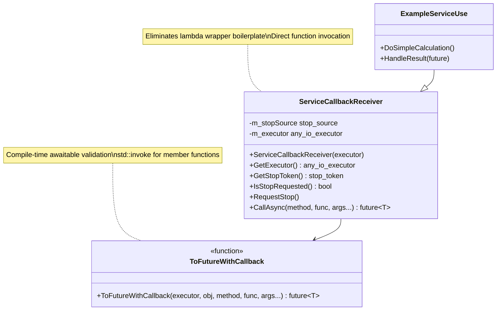
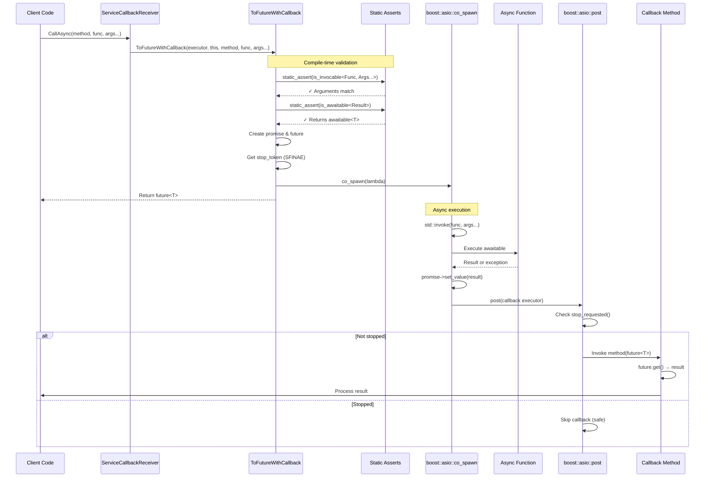
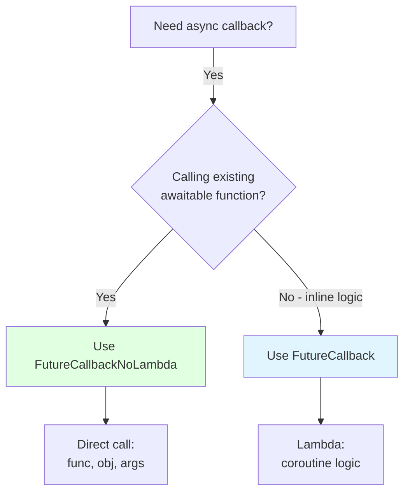

# FutureCallbackNoLambda - Direct Awaitable Function Calls

Eliminates lambda wrapper boilerplate when calling `boost::asio::awaitable<T>`-returning functions with callback-based result handling and `std::stop_token` lifetime safety.

## Overview

This implementation allows you to call awaitable-returning functions **directly** by passing the function and its arguments, eliminating the verbose lambda wrappers required by the original `FutureCallback` implementation.

**Key Features:**
- ✅ **No lambda wrappers** - call awaitable functions directly
- ✅ Automatic lifetime safety via `std::stop_token`
- ✅ Thread-safe callback marshaling using `boost::asio::post`
- ✅ Exception propagation through `std::future<T>`
- ✅ Support for both void and non-void result types
- ✅ Compile-time validation with clear error messages
- ✅ Member functions, free functions, and functors all supported
- ✅ Pure Boost.Asio - no framework dependencies

## Before and After Comparison

### Old Way (FutureCallback with Lambda Wrapper)

```cpp
// Verbose lambda wrapper required
auto future = CallAsync(&MyClass::OnResult,
                        [this, service]() -> boost::asio::awaitable<double>
                        {
                            return service->AddAsync(10.0, 32.0);
                        });
```

### New Way (FutureCallbackNoLambda Direct Call)

```cpp
// Direct call - no lambda wrapper!
auto future = CallAsync(&MyClass::OnResult,
                        &IAddService::AddAsync, service, 10.0, 32.0);
```

**Result:** Cleaner syntax, less boilerplate, easier to read and maintain.

## Architecture

### Class Diagram



### Execution Flow



## API Reference

### ToFutureWithCallback

```cpp
template <typename TCallback, typename CallbackMethod, typename AwaitableFunc, typename... Args>
auto ToFutureWithCallback(
    boost::asio::any_io_executor callbackExecutor,
    TCallback* callbackObj,
    CallbackMethod callbackMethod,
    AwaitableFunc awaitableFunc,
    Args&&... args
) -> std::future<T>
```

**Parameters:**
- `callbackExecutor`: Executor to run the callback on
- `callbackObj`: Pointer to callback receiver object
- `callbackMethod`: Pointer to callback member function (e.g., `&MyClass::handleResult`)
- `awaitableFunc`: Function that returns `boost::asio::awaitable<T>` when called with `args`
- `args...`: Arguments to pass to the awaitable function

**Returns:** `std::future<T>` for result access

**Compile-Time Validation:**
```cpp
// Validates arguments match function signature
static_assert(std::is_invocable_v<AwaitableFunc, Args...>,
              "Function must be callable with provided arguments. "
              "Check that argument types match the function signature.");

// Validates return type is awaitable<T>
static_assert(Detail::is_awaitable_v<AwaitableType>,
              "Function must return boost::asio::awaitable<T>. "
              "If calling a member function, use: &Class::method, objectPtr, args...");
```

**Supported Function Types:**
- Member functions: `&Class::method, objectPtr, arg1, arg2`
- Free functions: `&freeFunction, arg1, arg2`
- Function pointers: `funcPtr, arg1, arg2`
- Functors/Lambdas: `functor, arg1, arg2` (that return `awaitable<T>`)

### ServiceCallbackReceiver

```cpp
class ServiceCallbackReceiver
{
protected:
    explicit ServiceCallbackReceiver(boost::asio::any_io_executor executor);
    ~ServiceCallbackReceiver();

public:
    const boost::asio::any_io_executor& GetExecutor() const noexcept;
    std::stop_token GetStopToken() const noexcept;
    bool IsStopRequested() const noexcept;
    void RequestStop();

    template <typename CallbackMethod, typename AwaitableFunc, typename... Args>
    auto CallAsync(CallbackMethod method, AwaitableFunc awaitableFunc, Args&&... args);
};
```

**Lifecycle:**
- Constructor: Stores executor, creates `stop_source`
- Destructor: Automatically calls `request_stop()`
- Non-copyable, non-movable

**Methods:**
- `GetExecutor()`: Returns the stored executor
- `GetStopToken()`: Returns stop token for lifetime checking
- `IsStopRequested()`: Checks if stop requested (destruction or manual)
- `RequestStop()`: Manually request stop (early cancellation)
- `CallAsync()`: Convenience wrapper for direct function calls

## Usage Examples

### Example 1: Member Function Direct Call

```cpp
class MyService : public Test3::NoLambda::ServiceCallbackReceiver
{
public:
    MyService(boost::asio::any_io_executor executor, ICalculatorService* calc)
        : ServiceCallbackReceiver(executor), m_calc(calc)
    {
    }

    void performCalculation()
    {
        // OLD: Lambda wrapper
        // CallAsync(&MyService::onResult,
        //           [this]() { return m_calc->AddAsync(10.0, 20.0); });

        // NEW: Direct call
        CallAsync(&MyService::onResult,
                  &ICalculatorService::AddAsync, m_calc, 10.0, 20.0);
    }

private:
    void onResult(std::future<double> future)
    {
        try
        {
            double result = future.get();
            std::cout << "Result: " << result << std::endl;
        }
        catch (const std::exception& ex)
        {
            std::cerr << "Error: " << ex.what() << std::endl;
        }
    }

    ICalculatorService* m_calc;
};
```

### Example 2: Free Function Call

```cpp
// Free function that returns awaitable
boost::asio::awaitable<std::string> FormatMessageAsync(std::string name, int id)
{
    co_return name + " (ID: " + std::to_string(id) + ")";
}

class MessageFormatter : public Test3::NoLambda::ServiceCallbackReceiver
{
public:
    void formatMessage(const std::string& name, int id)
    {
        // Call free function directly
        CallAsync(&MessageFormatter::onFormatted,
                  &FormatMessageAsync, name, id);
    }

private:
    void onFormatted(std::future<std::string> future)
    {
        try
        {
            std::string result = future.get();
            std::cout << "Formatted: " << result << std::endl;
        }
        catch (const std::exception& ex)
        {
            std::cerr << "Error: " << ex.what() << std::endl;
        }
    }
};
```

### Example 3: Error Handling

```cpp
class SafeDivider : public Test3::NoLambda::ServiceCallbackReceiver
{
public:
    void divide(double numerator, double denominator)
    {
        CallAsync(&SafeDivider::onDivisionResult,
                  &ICalculatorService::DivideAsync, m_calc, numerator, denominator);
    }

private:
    void onDivisionResult(std::future<double> future)
    {
        try
        {
            double result = future.get();
            std::cout << "Division result: " << result << std::endl;
        }
        catch (const std::invalid_argument& ex)
        {
            std::cerr << "Validation error: " << ex.what() << std::endl;
        }
        catch (const std::exception& ex)
        {
            std::cerr << "Calculation error: " << ex.what() << std::endl;
        }
    }

    ICalculatorService* m_calc;
};
```

### Example 4: Void Operations

```cpp
class Logger : public Test3::NoLambda::ServiceCallbackReceiver
{
public:
    void logMessage(const std::string& message)
    {
        CallAsync(&Logger::onLogComplete,
                  &ILogService::LogAsync, m_logService, message);
    }

private:
    void onLogComplete(std::future<void> future)
    {
        try
        {
            future.get();  // Check for exceptions
            std::cout << "Log saved successfully" << std::endl;
        }
        catch (const std::exception& ex)
        {
            std::cerr << "Failed to save log: " << ex.what() << std::endl;
        }
    }

    ILogService* m_logService;
};
```

### Example 5: Multiple Arguments

```cpp
boost::asio::awaitable<int> CalculateSumAsync(int a, int b, int c)
{
    co_return a + b + c;
}

class Calculator : public Test3::NoLambda::ServiceCallbackReceiver
{
public:
    void calculateSum(int a, int b, int c)
    {
        // Pass multiple arguments directly
        CallAsync(&Calculator::onSumCalculated,
                  &CalculateSumAsync, a, b, c);
    }

private:
    void onSumCalculated(std::future<int> future)
    {
        try
        {
            int result = future.get();
            std::cout << "Sum: " << result << std::endl;
        }
        catch (const std::exception& ex)
        {
            std::cerr << "Error: " << ex.what() << std::endl;
        }
    }
};
```

### Example 6: Batch Operations

```cpp
class BatchProcessor : public Test3::NoLambda::ServiceCallbackReceiver
{
public:
    void processBatch(const std::vector<std::pair<double, double>>& items)
    {
        m_totalItems = items.size();
        m_completedItems = 0;

        for (const auto& [a, b] : items)
        {
            CallAsync(&BatchProcessor::onItemProcessed,
                      &ICalculatorService::AddAsync, m_calc, a, b);
        }
    }

private:
    void onItemProcessed(std::future<double> future)
    {
        try
        {
            double result = future.get();
            ++m_completedItems;

            std::cout << "Progress: " << m_completedItems
                      << "/" << m_totalItems << " (result: " << result << ")" << std::endl;

            if (m_completedItems == m_totalItems)
            {
                std::cout << "Batch complete!" << std::endl;
            }
        }
        catch (const std::exception& ex)
        {
            std::cerr << "Item failed: " << ex.what() << std::endl;
        }
    }

    ICalculatorService* m_calc;
    size_t m_totalItems = 0;
    size_t m_completedItems = 0;
};
```

### Example 7: Lifetime Safety

```cpp
void demonstrateLifetimeSafety()
{
    boost::asio::io_context ioc;
    ICalculatorService* calc = getCalculatorService();

    {
        auto processor = std::make_shared<BatchProcessor>(ioc.get_executor(), calc);

        // Launch async operation
        processor->CallAsync(&BatchProcessor::onResult,
                             &ICalculatorService::AddAsync, calc, 10.0, 20.0);

        // Object destroyed here - stop_token prevents callback
    } // ~ServiceCallbackReceiver() calls request_stop()

    // Safe to run - callback will be skipped
    ioc.run();
}
```

## When to Use This Implementation

### ✅ Use FutureCallbackNoLambda When:

- You're calling **existing** awaitable-returning functions (services, APIs, etc.)
- You want to **eliminate lambda wrapper boilerplate**
- You need clean, direct function call syntax
- You're working with multiple arguments and want readable code
- You want compile-time validation of function signatures

### ⚠️ Use FutureCallback (Lambda Version) When:

- You're **creating new async logic** inline (not calling existing functions)
- You need to **chain multiple awaitable calls** in one lambda
- You want to **capture and transform** data before calling async functions
- You're writing **complex coroutine logic** that doesn't map to a single function call

### Example Comparison

```cpp
// FutureCallbackNoLambda - Best for calling existing functions
CallAsync(&Handler, &Service::OperationAsync, service, arg1, arg2);

// FutureCallback - Best for inline coroutine logic
CallAsync(&Handler, [service, arg1, arg2]() -> boost::asio::awaitable<Result>
{
    auto intermediate = co_await service->FirstAsync(arg1);
    auto final = co_await service->SecondAsync(intermediate, arg2);
    co_return final;
});
```

## Compile-Time Error Messages

The implementation provides clear compile-time error messages for common mistakes:

### Error: Wrong Argument Types

```cpp
// Function expects (IService*, double, double)
CallAsync(&Handler, &IService::Method, service, "wrong", "types");

// Compiler error:
// static assertion failed: Function must be callable with provided arguments.
// Check that argument types match the function signature.
```

### Error: Doesn't Return Awaitable

```cpp
// Function returns int, not awaitable<int>
CallAsync(&Handler, &SomeClass::SyncMethod, obj, 42);

// Compiler error:
// static assertion failed: Function must return boost::asio::awaitable<T>.
// If calling a member function, use: &Class::method, objectPtr, args...
```

## Comparison with FutureCallback

| Feature | FutureCallback | FutureCallbackNoLambda |
|---------|----------------|------------------------|
| **Syntax** | Lambda wrapper | Direct function call |
| **Verbosity** | Higher (lambda boilerplate) | Lower (no wrapper) |
| **Use Case** | Inline coroutine logic | Calling existing functions |
| **Function Type** | Lambda returning `awaitable<T>` | Function returning `awaitable<T>` |
| **Arguments** | Captured in lambda | Passed directly |
| **Compile Errors** | Lambda-related errors | Function signature errors |
| **Readability** | Good for complex logic | Excellent for simple calls |
| **Both Share** | stop_token safety, future-based results, exception handling |

### Decision Matrix



## Build Setup

### CMake Configuration

```cmake
# Requires C++20 for std::stop_token
set(CMAKE_CXX_STANDARD 20)
set(CMAKE_CXX_STANDARD_REQUIRED ON)

# Find Boost
find_package(Boost 1.70 REQUIRED COMPONENTS system)

# Your target
add_executable(MyApp
    main.cpp
    myservice.cpp
)

target_link_libraries(MyApp
    PRIVATE
    Boost::system
)

# Include path for Test3 headers
target_include_directories(MyApp
    PRIVATE
    ${CMAKE_SOURCE_DIR}/include
)
```

### Header Include Pattern

```cpp
#include <Test3/FutureCallbackNoLambda/ServiceCallbackReceiver.hpp>
#include <Test3/FutureCallbackNoLambda/ToFutureWithCallback.hpp>
#include <boost/asio/io_context.hpp>
#include <boost/asio/awaitable.hpp>
#include <future>

class MyService : public Test3::NoLambda::ServiceCallbackReceiver
{
    // Implementation
};
```

## Troubleshooting

### Callback Not Invoked

**Problem:** Callback method never called

**Possible Causes:**
1. Object destroyed before coroutine completed (expected with `stop_token`)
2. Executor not running
3. Wrong executor specified

**Solutions:**
```cpp
// Verify object lifetime
std::cout << "Stop requested: " << receiver->IsStopRequested() << std::endl;

// Ensure executor is running
ioc.run();

// Check executor correctness
auto future = CallAsync(method, func, args...);
```

### Compiler Error: Arguments Don't Match

**Problem:** `static_assert` fails about callable with arguments

**Cause:** Argument types don't match function signature

**Solution:**
```cpp
// Check function signature
boost::asio::awaitable<double> AddAsync(double a, double b);

// Ensure argument types match exactly
CallAsync(&Handler, &Service::AddAsync, service, 10.0, 20.0);  // ✓ Correct
// CallAsync(&Handler, &Service::AddAsync, service, 10, 20);    // ✗ Wrong (int vs double)
```

### Compiler Error: Not an Awaitable

**Problem:** `static_assert` fails about returning `awaitable<T>`

**Cause:** Function doesn't return `boost::asio::awaitable<T>`

**Solution:**
```cpp
// Function must return awaitable<T>
boost::asio::awaitable<int> MyFunc() { co_return 42; }  // ✓ Correct

// Not a coroutine
int MyFunc() { return 42; }  // ✗ Wrong - use FutureCallback instead
```

### Member Function Syntax Error

**Problem:** Can't figure out how to call member functions

**Solution:**
```cpp
// Member function syntax: &Class::method, objectPtr, args...
CallAsync(&Handler, &IService::Method, servicePtr, arg1, arg2);

// NOT: servicePtr->Method (this would call it immediately)
// NOT: &IService::Method, arg1, arg2 (missing object pointer)
```

## Limitations

1. **C++20 Requirement**: Requires `std::stop_token` and `std::invoke`
2. **Boost.Asio Dependency**: Requires Boost 1.70+ for coroutines
3. **Awaitable Functions Only**: Function must return `boost::asio::awaitable<T>`
4. **Single Future Retrieval**: `std::future<T>` can only call `get()` once
5. **Executor Must Run**: Callbacks won't execute if executor's `run()` is never called

## See Also

- `Test3::FutureCallback` - Original lambda-based implementation for inline coroutine logic
- `Test3::QtSlot` - Qt slot-based implementation with connection tracking
- `Test3::QtPointer` - Lightweight Qt implementation without MOC
- Boost.Asio Documentation: [Coroutines](https://www.boost.org/doc/libs/release/doc/html/boost_asio/overview/composition/coroutine.html)
- C++20 Documentation: [std::invoke](https://en.cppreference.com/w/cpp/utility/functional/invoke)
