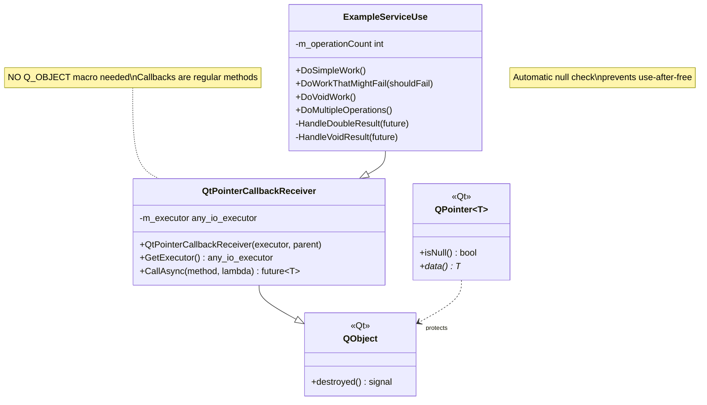
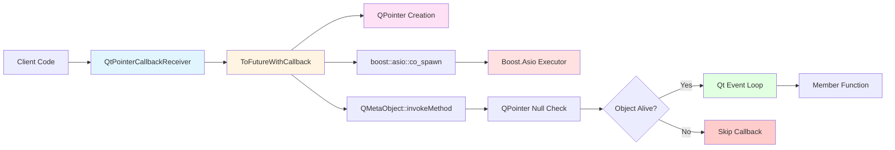
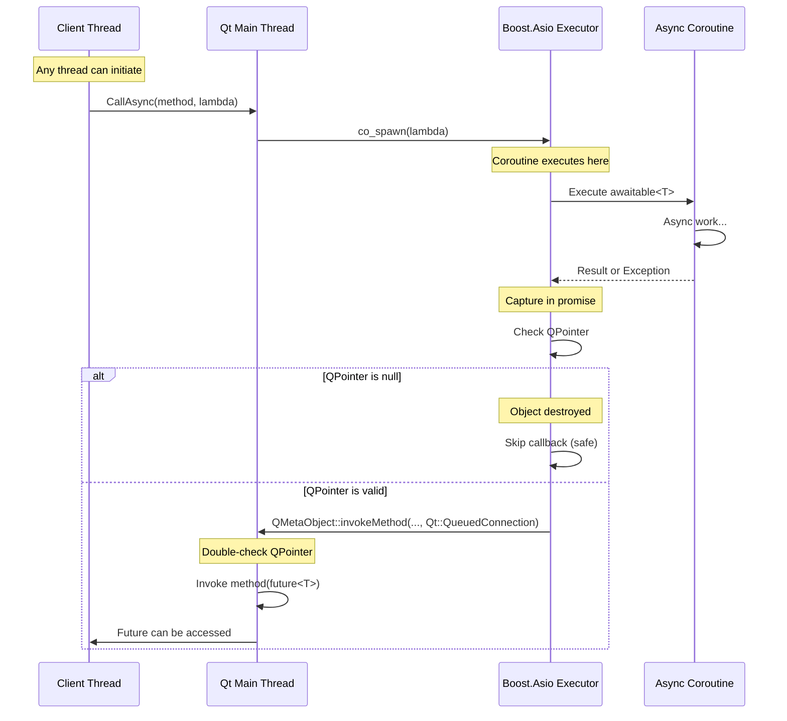
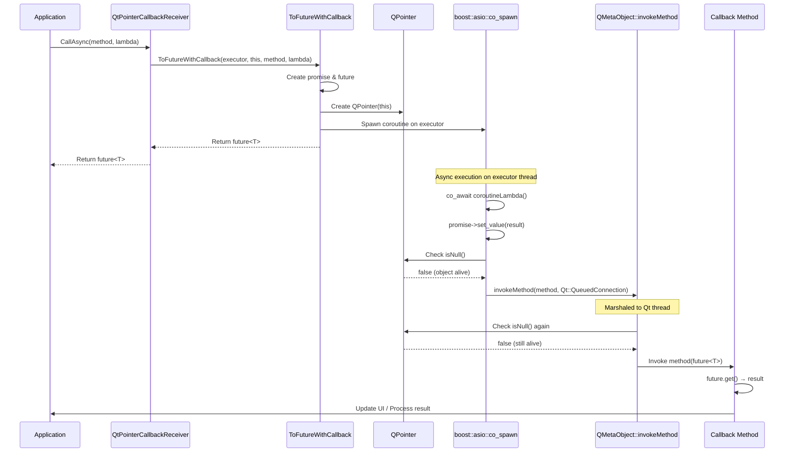
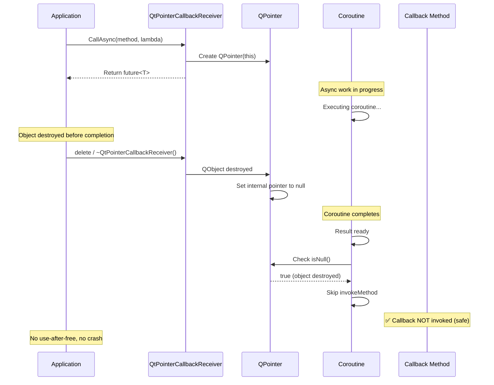
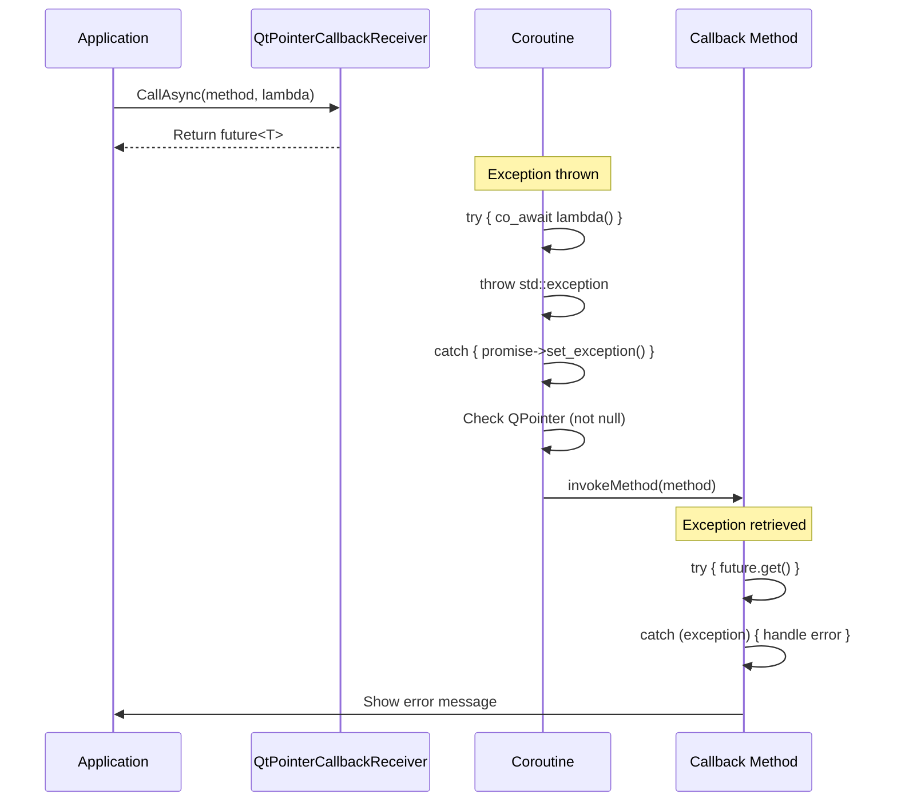
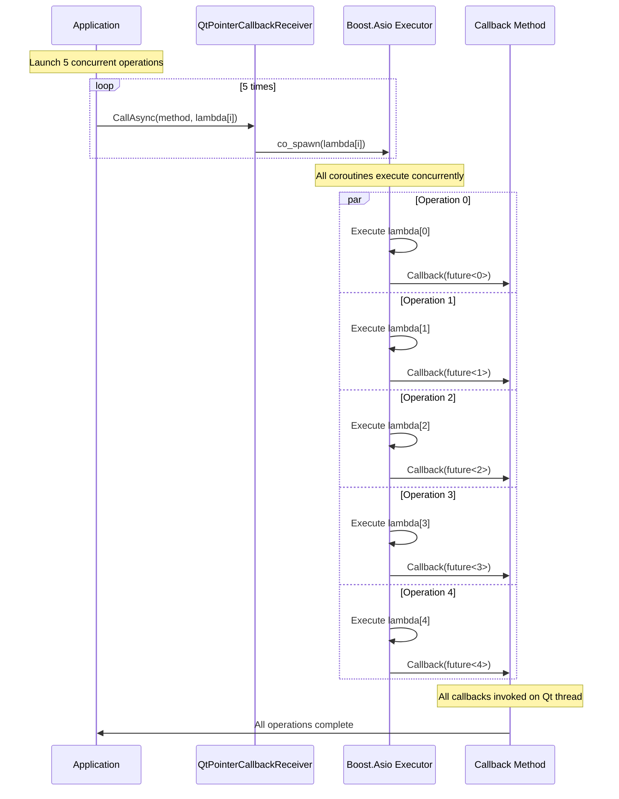
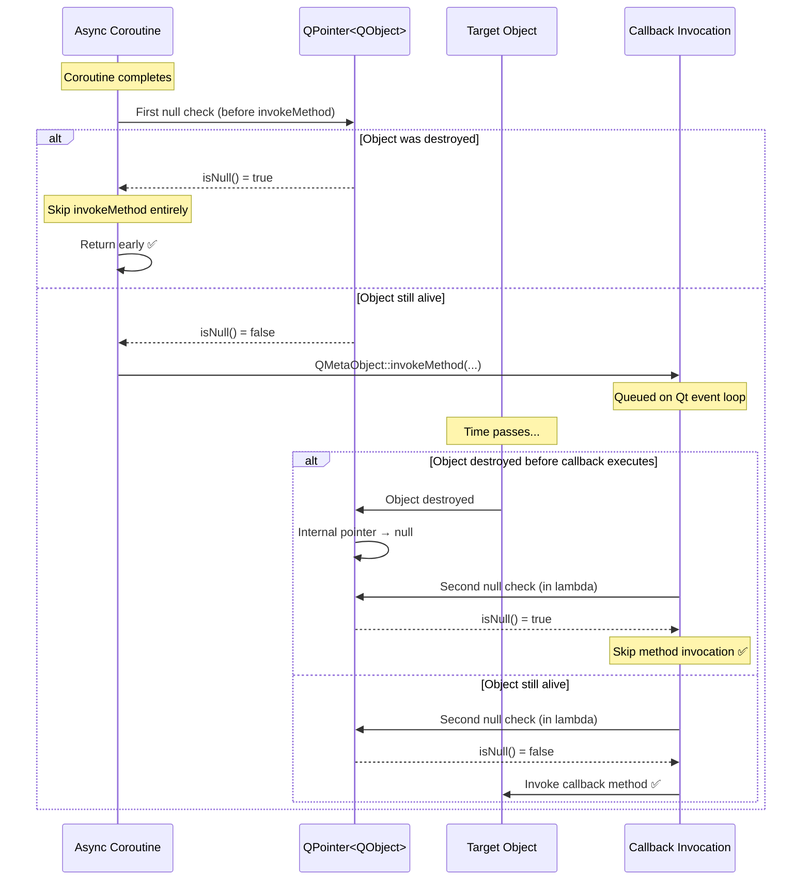
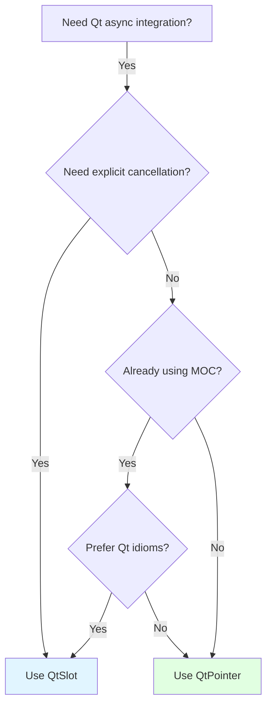

# Qt Pointer Callback - Boost.Asio Coroutine Integration

Lightweight Qt5-based async helper for executing `boost::asio::awaitable<T>` coroutines with automatic lifetime safety using QPointer, without requiring Qt's MOC or slot declarations.

## Overview

This implementation provides simple integration between Boost.Asio coroutines and QObject callbacks without MOC dependencies. It executes async operations on a Boost.Asio executor and marshals callbacks back to QObject member functions using `Qt::QueuedConnection`, with automatic lifetime safety via QPointer.

**Key Features:**
- ✅ No Q_OBJECT macro required - works without MOC
- ✅ Regular member functions as callbacks (no slots needed)
- ✅ Automatic lifetime safety via QPointer null checks
- ✅ Thread-safe callback marshaling using Qt's queued connections
- ✅ Exception propagation through `std::future<T>`
- ✅ Support for both void and non-void result types
- ✅ Header-only friendly design
- ✅ Minimal overhead compared to slot-based approach

## Architecture

### Class Diagram



### Component Interaction



## Threading Model

### Thread Boundaries



## Sequence Diagrams

### Normal Flow - Successful Completion



### Lifetime Safety Flow - Object Destroyed



### Error Flow - Exception Handling



### Multiple Concurrent Operations



### QPointer Protection Mechanism



## API Reference

### ToFutureWithCallback

```cpp
template <typename TCallback, typename CallbackMethod, typename CoroutineLambda>
auto ToFutureWithCallback(
    boost::asio::any_io_executor workExecutor,
    TCallback* callbackObj,
    CallbackMethod callbackMethod,
    CoroutineLambda coroutineLambda
) -> std::future<T>
```

**Parameters:**
- `workExecutor`: Boost.Asio executor to run the coroutine on
- `callbackObj`: Pointer to QObject with callback method (must inherit from QObject)
- `callbackMethod`: Pointer to callback member function (e.g., `&MyClass::handleResult`)
- `coroutineLambda`: Lambda returning `boost::asio::awaitable<T>`

**Returns:** `std::future<T>` for result access

**Requirements:**
- `TCallback` must inherit from `QObject`
- `callbackMethod` is a regular member function (NOT a slot)
- `coroutineLambda` must return `boost::asio::awaitable<T>`
- NO Q_OBJECT macro required
- NO MOC processing needed

**Lifetime Safety:**
- Uses `QPointer<TCallback>` to track object lifetime
- Two null checks: before `invokeMethod` and in the queued lambda
- Callback automatically skipped if object destroyed

### QtPointerCallbackReceiver

```cpp
class QtPointerCallbackReceiver : public QObject
{
public:
    explicit QtPointerCallbackReceiver(
        boost::asio::any_io_executor executor,
        QObject* parent = nullptr
    );

    boost::asio::any_io_executor GetExecutor() const;

    template <typename CallbackMethod, typename CoroutineLambda>
    auto CallAsync(CallbackMethod method, CoroutineLambda lambda);
};
```

**Methods:**
- `CallAsync`: Convenience wrapper that automatically passes `this` and stored executor

**Benefits:**
- Automatically passes `this` and stored executor
- Cleaner syntax at call sites
- Consistent executor management
- NO Q_OBJECT macro in this class

**Note:** Derived classes do NOT need Q_OBJECT unless they want to use Qt signals/slots.

## Usage Examples

### Example 1: Simple Async Call Without MOC

```cpp
// No Q_OBJECT needed!
class MyWidget : public Test3::QtPointer::QtPointerCallbackReceiver
{
public:
    MyWidget(boost::asio::any_io_executor executor)
        : QtPointerCallbackReceiver(executor)
    {
    }

    void loadData()
    {
        // Fire and forget - callback will be invoked on completion
        CallAsync(&MyWidget::onDataLoaded,
                  []() -> boost::asio::awaitable<QString>
                  {
                      // Simulate async database query
                      co_return QString("Database result");
                  });
    }

private:
    // Regular member function - NOT a slot!
    void onDataLoaded(std::future<QString> future)
    {
        try
        {
            QString data = future.get();
            // Update UI safely on Qt thread
            // label->setText(data);
        }
        catch (const std::exception& ex)
        {
            // Handle error
            // QMessageBox::warning(nullptr, "Error", ex.what());
        }
    }
};
```

### Example 2: Automatic Lifetime Safety

```cpp
class DataProcessor : public Test3::QtPointer::QtPointerCallbackReceiver
{
public:
    DataProcessor(boost::asio::any_io_executor executor)
        : QtPointerCallbackReceiver(executor)
    {
    }

    void processLongRunningTask()
    {
        CallAsync(&DataProcessor::onProcessingComplete,
                  []() -> boost::asio::awaitable<ProcessResult>
                  {
                      // Simulate very long processing (e.g., 10 seconds)
                      ProcessResult result;
                      result.success = true;
                      co_return result;
                  });

        // Safe to delete this object immediately!
        // If deleted before coroutine completes, callback is automatically skipped
        // No crash, no use-after-free
    }

private:
    void onProcessingComplete(std::future<ProcessResult> future)
    {
        // This method is only called if object is still alive
        try
        {
            ProcessResult result = future.get();
            // Process result
        }
        catch (const std::exception& ex)
        {
            // Handle error
        }
    }
};

// Usage:
auto processor = new DataProcessor(executor);
processor->processLongRunningTask();
delete processor;  // Safe! Callback will be skipped via QPointer check
```

### Example 3: Error Handling

```cpp
class ApiClient : public Test3::QtPointer::QtPointerCallbackReceiver
{
public:
    void fetchUserData(int userId)
    {
        CallAsync(&ApiClient::onUserDataReceived,
                  [userId]() -> boost::asio::awaitable<UserData>
                  {
                      if (userId < 0)
                      {
                          throw std::invalid_argument("Invalid user ID");
                      }

                      // Simulate API call
                      UserData data;
                      data.id = userId;
                      data.name = "John Doe";
                      co_return data;
                  });
    }

private:
    void onUserDataReceived(std::future<UserData> future)
    {
        try
        {
            UserData data = future.get();
            // Update UI with user data
            // updateUserDisplay(data);
        }
        catch (const std::invalid_argument& ex)
        {
            // Handle validation error
            // showError("Validation failed: " + QString(ex.what()));
        }
        catch (const std::exception& ex)
        {
            // Handle other errors
            // showError("API error: " + QString(ex.what()));
        }
    }
};
```

### Example 4: Void Operations

```cpp
class Logger : public Test3::QtPointer::QtPointerCallbackReceiver
{
public:
    void saveLogAsync(const QString& message)
    {
        CallAsync(&Logger::onLogSaved,
                  [message]() -> boost::asio::awaitable<void>
                  {
                      // Simulate async file write
                      // writeToFile(message);
                      co_return;
                  });
    }

private:
    void onLogSaved(std::future<void> future)
    {
        try
        {
            future.get();  // Check for exceptions
            // statusBar->showMessage("Log saved successfully");
        }
        catch (const std::exception& ex)
        {
            // statusBar->showMessage("Failed to save log: " + QString(ex.what()));
        }
    }
};
```

### Example 5: Multiple Concurrent Operations

```cpp
class BatchProcessor : public Test3::QtPointer::QtPointerCallbackReceiver
{
public:
    void processBatch(const QVector<QString>& items)
    {
        m_totalItems = items.size();
        m_completedItems = 0;

        for (const QString& item : items)
        {
            CallAsync(&BatchProcessor::onItemProcessed,
                      [item]() -> boost::asio::awaitable<ProcessResult>
                      {
                          // Process each item concurrently
                          ProcessResult result;
                          result.item = item;
                          result.success = true;
                          co_return result;
                      });
        }
    }

private:
    void onItemProcessed(std::future<ProcessResult> future)
    {
        try
        {
            ProcessResult result = future.get();
            ++m_completedItems;

            // Update progress
            // progressBar->setValue(m_completedItems * 100 / m_totalItems);

            if (m_completedItems == m_totalItems)
            {
                // All items processed
                // If this class had Q_OBJECT: emit batchComplete();
            }
        }
        catch (const std::exception& ex)
        {
            // Handle error
            // If this class had Q_OBJECT: emit itemFailed(ex.what());
        }
    }

private:
    int m_totalItems;
    int m_completedItems;
};
```

### Example 6: With Q_OBJECT for Signals (Optional)

```cpp
// You CAN still use Q_OBJECT if you want signals/slots in your derived class
class Downloader : public Test3::QtPointer::QtPointerCallbackReceiver
{
    Q_OBJECT  // Optional - only if you want signals/slots

public:
    Downloader(boost::asio::any_io_executor executor)
        : QtPointerCallbackReceiver(executor)
    {
    }

    void download(const QUrl& url)
    {
        CallAsync(&Downloader::onDownloadComplete,
                  [url]() -> boost::asio::awaitable<QByteArray>
                  {
                      // Simulate download
                      co_return QByteArray("Downloaded data");
                  });
    }

signals:
    void downloadFinished(const QByteArray& data);
    void downloadFailed(const QString& error);

private:
    void onDownloadComplete(std::future<QByteArray> future)
    {
        try
        {
            QByteArray data = future.get();
            emit downloadFinished(data);
        }
        catch (const std::exception& ex)
        {
            emit downloadFailed(ex.what());
        }
    }
};
```

### Example 7: Using Future for Synchronous Wait

```cpp
class DataValidator : public Test3::QtPointer::QtPointerCallbackReceiver
{
public:
    bool validateDataSync(const QString& data)
    {
        // Get future for synchronous wait
        auto future = CallAsync(&DataValidator::onValidationComplete,
                                [data]() -> boost::asio::awaitable<bool>
                                {
                                    // Async validation logic
                                    co_return !data.isEmpty();
                                });

        // Block and wait for result (callback also invoked if object alive)
        try
        {
            return future.get();
        }
        catch (...)
        {
            return false;
        }
    }

private:
    void onValidationComplete(std::future<bool> future)
    {
        try
        {
            bool valid = future.get();
            // Handle result asynchronously
        }
        catch (const std::exception& ex)
        {
            // Handle error
        }
    }
};
```

### Example 8: Standalone Function Usage (Without Base Class)

```cpp
// You don't have to inherit from QtPointerCallbackReceiver
class MyComponent : public QObject
{
public:
    MyComponent(boost::asio::any_io_executor executor)
        : m_executor(executor)
    {
    }

    void doWork()
    {
        // Call standalone function directly
        auto future = Test3::QtPointer::ToFutureWithCallback(
            m_executor,
            this,
            &MyComponent::handleResult,
            []() -> boost::asio::awaitable<int>
            {
                co_return 42;
            });
    }

private:
    void handleResult(std::future<int> future)
    {
        try
        {
            int result = future.get();
            // Process result
        }
        catch (const std::exception& ex)
        {
            // Handle error
        }
    }

    boost::asio::any_io_executor m_executor;
};
```

## No MOC Required - Build Setup

### CMake Configuration

```cmake
# NO CMAKE_AUTOMOC needed for QtPointerCallback!
# (Unless your derived classes use Q_OBJECT for signals/slots)

# Find Qt5
find_package(Qt5 COMPONENTS Core Widgets REQUIRED)

# Your target
add_executable(MyApp
    main.cpp
    mywidget.cpp
    # No .h files needed for MOC processing
)

target_link_libraries(MyApp
    Qt5::Core
    Qt5::Widgets
    Boost::system
    # ... other dependencies
)

# Optional: Only enable AUTOMOC if you use Q_OBJECT in your classes
# set(CMAKE_AUTOMOC ON)
```

### qmake Configuration

```pro
QT += core widgets
CONFIG += c++20

# No MOC processing needed for QtPointerCallback base class

SOURCES += \
    main.cpp \
    mywidget.cpp

# Headers don't need to be listed for MOC
# (unless they contain Q_OBJECT)

LIBS += -lboost_system
```

### Header Include Order

```cpp
// Simple - no special MOC requirements
#include "QtPointerCallbackReceiver.hpp"
#include <QWidget>

// No Q_OBJECT needed
class MyWidget : public QWidget, public Test3::QtPointer::QtPointerCallbackReceiver
{
public:
    // Regular member functions as callbacks - no slots keyword
    void handleResult(std::future<int> future);
};
```

## When to Use This Implementation

### ✅ Use QtPointer When:

- You want to avoid MOC dependencies
- You're using Qt primarily for QObject lifetime management, not signals/slots
- You need minimal build complexity
- You prefer simpler, more portable code
- You're integrating with existing non-MOC QObject code
- You value automatic lifetime safety over explicit cancellation
- Your project uses header-only libraries
- You want the lightest-weight Qt integration

### ⚠️ Consider Alternatives When:

- You need explicit callback cancellation (use QtSlot implementation)
- You want Qt-native signal/slot integration
- You're already using MOC extensively in your project
- You want connection tracking capabilities
- You prefer Qt idioms over simplicity

## Performance Considerations

### QPointer Overhead

**Null Check Cost:**
- Two QPointer null checks per callback (very lightweight)
- `isNull()` is a simple pointer comparison
- Negligible overhead (nanoseconds on modern CPUs)

**Memory Overhead:**
- QPointer internally uses Qt's weak pointer mechanism
- Small per-instance overhead (~8 bytes on 64-bit)
- No heap allocation for QPointer itself

### Comparison with QtSlot

| Metric | QtPointer | QtSlot |
|--------|-----------|---------|
| **Null checks** | 2 per callback | 0 |
| **Connection tracking** | No | Yes (small overhead) |
| **MOC processing** | No | Yes |
| **Typical overhead** | ~10-20ns | ~20-30ns |
| **Memory per operation** | QPointer (~8 bytes) | Connection (~16 bytes) |

**Recommendation:** Both implementations have negligible overhead for typical async operations (milliseconds+). Use QtPointer for simplicity unless you need explicit cancellation.

### Qt Queued Connection Overhead

- Same as QtSlot implementation
- Uses Qt's event queue
- Small latency (typically microseconds)
- Negligible for UI updates and typical async operations

## Troubleshooting

### Callback Not Invoked

**Problem:** Callback method never called

**Possible Causes:**
1. Object destroyed before coroutine completed (expected behavior - QPointer protection)
2. Wrong thread for QObject
3. Qt event loop not running

**Solutions:**
1. Check object lifetime:
```cpp
qDebug() << "Object still alive:" << (object != nullptr);
```

2. Verify thread affinity:
```cpp
qDebug() << "Object thread:" << thread();
qDebug() << "Current thread:" << QThread::currentThread();
```

3. Ensure Qt event loop is running:
```cpp
QCoreApplication::exec();  // Or QApplication::exec()
```

### Compiler Error: "QPointer not found"

**Problem:** Missing Qt includes

**Solution:**
```cpp
#include <QPointer>
#include <QObject>
```

### Compiler Error: "awaitable<T> not found"

**Problem:** Missing Boost.Asio includes

**Solution:**
```cpp
#include <boost/asio/awaitable.hpp>
#include <boost/asio/co_spawn.hpp>
```

### QPointer isNull() Always True

**Problem:** Object destroyed immediately

**Cause:** Object goes out of scope or is deleted too quickly

**Solution:**
```cpp
// Bad - object destroyed immediately
{
    MyComponent component(executor);
    component.doWork();
}  // component destroyed here

// Good - object lifetime managed properly
auto component = new MyComponent(executor);
component->setParent(someQObject);  // Or manage lifetime explicitly
component->doWork();
```

### Callback Invoked on Wrong Thread

**Problem:** Expected callback on main thread, but got worker thread

**Cause:** Qt object moved to different thread

**Solution:**
```cpp
// Ensure object is on the correct thread
myObject->moveToThread(QApplication::instance()->thread());
```

## Limitations

1. **No Explicit Cancellation**: Cannot disconnect callbacks before completion (use QtSlot for this)
2. **QPointer Overhead**: Small overhead for null checking (though negligible)
3. **Silent Failures**: Callbacks silently skipped if object destroyed (by design for safety)
4. **QObject Dependency**: Still requires QObject base (lighter than full Qt MOC though)
5. **No Connection Tracking**: Cannot query if callbacks are pending

## Comparison with QtSlot Implementation

| Feature | QtPointer (This) | QtSlot |
|---------|------------------|---------|
| **MOC Required** | ❌ No | ✅ Yes |
| **Callback Type** | Regular member functions | Qt slots |
| **Connection Tracking** | ❌ Not available | ✅ Built-in |
| **Explicit Cancellation** | ❌ No (relies on destruction) | ✅ Via disconnect |
| **Build Complexity** | ✅ Lower (no MOC) | Higher (requires MOC) |
| **Qt Integration** | Basic (QObject only) | Native (signals/slots) |
| **Overhead** | ✅ Minimal (QPointer check) | Small (connection tracking) |
| **Lifetime Safety** | ✅ Automatic (QPointer) | ✅ Automatic (Qt cleanup) |
| **Header-Only Friendly** | ✅ Yes | ❌ No (needs MOC) |
| **Portability** | ✅ Higher | Lower (Qt build system) |
| **Qt Idioms** | Less Qt-specific | ✅ Follows Qt patterns |

### When to Choose Which



## See Also

- `Test3::QtSlot` - Slot-based implementation with connection tracking and explicit cancellation
- `Test3::AwaitableToFuture` - Original Boost.Asio-only implementation with stop_token
- Qt Documentation: [QPointer](https://doc.qt.io/qt-5/qpointer.html)
- Qt Documentation: [QObject](https://doc.qt.io/qt-5/qobject.html)
- Qt Documentation: [Thread Support](https://doc.qt.io/qt-5/threads-qobject.html)
