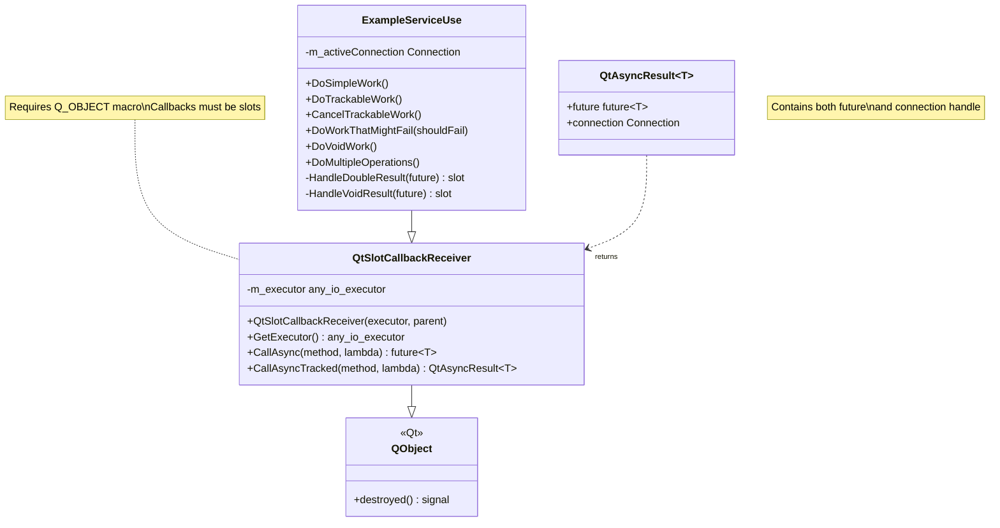
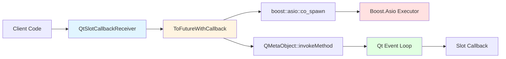
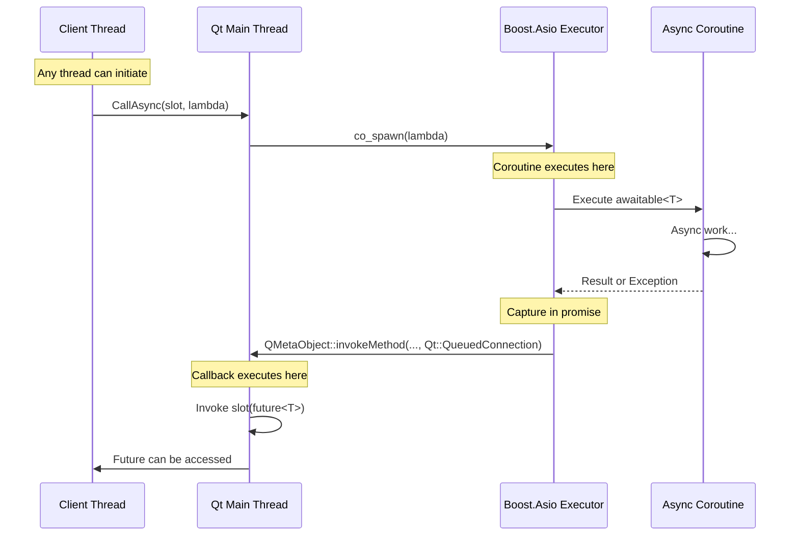
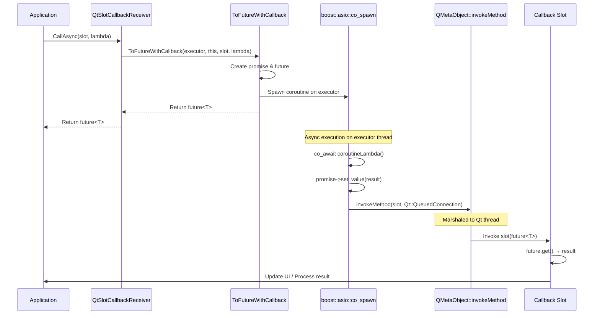
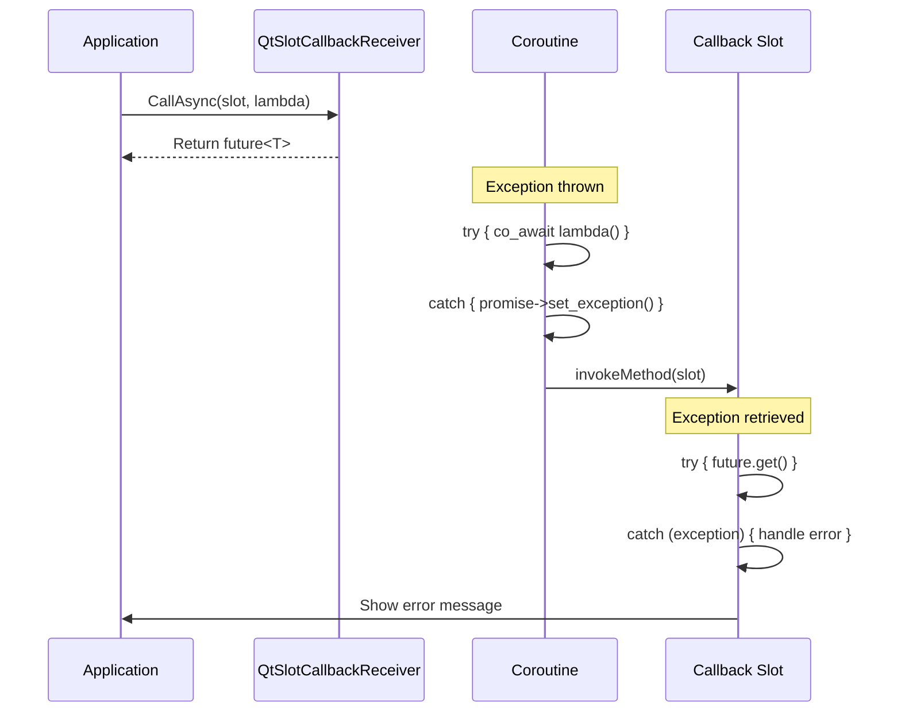
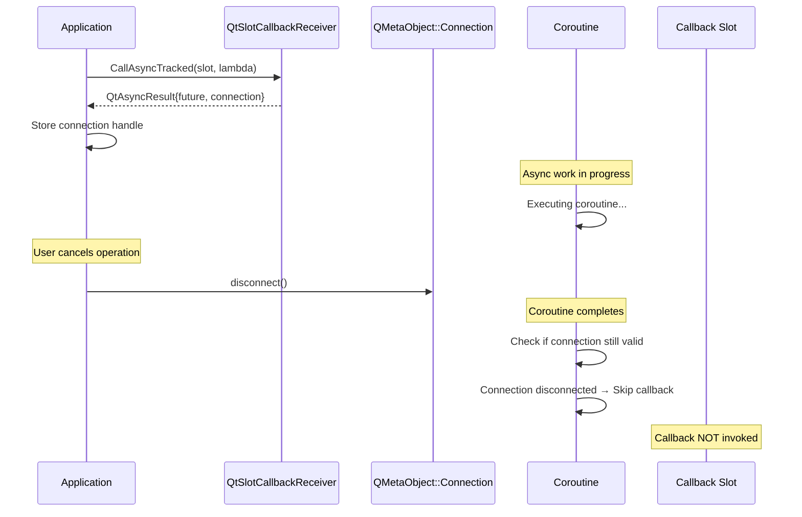
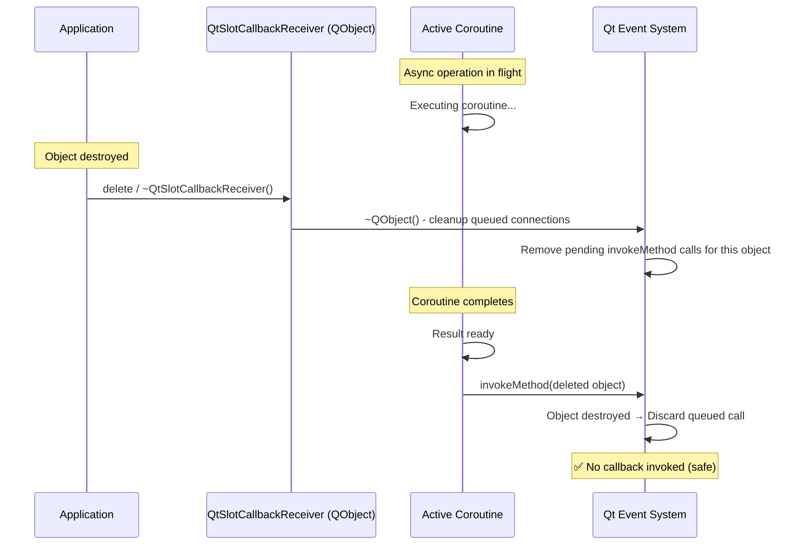

# Qt Slot Callback - Boost.Asio Coroutine Integration

Qt5-based async helper for executing `boost::asio::awaitable<T>` coroutines with Qt slot callbacks, leveraging Qt's connection tracking and automatic cleanup.

## Overview

This implementation provides seamless integration between Boost.Asio coroutines and Qt's signal/slot mechanism. It executes async operations on a Boost.Asio executor and marshals callbacks back to Qt slots using `Qt::QueuedConnection`, ensuring thread-safe callback execution on the QObject's thread.

**Key Features:**
- ✅ Qt-native slot-based callbacks with MOC integration
- ✅ Connection tracking for explicit cancellation control
- ✅ Automatic cleanup via Qt's parent-child and connection management
- ✅ Thread-safe callback marshaling using Qt's queued connections
- ✅ Exception propagation through `std::future<T>`
- ✅ Support for both void and non-void result types
- ✅ Two usage patterns: simple (fire-and-forget) and tracked (cancellable)

## Architecture

### Class Diagram



### Component Interaction



## Threading Model

### Thread Boundaries



## Sequence Diagrams

### Normal Flow - Successful Completion



### Error Flow - Exception Handling



### Cancellation Flow - Explicit Disconnect



### Object Destruction Flow - Qt Cleanup



## API Reference

### ToFutureWithCallback (Simple Version)

```cpp
template <typename TCallback, typename CallbackMethod, typename CoroutineLambda>
auto ToFutureWithCallback(
    boost::asio::any_io_executor workExecutor,
    TCallback* callbackObj,
    CallbackMethod callbackMethod,
    CoroutineLambda coroutineLambda
) -> std::future<T>
```

**Parameters:**
- `workExecutor`: Boost.Asio executor to run the coroutine on
- `callbackObj`: Pointer to QObject with callback slot (must inherit from QObject)
- `callbackMethod`: Pointer to callback slot (e.g., `&MyClass::handleResult`)
- `coroutineLambda`: Lambda returning `boost::asio::awaitable<T>`

**Returns:** `std::future<T>` for result access

**Requirements:**
- `TCallback` must inherit from `QObject`
- `callbackMethod` must be a slot declared with Q_OBJECT and slots keyword
- `coroutineLambda` must return `boost::asio::awaitable<T>`

**Use When:**
- Fire-and-forget async operations
- You don't need explicit cancellation control
- Simpler code is preferred

### ToFutureWithCallbackTracked (Connection-Tracked Version)

```cpp
template <typename TCallback, typename CallbackMethod, typename CoroutineLambda>
auto ToFutureWithCallbackTracked(
    boost::asio::any_io_executor workExecutor,
    TCallback* callbackObj,
    CallbackMethod callbackMethod,
    CoroutineLambda coroutineLambda
) -> QtAsyncResult<T>
```

**Parameters:** Same as simple version

**Returns:** `QtAsyncResult<T>` containing:
- `future`: `std::future<T>` for result access
- `connection`: `QMetaObject::Connection` handle for explicit disconnection

**Use When:**
- You need explicit cancellation capability
- You want to disconnect callbacks before operations complete
- You need to track active operations for cleanup

### QtSlotCallbackReceiver

```cpp
class QtSlotCallbackReceiver : public QObject
{
    Q_OBJECT

public:
    explicit QtSlotCallbackReceiver(
        boost::asio::any_io_executor executor,
        QObject* parent = nullptr
    );

    boost::asio::any_io_executor GetExecutor() const;

    template <typename CallbackMethod, typename CoroutineLambda>
    auto CallAsync(CallbackMethod method, CoroutineLambda lambda);

    template <typename CallbackMethod, typename CoroutineLambda>
    auto CallAsyncTracked(CallbackMethod method, CoroutineLambda lambda);
};
```

**Methods:**
- `CallAsync`: Convenience wrapper for simple async operations
- `CallAsyncTracked`: Convenience wrapper returning connection handle

**Benefits:**
- Automatically passes `this` and stored executor
- Cleaner syntax at call sites
- Consistent executor management

### QtAsyncResult<T>

```cpp
template <typename T>
struct QtAsyncResult
{
    std::future<T> future;              // Result or exception
    QMetaObject::Connection connection;  // Connection handle
};
```

**Members:**
- `future`: Access result with `.get()` or check status
- `connection`: Disconnect with `QObject::disconnect(connection)`

## Usage Examples

### Example 1: Simple Async Call

```cpp
class MyWidget : public Test3::QtSlot::QtSlotCallbackReceiver
{
    Q_OBJECT

public:
    MyWidget(boost::asio::any_io_executor executor)
        : QtSlotCallbackReceiver(executor)
    {
    }

    void loadData()
    {
        // Fire and forget - callback will be invoked on completion
        CallAsync(&MyWidget::onDataLoaded,
                  []() -> boost::asio::awaitable<QString>
                  {
                      // Simulate async database query
                      co_return QString("Database result");
                  });
    }

private slots:
    void onDataLoaded(std::future<QString> future)
    {
        try
        {
            QString data = future.get();
            // Update UI safely on Qt thread
            label->setText(data);
        }
        catch (const std::exception& ex)
        {
            QMessageBox::warning(this, "Error", ex.what());
        }
    }

private:
    QLabel* label;
};
```

### Example 2: Connection Tracking for Cancellation

```cpp
class DownloadManager : public Test3::QtSlot::QtSlotCallbackReceiver
{
    Q_OBJECT

public:
    void startDownload(const QUrl& url)
    {
        // Track connection for cancellation
        auto result = CallAsyncTracked(&DownloadManager::onDownloadComplete,
                                       [url]() -> boost::asio::awaitable<QByteArray>
                                       {
                                           // Simulate download
                                           co_return QByteArray("Downloaded data");
                                       });

        m_activeDownload = result.connection;
        m_downloadFuture = std::move(result.future);
    }

    void cancelDownload()
    {
        if (m_activeDownload)
        {
            // Disconnect callback - it won't be invoked
            QObject::disconnect(m_activeDownload);
            m_activeDownload = QMetaObject::Connection();
        }
    }

private slots:
    void onDownloadComplete(std::future<QByteArray> future)
    {
        try
        {
            QByteArray data = future.get();
            // Process downloaded data
            emit downloadFinished(data);
        }
        catch (const std::exception& ex)
        {
            emit downloadFailed(ex.what());
        }
    }

signals:
    void downloadFinished(const QByteArray& data);
    void downloadFailed(const QString& error);

private:
    QMetaObject::Connection m_activeDownload;
    std::future<QByteArray> m_downloadFuture;
};
```

### Example 3: Error Handling

```cpp
class ApiClient : public Test3::QtSlot::QtSlotCallbackReceiver
{
    Q_OBJECT

public:
    void fetchUserData(int userId)
    {
        CallAsync(&ApiClient::onUserDataReceived,
                  [userId]() -> boost::asio::awaitable<UserData>
                  {
                      if (userId < 0)
                      {
                          throw std::invalid_argument("Invalid user ID");
                      }

                      // Simulate API call
                      UserData data;
                      data.id = userId;
                      data.name = "John Doe";
                      co_return data;
                  });
    }

private slots:
    void onUserDataReceived(std::future<UserData> future)
    {
        try
        {
            UserData data = future.get();
            // Update UI with user data
            updateUserDisplay(data);
        }
        catch (const std::invalid_argument& ex)
        {
            // Handle validation error
            showError("Validation failed: " + QString(ex.what()));
        }
        catch (const std::exception& ex)
        {
            // Handle other errors
            showError("API error: " + QString(ex.what()));
        }
    }
};
```

### Example 4: Void Operations

```cpp
class Logger : public Test3::QtSlot::QtSlotCallbackReceiver
{
    Q_OBJECT

public:
    void saveLogAsync(const QString& message)
    {
        CallAsync(&Logger::onLogSaved,
                  [message]() -> boost::asio::awaitable<void>
                  {
                      // Simulate async file write
                      // writeToFile(message);
                      co_return;
                  });
    }

private slots:
    void onLogSaved(std::future<void> future)
    {
        try
        {
            future.get();  // Check for exceptions
            statusBar->showMessage("Log saved successfully");
        }
        catch (const std::exception& ex)
        {
            statusBar->showMessage("Failed to save log: " + QString(ex.what()));
        }
    }
};
```

### Example 5: Multiple Concurrent Operations

```cpp
class BatchProcessor : public Test3::QtSlot::QtSlotCallbackReceiver
{
    Q_OBJECT

public:
    void processBatch(const QVector<QString>& items)
    {
        m_totalItems = items.size();
        m_completedItems = 0;

        for (const QString& item : items)
        {
            CallAsync(&BatchProcessor::onItemProcessed,
                      [item]() -> boost::asio::awaitable<ProcessResult>
                      {
                          // Process each item concurrently
                          ProcessResult result;
                          result.item = item;
                          result.success = true;
                          co_return result;
                      });
        }
    }

private slots:
    void onItemProcessed(std::future<ProcessResult> future)
    {
        try
        {
            ProcessResult result = future.get();
            ++m_completedItems;

            // Update progress
            progressBar->setValue(m_completedItems * 100 / m_totalItems);

            if (m_completedItems == m_totalItems)
            {
                emit batchComplete();
            }
        }
        catch (const std::exception& ex)
        {
            emit itemFailed(ex.what());
        }
    }

signals:
    void batchComplete();
    void itemFailed(const QString& error);

private:
    int m_totalItems;
    int m_completedItems;
};
```

### Example 6: Using Future for Synchronous Wait

```cpp
class DataValidator : public Test3::QtSlot::QtSlotCallbackReceiver
{
    Q_OBJECT

public:
    bool validateDataSync(const QString& data)
    {
        // Get future for synchronous wait
        auto future = CallAsync(&DataValidator::onValidationComplete,
                                [data]() -> boost::asio::awaitable<bool>
                                {
                                    // Async validation logic
                                    co_return !data.isEmpty();
                                });

        // Block and wait for result (callback also invoked)
        try
        {
            return future.get();
        }
        catch (...)
        {
            return false;
        }
    }

private slots:
    void onValidationComplete(std::future<bool> future)
    {
        try
        {
            bool valid = future.get();
            emit validationResult(valid);
        }
        catch (const std::exception& ex)
        {
            emit validationError(ex.what());
        }
    }

signals:
    void validationResult(bool valid);
    void validationError(const QString& error);
};
```

## MOC Requirements and Build Setup

### Qt MOC (Meta-Object Compiler)

This implementation requires Qt's MOC because:
- `QtSlotCallbackReceiver` uses the `Q_OBJECT` macro
- Callback methods must be declared as slots
- Qt's meta-object system enables thread-safe queued connections

### CMake Configuration

```cmake
# Enable Qt MOC
set(CMAKE_AUTOMOC ON)

# Find Qt5
find_package(Qt5 COMPONENTS Core Widgets REQUIRED)

# Your target
add_executable(MyApp
    main.cpp
    mywidget.cpp
    mywidget.h  # Will be processed by MOC
)

target_link_libraries(MyApp
    Qt5::Core
    Qt5::Widgets
    Boost::system
    # ... other dependencies
)
```

### qmake Configuration

```pro
QT += core widgets
CONFIG += c++20

SOURCES += \
    main.cpp \
    mywidget.cpp

HEADERS += \
    mywidget.h  # Will be processed by MOC

LIBS += -lboost_system
```

### Header Include Order

```cpp
// Correct order for MOC processing
#include "QtSlotCallbackReceiver.hpp"  // Base class with Q_OBJECT
#include <QWidget>                     // Other Qt headers

class MyWidget : public QWidget, public Test3::QtSlot::QtSlotCallbackReceiver
{
    Q_OBJECT  // Required for MOC

public:
    // ...

private slots:  // Required for callback methods
    void onDataReady(std::future<QString> future);
};
```

## When to Use This Implementation

### ✅ Use QtSlot When:

- You're working in a Qt application with MOC already set up
- You want Qt-native integration with signals/slots
- You need explicit cancellation via connection disconnection
- You want Qt's automatic cleanup for pending queued connections
- You're comfortable with MOC requirements
- You prefer Qt idioms and patterns

### ⚠️ Consider Alternatives When:

- You want to avoid MOC dependencies
- You're integrating with non-Qt QObject classes
- You need the absolute minimum overhead
- You prefer simpler build configuration
- Your project doesn't already use Qt's build system

## Performance Considerations

### Connection Tracking Overhead

**Simple Version (`ToFutureWithCallback`):**
- One `QMetaObject::invokeMethod` call per operation
- No additional connection management
- Minimal overhead

**Tracked Version (`ToFutureWithCallbackTracked`):**
- Additional `QObject::connect` for tracking
- Connection validity check before callback
- Small overhead for connection management

**Recommendation:** Use simple version unless you need explicit cancellation.

### Qt Queued Connection Overhead

- Qt queued connections use an event queue
- Small latency (typically microseconds on desktop)
- Negligible for UI updates and typical async operations
- May be noticeable for high-frequency operations (thousands/sec)

### Memory Allocation

- Shared pointer for `std::promise<T>` (one allocation per operation)
- Qt's internal queued connection data (managed by Qt)
- Lambda capture overhead (depends on captured variables)

## Troubleshooting

### MOC Error: "No relevant classes found"

**Problem:** MOC can't find `Q_OBJECT` macro

**Solution:**
```cpp
// Ensure Q_OBJECT is present
class MyClass : public QtSlotCallbackReceiver
{
    Q_OBJECT  // ← Required!

public:
    // ...
};
```

### Callback Not Invoked

**Problem:** Slot not declared or MOC not run

**Solutions:**
1. Declare callback as slot:
```cpp
private slots:  // ← Required!
    void myCallback(std::future<int> future);
```

2. Ensure MOC processes the header:
```cmake
set(CMAKE_AUTOMOC ON)  # CMake
```

3. Check object thread affinity:
```cpp
qDebug() << "Object thread:" << thread();
qDebug() << "Current thread:" << QThread::currentThread();
```

### Connection Disconnect Not Working

**Problem:** Callback still invoked after disconnect

**Cause:** Using simple version instead of tracked version

**Solution:**
```cpp
// Use tracked version
auto result = CallAsyncTracked(&MyClass::callback, lambda);
QObject::disconnect(result.connection);  // Now works
```

### Compiler Error: "awaitable<T> not found"

**Problem:** Missing Boost.Asio includes

**Solution:**
```cpp
#include <boost/asio/awaitable.hpp>
#include <boost/asio/co_spawn.hpp>
```

### Runtime Error: QObject::connect: Cannot queue arguments

**Problem:** `std::future<CustomType>` with non-registered type

**Solution:**
```cpp
// Register custom type with Qt's meta-type system
Q_DECLARE_METATYPE(std::future<CustomType>)
qRegisterMetaType<std::future<CustomType>>();
```

## Limitations

1. **MOC Dependency**: Requires Qt's build system and MOC processing
2. **Slot Requirement**: Callbacks must be declared as slots
3. **QObject Thread Affinity**: Callbacks execute on QObject's thread (usually desired, but limits flexibility)
4. **Connection Tracking**: Tracked version has small overhead for connection management
5. **No Direct Signal Emission**: To emit signals from coroutines, use the callback slot as intermediary

## Comparison with QtPointer Implementation

| Feature | QtSlot (This) | QtPointer |
|---------|---------------|-----------|
| **MOC Required** | ✅ Yes | ❌ No |
| **Callback Type** | Qt slots | Regular member functions |
| **Connection Tracking** | ✅ Built-in | ❌ Not available |
| **Explicit Cancellation** | ✅ Via disconnect | ❌ No (relies on destruction) |
| **Build Complexity** | Higher (MOC) | Lower (header-only friendly) |
| **Qt Integration** | Native (signals/slots) | Basic (QObject only) |
| **Overhead** | Small (connection tracking) | Minimal (QPointer check) |
| **Qt Idioms** | ✅ Follows Qt patterns | Simpler, less Qt-specific |

## See Also

- `Test3::QtPointer` - Simpler QPointer-based implementation without MOC
- `Test3::AwaitableToFuture` - Original Boost.Asio-only implementation
- Qt Documentation: [Signals & Slots](https://doc.qt.io/qt-5/signalsandslots.html)
- Qt Documentation: [Thread Support](https://doc.qt.io/qt-5/threads-qobject.html)
