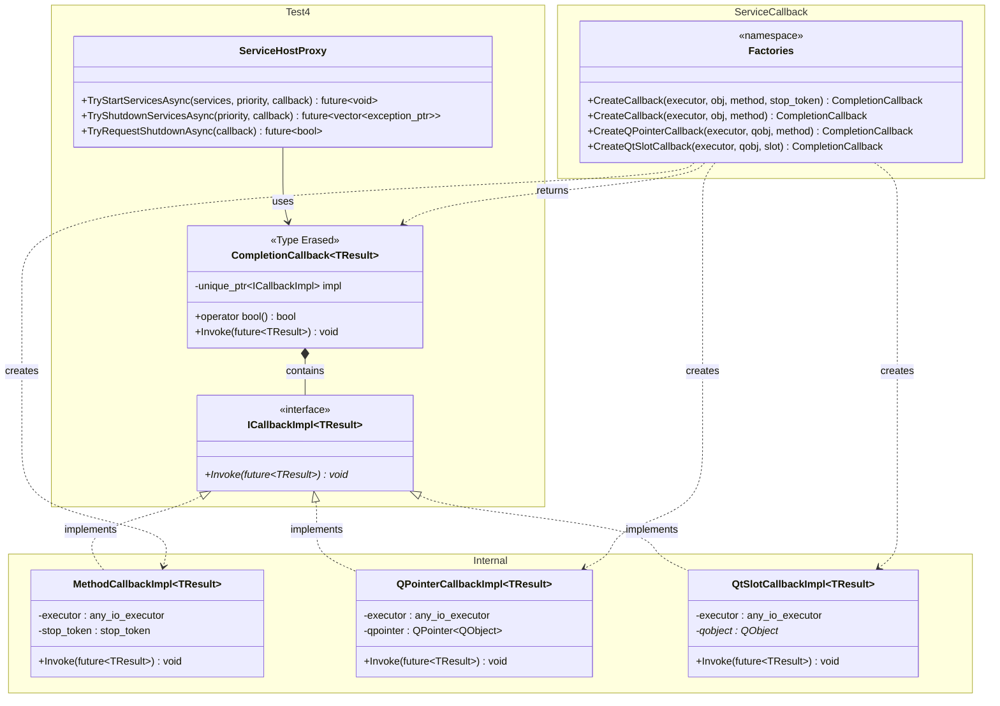
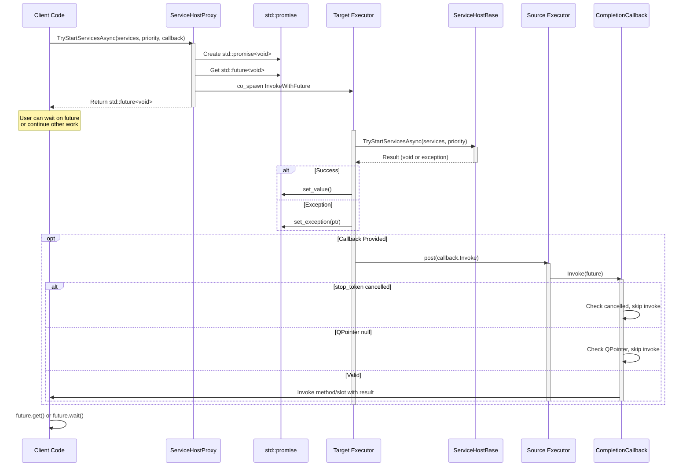
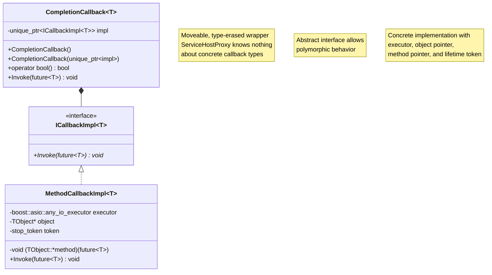

# Test4 Framework - Future-Based Async Pattern with Flexible Callbacks

## Status: Non-Compilable Prototypes

This directory contains **prototype implementations only**. These files are designed to demonstrate patterns and architectures but are **not intended to be compiled or used in production**.

---

## Overview

Test4 explores an alternative asynchronous programming model that replaces Test2's coroutine-based `boost::asio::awaitable<T>` pattern with a more traditional `std::future<T>` approach. The key innovation is providing **flexible, type-erased callbacks** that can be invoked when asynchronous operations complete, with automatic lifetime tracking and thread marshaling.

### Key Differences from Test2

| Aspect | Test2 | Test4 |
|--------|-------|-------|
| **Return Type** | `boost::asio::awaitable<T>` | `std::future<T>` |
| **Async Model** | Coroutines (co_await) | Futures + Optional Callbacks |
| **Callback Support** | N/A (use co_await) | Type-erased CompletionCallback<T> |
| **Lifetime Tracking** | Coroutine scope | stop_token, QPointer, or Qt object lifetime |
| **Thread Marshaling** | co_spawn executor | Explicit executor per callback |

---

## Architecture

### Component Overview



### Key Components

1. **ServiceHostProxy**: Public-facing API that returns `std::future<T>` and accepts optional `CompletionCallback<T>` parameters
2. **CompletionCallback<T>**: Type-erased moveable wrapper that hides callback implementation details
3. **ICallbackImpl<TResult>**: Abstract interface for callback implementations
4. **ServiceCallback Namespace**: Factory functions that create callbacks with different lifetime tracking strategies
5. **Internal Namespace**: Concrete callback implementations (MethodCallbackImpl, QPointerCallbackImpl, QtSlotCallbackImpl)

---

## Execution Flow

The following sequence diagram illustrates how a typical async operation works with a callback:



### Flow Explanation

1. **Initiation**: Client calls proxy method, receives `std::future<T>` immediately
2. **Promise Creation**: Proxy creates `std::promise<T>` and extracts future for return
3. **Target Execution**: Operation co_spawned onto target executor (service host thread)
4. **Result Capture**: Promise captures success (set_value) or failure (set_exception)
5. **Callback Marshaling**: If callback provided, posted to source executor
6. **Lifetime Check**: Callback checks lifetime token (stop_token/QPointer) before invoking
7. **User Invocation**: If valid, user's method/slot called with result on source executor

---

## Callback Strategies

Test4 provides three callback strategies, each with different lifetime tracking mechanisms:

### 1. Method Callback (std::stop_token)

**Use Case**: General-purpose callbacks with explicit lifetime management

```cpp
auto callback = ServiceCallback::CreateCallback<void>(
    executor,
    this,
    &MyClass::OnStartComplete,
    stopToken  // Explicit stop_token
);

// Or with auto-detection via GetStopToken() method
auto callback = ServiceCallback::CreateCallback<void>(
    executor,
    this,
    &MyClass::OnStartComplete
);
```

**Lifetime Tracking**:
- Checks `stop_token.stop_requested()` before invocation
- Supports SFINAE detection of `GetStopToken()` method for automatic token extraction
- Best for non-Qt scenarios or when you want explicit cancellation control

### 2. QPointer Callback (Qt Framework)

**Use Case**: Qt objects with automatic null-checking (no MOC required)

```cpp
auto callback = ServiceCallback::CreateQPointerCallback<void>(
    executor,
    qtObject,  // Must derive from QObject
    &MyQtClass::OnStartComplete
);
```

**Lifetime Tracking**:
- Uses `QPointer<QObject>` for automatic null-checking
- Double-check pattern: once when posted, once in lambda
- Safe for Qt objects destroyed on different threads
- No MOC macro requirements

### 3. Qt Slot Callback (Qt Signals/Slots)

**Use Case**: Integration with Qt's signal/slot mechanism

```cpp
auto callback = ServiceCallback::CreateQtSlotCallback<void>(
    executor,
    qtObject,
    "onStartComplete"  // Slot name as string
);
```

**Lifetime Tracking**:
- Leverages Qt's built-in object lifetime tracking
- Uses `QMetaObject::invokeMethod` with `Qt::QueuedConnection`
- Thread-safe slot invocation
- Requires proper Qt MOC processing

---

## Type Erasure Pattern

The `CompletionCallback<T>` class uses the **type erasure pattern** to hide implementation details from ServiceHostProxy:



**Benefits**:
- ServiceHostProxy has **zero knowledge** of callback implementation
- Callbacks are **moveable** (unique_ptr semantics)
- Easy to **extend** with new callback strategies
- Clean **separation of concerns** (API vs implementation)

---

## Design Goals

### 1. User Choice at Call Site

Users decide which callback strategy fits their needs:

```cpp
// Option 1: No callback, just use the future
auto future = proxy.TryStartServicesAsync(services, priority);
future.wait();

// Option 2: Method callback with stop_token
auto cb1 = ServiceCallback::CreateCallback<void>(exec, this, &MyClass::OnComplete, token);
proxy.TryStartServicesAsync(services, priority, std::move(cb1));

// Option 3: Qt QPointer callback
auto cb2 = ServiceCallback::CreateQPointerCallback<void>(exec, qtObj, &QtClass::OnComplete);
proxy.TryStartServicesAsync(services, priority, std::move(cb2));

// Option 4: Qt slot callback
auto cb3 = ServiceCallback::CreateQtSlotCallback<void>(exec, qtObj, "onComplete");
proxy.TryStartServicesAsync(services, priority, std::move(cb3));
```

### 2. Type Erasure for API Simplicity

ServiceHostProxy signature remains simple:

```cpp
std::future<void> TryStartServicesAsync(
    const std::vector<Test2::StartServiceRecord>& services,
    Test2::ServiceLaunchPriority priority,
    CompletionCallback<void> callback = {}
);
```

No template parameters, no knowledge of callback internals, just a clean interface.

### 3. Conditional Compilation for Qt

Qt-dependent callbacks are conditionally compiled:

```cpp
#ifdef QT_VERSION
namespace ServiceCallback {
    // QPointer and QtSlot factories only available when Qt is present
    template<typename TResult, typename TObject>
    CompletionCallback<TResult> CreateQPointerCallback(...);
}
#endif
```

Allows the framework to work in both Qt and non-Qt environments.

### 4. Modular File Organization

Each callback strategy has its own files:

- **Public API**: `ServiceCallback_Method.hpp`, `ServiceCallback_QPointer.hpp`, `ServiceCallback_QtSlot.hpp`
- **Implementation**: `ServiceCallback_Method_Internal.hpp`, `ServiceCallback_QPointer_Internal.hpp`, `ServiceCallback_QtSlot_Internal.hpp`

Users include only what they need; implementation details are separated.

---

## Thread Safety

### Executor-Based Marshaling

All callbacks use **explicit executor marshaling**:

```cpp
boost::asio::post(executor_, [callback = std::move(callback_),
                               future = std::move(future_)]() mutable {
    if (!stopToken_.stop_requested()) {
        (object_->*method_)(std::move(future));
    }
});
```

This ensures the callback runs on the **caller's original thread** (source executor), not the service host thread (target executor).

### Lifetime Safety

- **stop_token**: Checked immediately before invocation in the posted lambda
- **QPointer**: Double-checked (at post time and in lambda) to catch destruction
- **Qt Objects**: Qt's meta-object system handles lifetime via QueuedConnection

---

## Comparison with Test2

### Test2 (Coroutine-Based)

```cpp
// Test2: co_await pattern
boost::asio::awaitable<void> StartServices() {
    auto dispatchContext = CreateDispatchContext();
    co_await proxy.TryStartServicesAsync(services, priority);
    // Continuation happens here automatically
}
```

**Pros**:
- Linear code flow
- Automatic suspension/resumption
- Exception propagation via try/catch

**Cons**:
- Requires C++20 coroutines
- Less explicit about threading
- No callback option without additional wrapping

### Test4 (Future + Callback)

```cpp
// Test4: future + callback pattern
void StartServices() {
    auto callback = ServiceCallback::CreateCallback<void>(
        executor, this, &MyClass::OnComplete, stopToken
    );
    auto future = proxy.TryStartServicesAsync(services, priority, std::move(callback));
    // Can wait on future, or callback will fire when complete
}

void OnComplete(std::future<void> result) {
    // Handle result on original thread
    try {
        result.get(); // Rethrows exception if any
        // Success path
    } catch (const std::exception& e) {
        // Error handling
    }
}
```

**Pros**:
- Works with C++11 and later
- Explicit thread marshaling
- Flexible callback strategies
- Can mix futures and callbacks

**Cons**:
- More verbose than co_await
- Manual callback lifetime management
- Continuation in separate function

---

## File Structure

```
Test4/
├── README.md (this file)
├── Framework/
│   ├── Host/
│   │   ├── ServiceHostProxy.hpp       # Public API: returns std::future<T>
│   │   └── ServiceHostProxy.cpp       # Implementation with InvokeWithFuture helper
│   └── Util/
│       ├── CompletionCallback.hpp     # Type-erased callback wrapper
│       ├── ServiceCallback_Method.hpp # Method callback factory (public API)
│       ├── ServiceCallback_Method_Internal.hpp # MethodCallbackImpl implementation
│       ├── ServiceCallback_QPointer.hpp # QPointer callback factory (Qt only)
│       ├── ServiceCallback_QPointer_Internal.hpp # QPointerCallbackImpl implementation
│       ├── ServiceCallback_QtSlot.hpp # Qt slot callback factory (Qt only)
│       └── ServiceCallback_QtSlot_Internal.hpp # QtSlotCallbackImpl implementation
```

---

## Note

These are **experimental prototypes** for exploring alternative async patterns. They demonstrate:
- Type erasure for flexible callback strategies
- Dual-executor pattern (source vs target)
- Lifetime tracking mechanisms
- Conditional compilation for Qt integration

For **working, compilable implementations**, refer to **Test2**. Test4 exists to explore "what if" scenarios and alternative design patterns.
