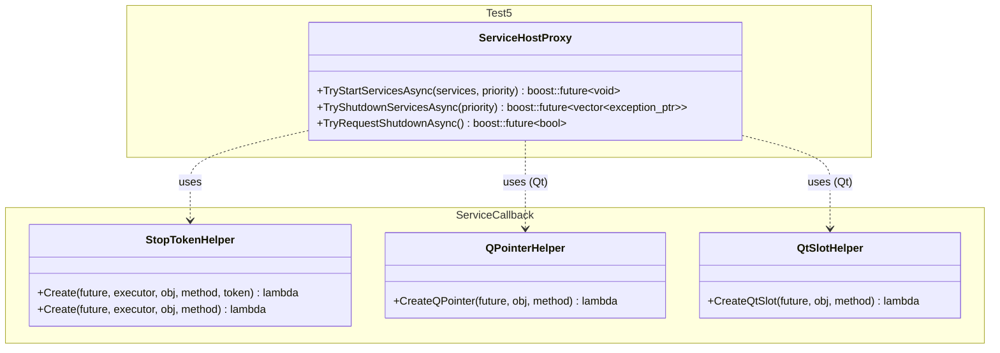

# Test5 Framework - boost::future with .then() Continuations

## Status: Non-Compilable Prototypes

This directory contains **prototype implementations only**. These files are designed to demonstrate patterns and architectures but are **not intended to be compiled or used in production**.

---

## Overview

Test5 builds on Test4's async proxy pattern but **simplifies it significantly** by using `boost::future<T>` instead of `std::future<T>`. The key advantage is that `boost::future` supports `.then()` continuations, eliminating the need for Test4's complex `CompletionCallback` infrastructure.

### Key Differences from Test4

| Aspect | Test4 | Test5 |
|--------|-------|-------|
| **Future Type** | `std::future<T>` | `boost::future<T>` |
| **Callback Parameter** | `CompletionCallback<T>` (optional) | None - use `.then()` |
| **Continuation Support** | Manual callback invocation | Native `.then()` chains |
| **Type Erasure** | Full `CompletionCallback` infrastructure | Simple helper functions |
| **API Simplicity** | Dual return (future + callback) | Single return (future only) |

### Key Differences from Test2

| Aspect | Test2 | Test5 |
|--------|-------|-------|
| **Return Type** | `boost::asio::awaitable<T>` | `boost::future<T>` |
| **Async Model** | Coroutines (co_await) | Futures + .then() |
| **C++ Version** | C++20 (coroutines) | C++11/14/17 |
| **Continuation** | co_await in same function | .then() continuation |

---

## Architecture

### Component Overview



---

## Usage Examples

### Basic Non-Blocking Pattern

```cpp
#include <Test5/Framework/Host/ServiceHostProxy.hpp>
#include <Test5/Framework/Util/ServiceCallback_StopToken.hpp>

class MyService {
    std::stop_source m_stopSource;
    boost::asio::any_io_executor m_executor;

public:
    ~MyService() {
        m_stopSource.request_stop();  // Signal that object is being destroyed
    }

    std::stop_token GetStopToken() const { return m_stopSource.get_token(); }

    void StartServices() {
        // Get future from proxy (no callback parameter!)
        auto future = proxy.TryStartServicesAsync(services, priority);

        // Attach callback using ServiceCallback - future is first parameter
        Test5::ServiceCallback::Create(future, m_executor, this, &MyService::OnComplete, GetStopToken());
    }

    void OnComplete(boost::future<void> result) {
        try {
            result.get();  // Rethrows exception if any
            // Success path
        } catch (const std::exception& e) {
            // Error handling
        }
    }
};
```

### Blocking Pattern

```cpp
// Same as Test4 - just call .get() to block
auto future = proxy.TryStartServicesAsync(services, priority);
future.get();  // Blocks until complete, throws on error
```

### With Lifetime-Safe Callbacks

#### 1. Using std::stop_token

```cpp
#include <Test5/Framework/Util/ServiceCallback_StopToken.hpp>

class MyService {
    std::stop_source m_stopSource;
    boost::asio::any_io_executor m_executor;

public:
    ~MyService() {
        m_stopSource.request_stop();  // Signal that object is being destroyed
    }

    std::stop_token GetStopToken() const { return m_stopSource.get_token(); }

    void StartServices() {
        auto future = proxy.TryStartServicesAsync(services, priority);

        // Callback will only run if stop_token not requested
        Test5::ServiceCallback::Create(future, m_executor, this, &MyService::OnComplete, GetStopToken());
    }

    void OnComplete(boost::future<void> result) {
        // Runs on m_executor, only if object still alive
        try {
            result.get();
        } catch (...) {
            // Handle error
        }
    }
};
```

#### 2. Using Qt QPointer (Conditional Compilation)

```cpp
#include <Test5/Framework/Util/ServiceCallback_QPointer.hpp>

class MyQObject : public QObject {
public:
    void StartServices() {
        auto future = proxy.TryStartServicesAsync(services, priority);

        // Callback marshaled to QObject's thread using Qt, only runs if QObject not destroyed
        Test5::ServiceCallback::CreateQPointer(future, this, &MyQObject::OnComplete);
    }

    void OnComplete(boost::future<void> result) {
        // Only runs if 'this' QObject still exists
        try {
            result.get();
        } catch (...) {
            // Handle error
        }
    }
};
```

#### 3. Using Qt Slots

```cpp
#include <Test5/Framework/Util/ServiceCallback_QtSlot.hpp>

class MyQObject : public QObject {
    Q_OBJECT

public:
    void StartServices() {
        auto future = proxy.TryStartServicesAsync(services, priority);

        // Uses Qt's queued connection for thread-safe marshaling to QObject's thread
        Test5::ServiceCallback::CreateQtSlot(future, this, &MyQObject::OnComplete);
    }

public slots:
    void OnComplete(boost::future<void> result) {
        // Runs on QObject's thread via Qt's event loop
        try {
            result.get();
        } catch (...) {
            // Handle error
        }
    }
};
```

---

## Advantages over Test4

### Simpler API

**Test4 (verbose):**
```cpp
auto callback = ServiceCallback::CreateCallback<void>(executor, this, &MyClass::OnComplete, stopToken);
auto future = proxy.TryStartServicesAsync(services, priority, std::move(callback));
// Two mechanisms: future AND callback
```

**Test5 (concise):**
```cpp
auto future = proxy.TryStartServicesAsync(services, priority);
// Just pass future to ServiceCallback - no explicit template parameters needed
ServiceCallback::Create(future, executor, this, &MyClass::OnComplete, stopToken);
```

### Natural Composition

`boost::future` allows chaining multiple async operations:

```cpp
auto future = proxy.TryStartServicesAsync(services, priority);
Test5::ServiceCallback::Create(future, executor, this, &MyService::OnStartComplete, stopToken)
    .then([this](boost::future<void> f) {
        f.get();  // Propagate exception if any
        return proxy.TryShutdownServicesAsync(priority);
    })
    .then([](boost::future<std::vector<std::exception_ptr>> f) {
        auto errors = f.get();
        // Handle shutdown results
    });
```

### No Type Erasure Overhead

Test4 uses `CompletionCallback<T>` with virtual dispatch and type erasure. Test5 uses simple template functions that generate lambdas—no runtime polymorphism needed.

---

## File Structure

```
Test5/
├── README.md (this file)
├── Framework/
│   ├── Host/
│   │   ├── ServiceHostProxy.hpp       # Public API: returns boost::future<T>
│   │   └── ServiceHostProxy.cpp       # Implementation (no callback handling)
│   └── Util/
│       ├── ServiceCallback_StopToken.hpp   # std::stop_token lifetime tracking
│       ├── ServiceCallback_QPointer.hpp    # Qt QPointer lifetime tracking
│       └── ServiceCallback_QtSlot.hpp      # Qt slot-based callbacks
```

---

## When to Use

### Use Test5 When:
- ✅ You need non-blocking async operations without C++20 coroutines
- ✅ You want simple API (no callback parameters)
- ✅ You can depend on Boost.Thread (`boost::future`)
- ✅ You want `.then()` continuation support
- ✅ You prefer composition over co_await

### Use Test2 When:
- ✅ You have C++20 coroutines available
- ✅ You want the most natural async flow (`co_await`)
- ✅ You prefer `boost::asio::awaitable<T>`

### Use Test4 When:
- ✅ You need `std::future` (no Boost.Thread dependency for futures)
- ✅ You want explicit dual return (future + callback)
- ✅ You prefer type-erased callbacks

---

## Implementation Notes

### boost::promise vs std::promise

Test5 uses `boost::promise<T>` and `boost::future<T>` from `<boost/thread/future.hpp>`:

```cpp
auto promise = std::make_shared<boost::promise<void>>();
auto future = promise->get_future();  // Returns boost::future

// Can use .then() for continuations:
future.then([](boost::future<void> f) { /* ... */ });
```

### ServiceCallback Pattern

Unlike Test4's `CompletionCallback` type erasure, Test5's helpers are simple template functions that take the future and return a new future:

```cpp
template <typename TResult, typename TCallback, typename CallbackMethod>
auto Create(boost::future<TResult> future, executor, obj, method, stopToken) {
    return future.then([executor, obj, method, stopToken](boost::future<TResult> f) mutable {
        boost::asio::post(executor, [obj, method, stopToken, f = std::move(f)]() mutable {
            if (!stopToken.stop_requested()) {
                (obj->*method)(std::move(f));
            }
        });
    });
}
```

No virtual dispatch, no unique_ptr, no type erasure—just a lambda. The TResult type is automatically deduced from the future parameter.

---

## Note

These are **experimental prototypes** for exploring alternative async patterns. They demonstrate:
- boost::future's `.then()` continuation support
- Simplified API design (no callback parameters)
- Lightweight lifetime tracking helpers
- Forward compatibility with future C++ standard features

For **working, compilable implementations**, refer to **Test2**. Test5 exists to explore the "sweet spot" between Test2's coroutines and Test4's future+callback pattern.
